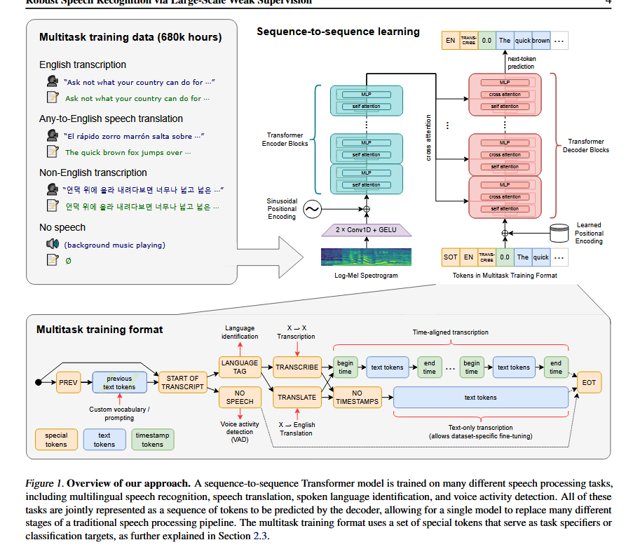

# Robust Speech Recognition via Large-Scale Weak Supervision
---
## Abstract

- This paper studies the capabilities of speech processing systems trained simply to predict large amounts of transcripts of audio on the internet.

---
## Introduction

- The pre-trained autoencoders learn high-quality representations of speech, but because they are purely unsupervised they lack an equivalently performant decoder mapping those representations to usable outputs, necessitating a fine-tuning stage in order to actually perform a task such as speech recognition.

- Machine learning methods are exceedingly adept at finding patterns within a training dataset which boost performance on held-out data from the dataset.However some of these patterns are brittle and spurious and don't generalize to other datasets and distributions. 

- This suggests that while unsupervised pre-training has improved the quality of audio encoders dramatically, the lack of an equivalently high-quality pre-trained decoder, combined with a recommended protocol of dataset-specific fine-tuning is a crucial weakness which limits their usefulness and robustness.

- Speech recognition systems that are pre-trained in a supervised fashion across many datasets exhibit higher robustness and generalize much more effectively to held-out datasets than models trained on a single-source. These works achieve this by combining as many existing high-quality speech recognition datasets as possible.

- Recognizing the limit size of existing high-quality supervised datasets, recent efforts have created larger datasets for speech recognition.Recent work in computer vision has demonstrated that moving beyond gold-standard crowdsourced datasets such as ImageNet to much larger but weakly supervised datasets significantly improves the robustness and generalization of models.

- Scaling weakly supervised speech recognition the next order of magnitude to 680,000 hours of labeled audio data.

- This work suggests that simple scling of weakly supervised pre-training has been underappreciated so far.
---
## Approach 

### Data Processing

- Whisper has been trained predict the raw text of transcripts without any significant standardization,relying on the expressiveness of the sequence-to-sequence models to learn to map between utterances and their transcribed form.

- For the dataset the audio is paired with their respective transcripts available on the internet. This results in a very diverse dataset covering a broad distribution of audio from many different environments, recording setups,speakers and languages. 

- diversity in audio quality is beneficial but in transcript quality might not be beneficial.

-  Many existing ASR systems output only a limited subset of written language which removes or normalizes away aspects that are difficult to predict from only audio signals such as complex punctuation(exclamation points, commas, and question marks), formatting whitespace such as paragraphs, or stylistic aspects such as capitalization.

- An all uppercase or all-lowercase transcript is very unlikely to be human generated. Many ASRs involve inverse text normalization, it is often simple or rule based and still detectable from other unhandled aspects such as never including commas.

- The researchers have also used an audio language detector which was created by fine-tuning a prototype model trained on a prototype version of the dataset on VoxLingua107 to ensure that the spoken language matches the language of the transcript according to CLD2.

- Exception: if the transcript is in english and are addded as X->en speech translation training examples instead.

- Also used fuzzy de-duping and automatically generated content in the training dataset.

- They broke audio files down into 30 segments paired with the subset of the transcript that occurs within that time segment. They trained it on all audio including segments where there is no speech.

- For an additional filtering pass, after training an initial model they aggregated information about its error rate on training data sources and performed manual inspection of these data sources sorting by a combination of both high error rate and data source size in order to identify and remove low-quality ones efficiently. This inspection showed a large number of poorly aligned transcripts as well as remaining low-quality machine -generated captions that filtering heuristics did not detect.
---
### Model

- Used an encoder-decoder structure. 

- resampled all audio files to 16,000 Hz.

- For feature normalization, we globally scale the input to be between -1 and 1 with approximately zero mean across the pre-training dataset. 

- The encoder processes this input representation with a small stem consisting of two convolution layers with a filter width of 3 and the GELU activation function where the second convolution layer has a stride of two.

- Sinusoidal position embeddings are then added to the output of the stem after which the encoder Transformer blocks are applied. The transformer uses pre-activation residual blocks and a final layer normalization is applied to the encoder output. The decoder uses learned position embeddings and tied input-output token representations.

- The encoder and decoder have the same width and number of transformer blocks.
---
### Multitask Format

- A fully featured speech recognition system can involve many additional components such as voice activity detection, speaker diarization and inverse text normalization. 

- Many tasks can be performed on the same input signal: transcription, translation, voice activity detection, alignment, and language identification etc.

- A simple format to specify all tasks and conditioning information as a sequence of input tokens to the decoder. Since the decoder is an audio-conditional language model, we also train it to condition on the history of text of the transcript in the hope that it will learn to use longer-range text context to resolve ambiguous audio. 

- With some probability they add the transcript text preceeding the current audio segment to the decoder's context. 

- Indicate the beginning of prediction with a <|startoftranscript|> token.

- First, predict the language being spoken which is represented by a unique token for each language in the training set.

- For the audio segments where there is no speech, the model is trained to predict <|nospeech|> token indicating this. The next token specifies the task (either transcriptopn <|trancribe|> or translation<|translate|>). 

- Another token <|notimestamps|> is used to decide whether to predict timestamps or not.

- Lastly , a <|endoftranscript|> token is added.

- Only mask out the training loss over the previous context textt and train the model  to predict all other tokens.

---
### Training Details

- Training has been done with data parallelism across accelerators using FP16 with dynamic loss scaling and activation checkpointing.

- trained with AdamW and gradient norm clipping with a linear learning rate decay to zero after a warmup over the first 2048 updates. 

- A batch size of 256 segments was used, and the models are trained for $2^20$ updates which is between two and three passes over the dataset. 