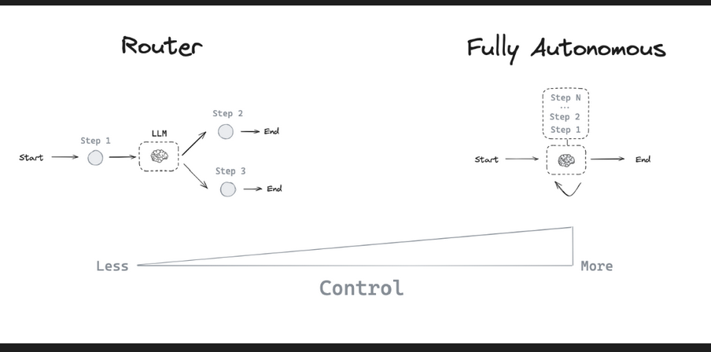
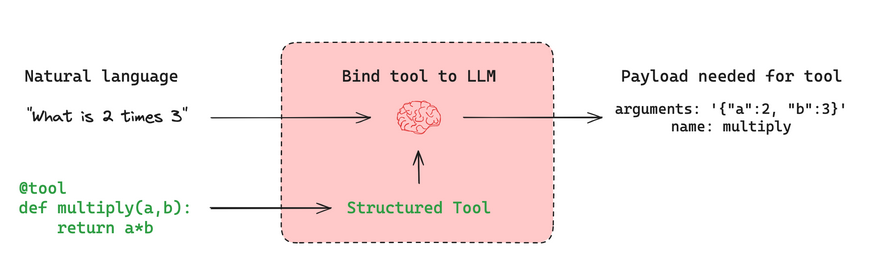

# Agents:

- By themselves, language models can't take actions - they just output text. Agents are systems that take a high-level task and use an LLM as a reasoning engine to decide what actions to take and execute those actions.

## Agent architecture:
- Many LLM applications implement a particular control flow of steps before and/or after LLM calls. 

- an agent is a system that uses an LLM to decide the control flow of an application. 

- ways that an LLM can control application:

1. An LLM can route between two potential paths

2. An LLM can decide which of many tools to call

3. An LLM can decide whether the generated answer is sufficient or more work is needed.

### Router 

- A router allows an LLM to select a single step from a specified set of options. This is an architecture that exhibits a relatively limited level of control because the LLM usually focuses on making a single dcision and produces a specific output from a limited set of pre-defined options. 

### Structured Outputs

- Structured outputs with LLMs work by providing a specific format or schema that the LLM should follow in its response. This is similar to tool calling, but more general. While tool calling typically involves selecting and using predefined functions, structured output can be used for any type of formatted response. Common methods to achieve structured outputs include:

1. Prompt engineering
2. Output parsers: Using post-processing to extract structured data from LLM responses.
3. Tool calling: Leveraging built-in tool calling capabilities of some LLMs to generate structured outputs.

### Tool-calling agent

- While a router allows an LLM to make a single decision, more complex agent architectures expand the LLM's control in two key ways:

1. Multi-step decision making: The LLM can make a series of decisions, one after another, instead of one

2. Tool access: The LLM can choose from and use a variety of tools to accomplish tasks.

- ReACT integrates three core concepts:

1. Tool calling

2. Memory: Enabling the agent to retain and use information from previous steps

3. Planning: Empowering the LLM to create and follow multi-steps plans to achieve goals.

### Tool Calling

- Tools are useful whenever you want an agent to interact with external systems.

- External systems often require a particular input schema or payload, rather than natural language.

- When we bind an API as a tool, we give the model awareness of the required input schema. 

- The model will choose to call a tool based upon the natural language input from the user and it will return an output that adheres to the tool's required schema.

### Memory 

- enables agents to retain and utilize information across multiple steps of problem-solving.

- operates on different scales:

1. Short-term memory: Allows the agent to recall information acquired during earlier steps in a sequence

2. Long-term memory: Enables the agent to recall information from previous interactions, such as past messages in a conversation.

### Planning

- In a tool-calling agent, an LLM is called repeatedly in a while-loop. At each step the agent decides which tools to call, and what the inputs to those tools should be. Those tools are then executed and the outputs are fed back into the LLM as observations.

### Custom agent architecture
- While routers and tool-calling agents (like ReAct) are common, customizing agent architectures often leads to better performance for specific tasks. LangGraph offers several powerful features for building tailored agent systems:

#### Human-in-the-loop¶

- Human involvement can significantly enhance agent reliability, especially for sensitive tasks. This can involve:

1. Approving specific actions
2. Providing feedback to update the agent's state
3. Offering guidance in complex decision-making processes

#### Parallelization¶

- Parallel processing is vital for efficient multi-agent systems and complex tasks. LangGraph supports parallelization through its Send API, enabling:

1. Concurrent processing of multiple states
2. Implementation of map-reduce-like operations
3. Efficient handling of independent subtasks

#### Subgraphs¶

- Subgraphs are essential for managing complex agent architectures, particularly in multi-agent systems. They allow:

1. Isolated state management for individual agents
2. Hierarchical organization of agent teams
3. Controlled communication between agents and the main system

- Subgraphs communicate with the parent graph through overlapping keys in the state schema. This enables flexible, modular agent design. 

#### Reflection¶

- Reflection mechanisms can significantly improve agent reliability by:

1. Evaluating task completion and correctness
2. Providing feedback for iterative improvement
3. Enabling self-correction and learning

- While often LLM-based, reflection can also use deterministic methods. For instance, in coding tasks, compilation errors can serve as feedback.

- By leveraging these features, LangGraph enables the creation of sophisticated, task-specific agent architectures that can handle complex workflows, collaborate effectively, and continuously improve their performance.