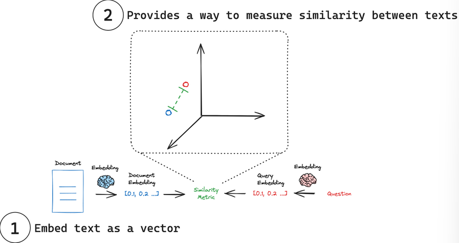

# Embedding models

- embedding models are able to capture the essence of any text-a tweet,document or book in a single, compact representation.
- They transform human language into a format that machines can understand and compare with speed and accuracy.
- These models take text as input and produce a fixed-length array of numbers, a numerical fingerprint of the text's semantic meaning.
- allows search systems to find releavnt documents based on semantic understanding.

## Key concepts

1. Embed text as a vector: Embeddings transform text into a numerical vector representation.
2. Measure similarity: vectors can be compared using simple mathematical operations.

## Interface
- two central methods:
    - embed_documents: For embedding multiple texts.
    - embed_query: For embedding a single text.

## Measure similarity:

- each embedding is essentially a set of coordinates, often in a high-dimensional space. In this space, the position of each point(embedding) reflects the meaning of its corresponding text. 

- common similarity metrics:
    - Cosine similarity
    - euclidean distance
    - dot product

## References
- [BERT](https://www.nvidia.com/en-us/glossary/bert/)
- [SBERT](https://www.sbert.net/examples/sentence_transformer/training/sts/README.html)
- [MTEB](https://huggingface.co/blog/mteb)
- [power of vector search](https://cameronrwolfe.substack.com/p/the-basics-of-ai-powered-vector-search)
- [Samwilson](https://simonwillison.net/2023/Oct/23/embeddings/)

- [Google](https://developers.google.com/machine-learning/clustering/dnn-clustering/supervised-similarity)

- [Pinecone](https://www.pinecone.io/learn/vector-similarity/)