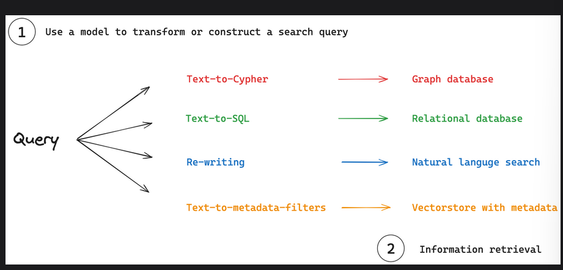
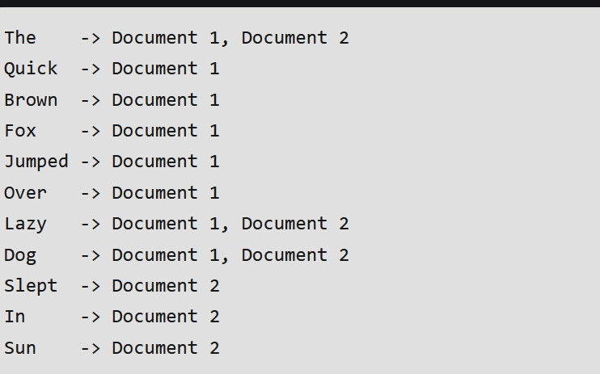
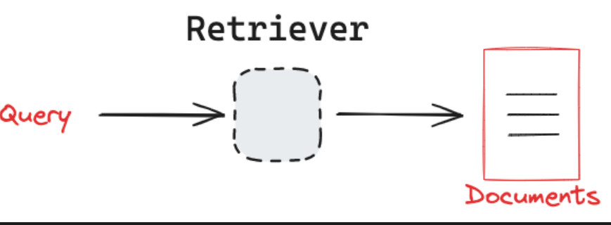
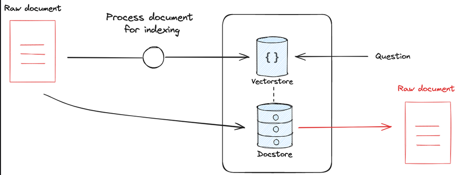

# Retrieval

## Overview 

- Retrieval systems are fundamental to many AI applications, efficiently identifying relevant information from large datasets. These systems accomodate various data formats:

1. Unstructured text is often stored in vector stores or lexical search indexes.

2. Structured data is typically housed in relational or graph databases with defined schemas.

## Key concepts 

- 

1. Query analysis: A process where models transform or construct search queries to optimise retrieval.

2. Information retrieval: Search queries are used to fetch information from various retrieval systems

## Query Analysis

- It serves as a bridge between raw user input and optimized search queries.Common applications include:

1. Query Re-writing: Queries can be re-written or expanded to improve semantic or lexical searches.

2. Query construction: Search indexes may require structured queries.

### Query re-writing

- Retrieval systems should ideally handle a wide spectrum of user inputs, from simple and poorly worded queries to complex, multi-faced questions. To achieve this veratility, a popular approach is to use models to transform raw user queries into more effective search queries.

1. Query Clarification: Models can rephrase ambiguous or poorly worded queries for clarity.

2. Semantic Understanding: They can capture the intent behind a query, going beyond literal keyword matching.

3. Query Expansion: Models can generate related terms or concepts to broaden the search scope.

4. Complex query handling: They can break down multi-part questions into simpler sub-queries.

#### Various techniques:

1. Multi-query: When you want to ensure high recall in retrieval by providing multiple phrasings of a question, rewrite the user question with multiple phrasings, retrieve documents for each rewritten question, return the unique documents for all queries.

2. Decomposition: Decompose a question into a set of subproblems/ questions, which can either be solved sequentially or in parallel.

3. Step back : First prompt the LLM to ask a generic step-back question about higher-level concepts or principles, and retrieve relevant facts about them. 

4. HyDE: Use an LLM to convert questions into hypothetical documents that answer the question. Use the embedded hypothetical documents to retrieve real documents with the premise that doc-doc similarity search can produce more relevant matches.
### Query construction 

- Query analysis can focus on translating natural language queries into specialized query languages or filters. This translation is crucial for effectively interacting with various types of databases that house structured or semi-structured data.

1. Structured data examples: For relational and graph databases, domain-specific languages are used to query data.

- text-to-SQL
- Text-to-cypher

2. Semi-structured data examples: for vectorstores, queries can combine semantic search with metadata filtering.

- Natural language to Metadata filters: converts user queries into appropriate metadata filters.

#### Popular techniques

- Self query: This uses an LLM to transform user input into 2 things: 1. a string to look up semantically, 2. a metadata filter to go along with it.

- Text-to-SQL: This uses an LLM to transform user input to a SQL query

- Text-to-cypher: This uses an LLM to transform user into a Cypher query.

## Information retrieval

### Common retrieval systems

#### Lexical search indexes
- Many search engines are based upon matching words in a query to the words in each document. This approach is called lexical retrieval. depends on word's frequency in query and the doc.

- The particular data structure used to implement this is often an inverted index.(In an inverted index, the index is organised by terms(words) and each term points to a list of documents or web pages that contain that term.)

- An inverted index is an index data structure storing a mapping from content, such as words or numbers, to its location in a document or a set of documents. 

#### Vector indexes 

- Vectorstores use an embedding model to compress documents into high-dimensional vector representation. This allows for efficient similarity search over embedding vectors using simple mathematical operations like cosine similarity.

#### Relational databases

- Relational databases are a fundamental type of structured data storage used in many applications. They organize data into tables with predefined schemas, where each table represents an entity or relationship. Data is stored in rows (records) and columns (attributes), allowing for efficient querying and manipulation through SQL (Structured Query Language). Relational databases excel at maintaining data integrity, supporting complex queries, and handling relationships between different data entities.

#### Graph database

- Graph databases are a specialized type of database designed to store and manage highly interconnected data. Unlike traditional relational databases, graph databases use a flexible structure consisting of nodes (entities), edges (relationships), and properties. This structure allows for efficient representation and querying of complex, interconnected data. Graph databases store data in a graph structure, with nodes, edges, and properties. They are particularly useful for storing and querying complex relationships between data points, such as social networks, supply-chain management, fraud detection, and recommendation services

## Retriever

1. input: a query
2. Output: a list of documents

- The only requirement for a retriever is the ability to accepts a query and return documents. In particular, LangChain's retriever class only requires that the _get_relevant_documents method is implemented, which takes a query: str and returns a list of Document objects that are most relevant to the query. The underlying logic used to get relevant documents is specified by the retriever and can be whatever is most useful for the application.

### Common types

#### Search apis

- We can build retrievers on top of search APIs that simply return search results. (Amazon kendra or Wikipidea Search)

#### Relational or graph database

- Retrievers can be built on top of relational or graph databases. In these cases, query analysis techniques to construct a structured query from natural language is critical. For example, you can build a retriever for a SQL database using text-to-SQL conversion. This allows a natural language query (string) retriever to be transformed into a SQL query behind the scenes.

#### Lexical search

- BM25 and TF-IDF

#### Vector store

- Efficient way to index and retrieve unstructured data.

### Advanced retrieval patterns

#### Ensemble:

- possible to combine multiple retrievers

- useful when multiple retrievers that are good at finding different types of relevant documents are used.

- re-ranking: takes output of multiple retrievers and combine them using a more sophisticated algorithm such as reciprocal rank fusion.

#### Source document retention

- Many retrievers utilize some kind of index to make documents easily searchable.

- The process of indexing can include a transformation step.(vectorstores use document splitting)

- it ensures no loss in document context for the model.

##### two types of retrievers:

1. Parent document(vector store  +document store): doesn't use an LLM; involves indexing multiple chunks for each document. most similar chunks are found iin embedding space, but we retrieve th ewhole parent document and return that.

2. Multi Vector: uses LLM sometimes during indexing; creates multiple vectors for each document. 

## Reference
- https://python.langchain.com/docs/concepts/retrievers/

- https://python.langchain.com/docs/concepts/retrieval/