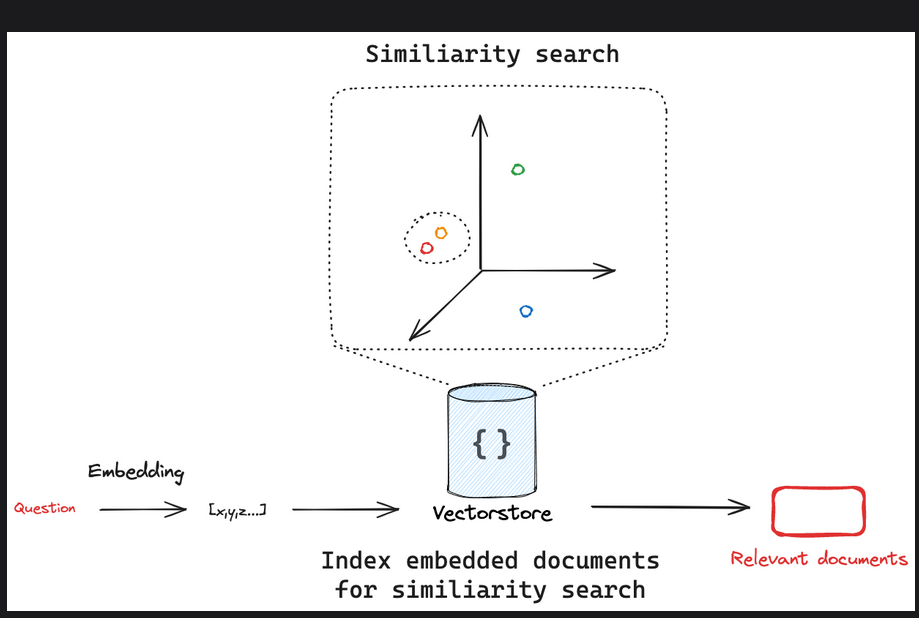

# Vector Stores
- Vector stores are specialized data stores that enable indexing and retrieving information based on vector representations.
- these vectors are called embeddings, capture the semantic meaning of data that has been embedded.
- Vector stores are frequently used to search over unstructures data, such as text, images and audio, to retrieve relevant information based on semantic similarity rather than exact keyword matches.

## Interface

- key methods:
    - add_documents: add a list of texts to the vector store.
    - delete: delete a list of documents from the vector store.
    - similarity search: search for similar documents to a given query.

## Similarity search

- Given a similarity metric to measure the distance between the embedded query and any embedded document, we need an algorithm to efficiently search over all the embedded documents to find the most similar ones. There are various ways to do this. As an example, many vectorstores implement HNSW (Hierarchical Navigable Small World), a graph-based index structure that allows for efficient similarity search. Regardless of the search algorithm used under the hood, the LangChain vectorstore interface has a similarity_search method for all integrations. 

- similarity search has the following parameters:
    - query: text to look up documents similar to.
    - k: number of documents to return
    - filter: Dictionary of arguments to filter on metadata.

## Metadata filtering
- Metadata filtering helps narrow down the search by applying specific conditions such as retrieving documents from a particular source or date range.
- These 2 concepts work well together:
1. Swmantic search: Query the unstructured data directly, often via embedding or keyword similarity.
2. Metadata search: Apply structured query to the metadata, filtering specific documents.

## Advanced search and retrieval techniques:

- While algorithms like HNSW provide the foundation for efficient similarity search in many cases, additional techniques can be employed to improve search quality and diversity.

- hybrid search: hybrid search combines keyword and semantic similarity, marrying the benefits of both approaches. 

- Maximal Marginal Relevance: MMR attempts to diversify the results of a search to avoid returning similar and redundant documents. 

## Reference
- [HNSW](https://www.pinecone.io/learn/series/faiss/hnsw/)