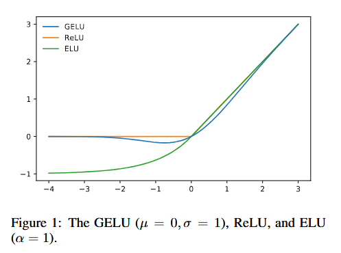

# Gaussian Error Linear Units(GELU)

## Abstract

- It is denoted by $x\phi(x)$, where $\phi(x)$ the standard Gaussian cumulative distribution function. The GELU nonlinearity weights inputs by their value, rather than gates inputs by their sign as in RelUs $(x1_{\text{x>0}})$. 

## Introduction

- Early artificial neurons utilized binary threshold units. These are smoothed with sigmoid activations, enabling a neuron to have a firing rate interpretation and to train with backpropagation. 

- GELU relates to stochastic regularizers in that it is the expectation of a modification to Adaptive Droput. 

## GELU Formulation

- This activation function is formed by combining properties from dropout, zoneout and RELUs.

- A ReLU and dropout both yield a neuron's output with the ReLU deterministically multiplying the input by zero or one and dropout stochastically  multiplying by zero.

- Also, a new RNN regularizer called zoneout stochastically multiplies inputs by one.

- We merge this functionality by multiplying the input by zero or one, but the values of this zero-one mask are stochastically determined while also dependent upon the input. 

- Specifically, we can multiply the neuron input x by $m~Bernoulli(\phi(x))$ where $\phi(x)=P(X<=x),X~N(0,1)$ is the cumlative distributive function of the standard normal distribution.

- We choose this distribution since neuron inputs tend to follow a normal distribution, espcially with Batch Normalization. 

- In this setting, inputs have a higher probability of being dropped as x decreases, so the transformation applied to x is stochastic yet depends upon the input.

- Masking inputs in this fashion retains non-determinism but maintains dependency upon the input value. A stochastically chosen mask amounts to a stochastic zero or identity transformation of the input.

- We often want a deterministic decision from a neural network and this gives rise to the new nonlinearity.The non-linearity is the expected transformations of the stochastic regularizer on an input x, which is $\phi(\text{x})x I\text{x}+(1-\phi(x)) x 0\text{x}=x\phi(x)$

- This expression states that we scale x by how much greater it is than other inputs. Since the cumulative distribution function of a Gaussian is often computed with the error function, we can define the Gaussian Error Linear Unit as

$$
  GELU(x)= xP(X<=x)= x\phi(x)= x.1/2[1+erf(x/\sqrt{2})].
$$

- we can approximate this function with

$$
    0.5x(1+tanh[\sqrt{2/\pi}(x+0.044715x^3)])\cr
    or \cr
    x \sigma(1.702x) if greater feedforward speed is worth the cost of exactness.
$$

- We could use different CDFs. We can use Logistic Distribution CDF $\sigma(x)$ to get what we call the Sigmoid Linear Unit $x\sigma(x)$
