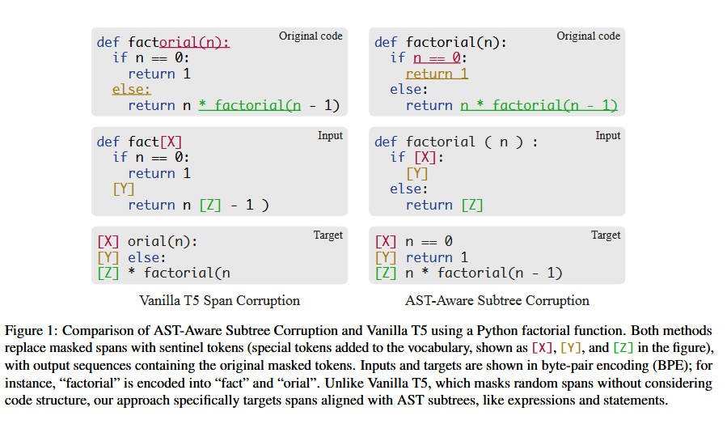
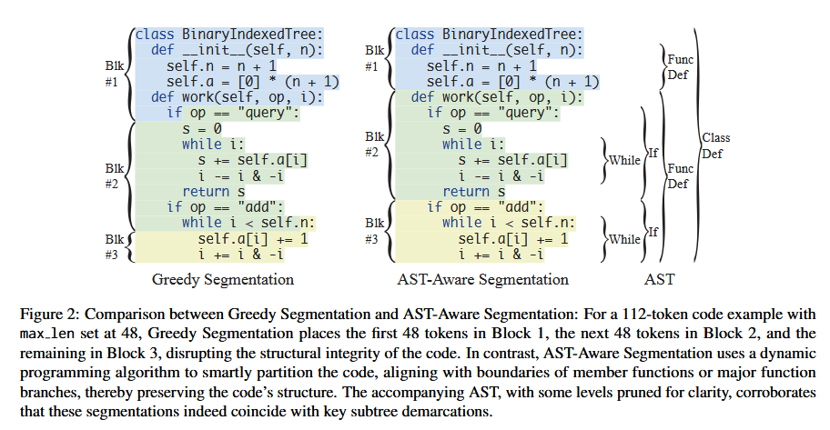
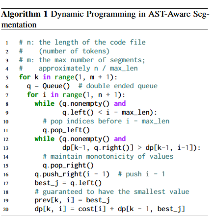
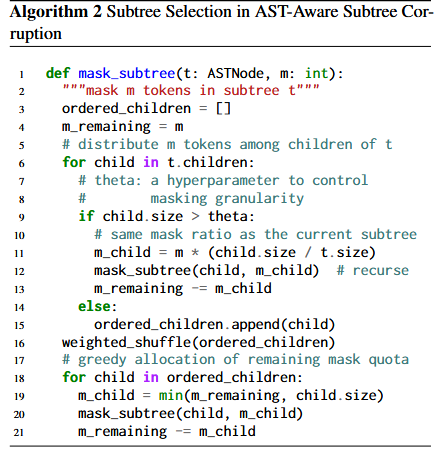
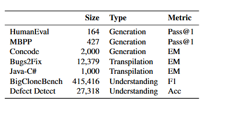
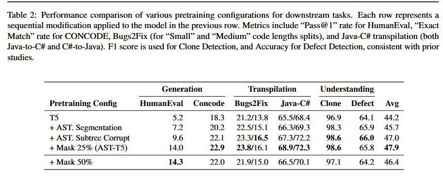
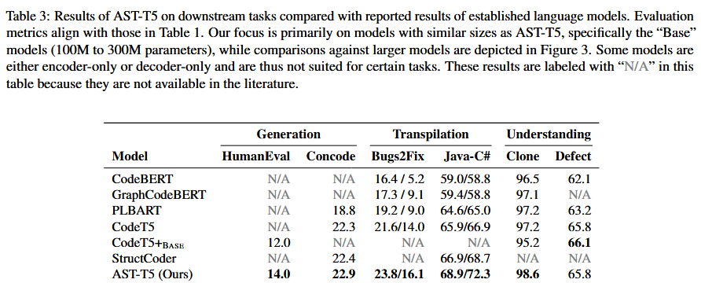
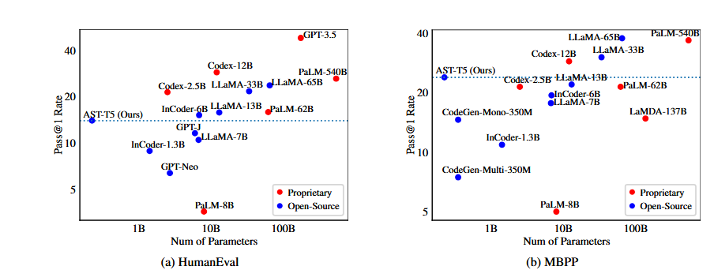

# AST-T5: Structure-Aware Pretraining for Code Generation and Understaning

## Abstract

- Large language models have made significant advancements in code-related tasks, yet many of them treat code as simple sequences, neglecting its structured nature.

- This paper introduces AST-T5, a novel pretraining paradigm that leverages the *Abstract Syntax Tree* for enhanced code generation, transpilation and understanding.

- **AST-Aware segmentation** retains code structure using dynamic programming and **AST-Aware Span Corruption** objective equips the model to reconstruct various code structures.

- Unlike other models, AST-T5 avoids complex program analysis or architectural changes, so it integrates seamlessly with any encoder-decoder Transformer.

## Introduction

- Despite impressive advancements, most models interpret code as mere sequences of subword tokens, over looking its intrinsic structured nature.

- AST-T5 uses a lightweight, multi-language parser called Tree-sitter, this approach has broad applicability across all syntactically well-defined programming languages.

- After parsing code into ASTs, it uses a dynamic programming based segmentation algorithm for AST-aware code segmentation to maintain the structural integrity of the input code. Using AST-Aware Span Corruption, the model is pretrained to reconstruct various code structures, ranging from individual tokens to entire function bodies. 

- Together, the approach offers three key advantages:

    1. enriched bidirectional encoding for improved code understanding.

    2. the ability to coherently generate code structures

    3. a unified, structure-aware pretraining framework that boosts performance across a variety of code-related tasks, particularly in code transpilation.

- In addition, other than the specialized AST-aware masking approach, AST-T5 introducs no architecture changes or additional heads. This compatibility enables seamless integration of our model as a drop-in replacement for any T5 variant.

- The inherent AST-awareness of AST-T5 offers unique advantages in structure-sensitive tasks, such as code-to-code transpilation and Clone Detection, highlighting its effectiveness at capturing the structural nuances of code.

- AST-T5 aligns with methods that utilize code structure only in pretraining. 

## Method

- First, AST-T5 parses code into ASTs to enable a deeper understanding of code structure.

- Leveraging this structure, this paper introduces AST-Aware Segmentation, an algorithm designed to address Transformer token limits while retaining the semantic coherence of the code.

- Second, it introduces AST-Aware Span Corruption, a masking technique that pretrains AST-T5 to reconstruct code structures ranging from individual tokens to entire function bodies, enhancing both its flexibility and structure-awareness.

### Parsing Code into ASTs

- Unlike traditional language models on code that handle code as simple sequences of subword ttokens, AST-T5 leverages the Abstract Syntax Tree of code to gain semantic insights.

- For parsing purpose, it assumes the provided code is syntactically valid- a reasonable assumption for tasks like code transpilation and understanding.

- It only requires the code to be parsable. It uses a tree sitter , a multi-language parser, to construct the ASTs, where each subtree represents a consecutive span of subword tokens, and every leaf node represents an individual token.

### AST-Aware Segmentation

- splits lengthy code files into chunks in a structure-preserving manner.

- **Segmentation in language model pretraining** is a critical yet often overlooked aspect. Transformer LMs impose token limits on input sequences, making segmentation essential for fitting these inputs within the max_len constraint. A naive approach is greedy segmentation where each chunk, except the last, contains exactly max_len tokens. 

- Research in NLP underscores that segmentation respecting sentence and document boundaries outperforms the greedy strategy. Given programming language's inherently structured nature, a more sophisticated segmentation approach is even more important.

- **AST-Aware segmentation** is designed to preserve the AST structure of code during segmentation. Unlike greedy segmentation, which can indiscriminately fragment AST structures, This method strategically minimizes such disruptions.

#### Dynamic programming based Algorithm

1. We construct an array cost, where cost[i] denotes the number of AST-structure breaks that would occur if partitioning happened right after token i. This array is populated by traversing the AST and incrementing cost[1..r-1] by 1 for each span[l,r] associated with an AST subtree.

2. We define a 2-D array dp, where dp[k,i] represents the minimum total number of AST-structure breaks when k partitions are made for the first i tokens, ending the last partition right after the i-th token. The state transition equation is :

$$
dp[k,i]=cost[i]+ min_{\text{i-max_leng<=j<i}}dp[k-1,j]
$$

3. While the naive DP algorithm has a quadratic time complexity $O(n^2)$ relative to the code file length n, it can be optimized to $O(n^2/max_len)$ by employing a monotonic queue for sliding-window minimum calculations. This allows for efficient computation across most code files. 

4. The algorithm outputs the partition associated with dp $[k_{\text{min}},n]$, where $k_{\text{min}}=arg min_{\text{k}}(dp[k,n])$, as the most optimal partition.

### Pretraining with Span Corruption

- AST-T5's pretraining is based on _span corruption_, a well-established method for pretraining transformer encoder-decoder models. 

- In this approach, 15% of the input tokens are randomly masked and replaced by unique "sentinel" tokens, distinct within each example. Each unique sentinel token is associated with a specific ID and added to the model's vocabulary.

- During pretraining, the encoder processes the corrupted input sequence. The decoder's objective is to reconstruct the dropped-out tokens based on the encoder's output representations. Specifically, the target sequence consists of the masked spans of tokens, demarcated by their corresponding sentinel tokens. This framework effectively trains the model to recover the oiginal text from a corrupted input. 

### AST- Aware Subtree Corruption

- AST-T5 augments the traditional span corruption paradigm by incorporating AST-awareness. Rather than arbitrarily masking consecutive token spans, AST-T5 masks code spans correspondiing to AST subtrees, rangining from individual expressions to entire function bodies.

- **Subtree Masking**. It uses a recursive algorithm, to traverse the AST and select subtrees for masking.

- fulfills 2 goals:

1. Introduce sufficient randomness across training epochs to enhance generalization.

2. Control the masking granularity via a tunable hyperparameter $\theta$.

- The **"mask quota"** _m_ denotes the number of tokens to be masked in a subtree rooted at node _t_. The size of a subtree corresponds to the number of tokens it encompasses, derived from the cumulative sizes of its children. For larger subtrees that exceed the size threshold $\theta$, masking is applied recursively.

- Meanwhile, smaller subtrees undergo a weighted shuffle, and the quota _m_ is then apportioned among _t_'s children in a greedy fashion according to a shuffled order. The weights for shuffling are determined by a heuristic function on the size of each child, such that masking probabilities are distributed uniformly across leaf nodes. 

- The parameter $\theta$ controls the granularity of masking. $\theta$ is randomly sampled within a predefined range(5-100) for each training example. This allows the pretraining framework to inherently accomodate tasks as varied as single-token completion to full function body generation from a given signature.

- The masking technique aims at the masking of ASt subtrees, potentially encompassing up to 100 tokens.

- **Pretraining objective**: Once subtrees are selected for masking and replaced with sentinel tokens, the encoder processes this modified input. Subsequently the decoder is tasked with reconstructing the original tokens within the masked subtrees. 

## Experimental Setup

### Model Architecture

- 12-layer encoder and a 12-layer decoder where each layer has 768 dimensions and 12 attention heads. total parameters: 277M

### Pretraining:

- pretrained on a subset of The Stack Dedup corpus, a near-duplicated version of The Stack-a 3.1TB, spanning 358 programming languages.

- For this experiment, AST-T5’s training involves Python, Java, C, C++, C#, Markdown, and reStructuredText subsets, comprising a 588GB dataset with 93M code and natural language files.

- Each file is first parsed using the tree-Sitter multi-language parser and then tokenized with byte-level Byte-Pair Encoding using a byte-level BPE token vocabulary. 

- Following AST-Aware segmentation, these files are partitioned into chunks of 1024 tokens.

- the model is pretrained using the AST-Aware Subtree Corruption objective for 524 billion tokens(1024 tokens per sequence,1024 sequences per batch and 500k steps)

- Pretraining uses Pytorch,Fairseq, FlashAttention conducted on 8 nodes, each with 8x NVIDIA A100 40 GB GPUs.

## Evaluation

- evaluated across 3 tasks
    1. text-to-code generation
    2. code-to-code transpilation
    3. Code classification

## Results

## References

- [AST-T5](https://arxiv.org/pdf/2401.03003)
-[github model repo](https://github.com/
gonglinyuan/ast t5)