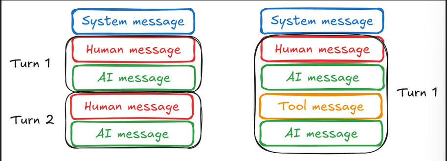

# Chat history

- Chat history is a record of the conversation between user and chat model. It is used to maintain context and state throughout the conversation.
- the chat history is sequence of messages, each of which is associated with a specific role.

## Conversation Patterns

- Most conversations start with a system message that sets the context for the conversation. This is followed by a user message containing the user's input and then an assistant message containing the model's response.

- The assistant may respond directly to the user or if configured with tools request that a tool be invoked to perform a specific task.

- A full conversation often involves a combination of two patterns of alternating messages:

1. The user and the assistant represrenting a back-and-forth conversation.

2. The assistant and tool messages representing an agentic workflow where the assistant is invoking tools to perform specific tasks.

## Managing chat history

- chat models have a minimum limit on input size, it's important to manage chat history and trim it as needed to avoid exceeding the context window.

### Key guidelines for managing chat history:

- The conversation should follow one of these structures:

1. The first message is either a "user" message or a "system" message, followed by a "user" and then an "assistant" message.

2. The last message should be either a "user" message or a "tool" message containing the result of a tool call. When using tool calling, a "tool" message should only follow an "assistant" message that requested the tool invocation