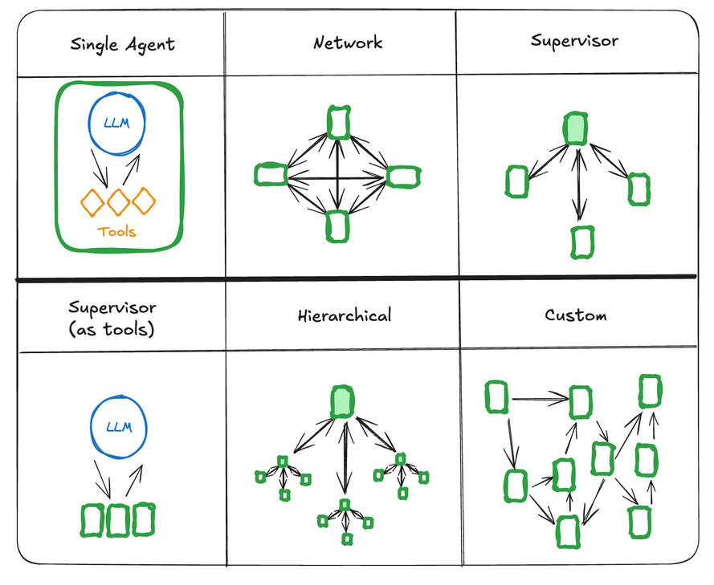
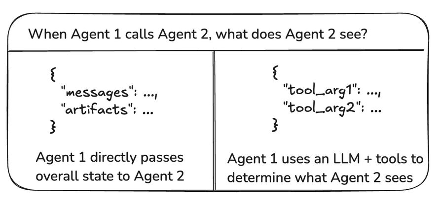
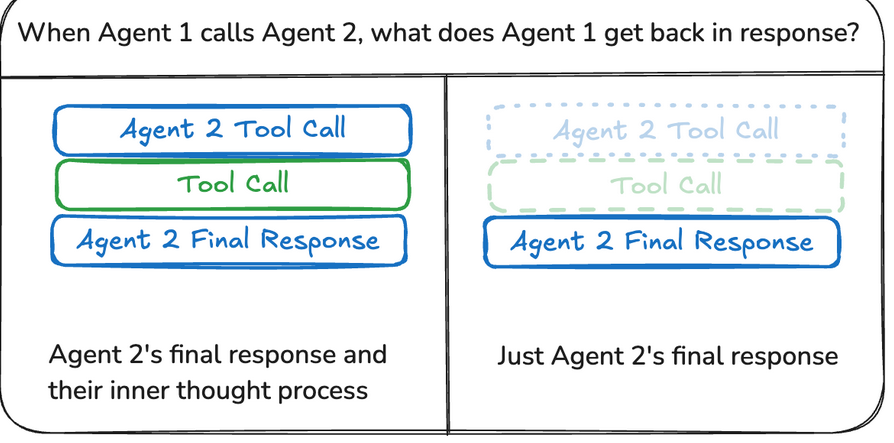

# Multi-agent systems

- An agent is a system that uses an LLM to decide the control flow of an application. As you develop these systems, they might grow more complex over time, making them harder to manage and scale. For example, you might run into the following problems:

1. agent has too many tools at its disposal and makes poor decisions about which tool to call next
2. context grows too complex for a single agent to keep track of
3. there is a need for multiple specialization areas in the system (e.g. planner, researcher, math expert, etc.)

- To tackle these, you might consider breaking your application into multiple smaller, independent agents and composing them into a multi-agent system. These independent agents can be as simple as a prompt and an LLM call, or as complex as a ReAct agent (and more!).

- The primary benefits of using multi-agent systems are:

1. Modularity: Separate agents make it easier to develop, test, and maintain agentic systems.
2. Specialization: You can create expert agents focused on specific domains, which helps with the overall system performance.
3. Control: You can explicitly control how agents communicate (as opposed to relying on function calling).

- There are several ways to connect agents in a multi-agent system:

1. Network: each agent can communicate with every other agent. Any agent can decide which other agent to call next.
2. Supervisor: each agent communicates with a single supervisor agent. Supervisor agent makes decisions on which agent should be called next.
3. Supervisor (tool-calling): this is a special case of supervisor architecture. Individual agents can be represented as tools. In this case, a supervisor agent uses a tool-calling LLM to decide which of the agent tools to call, as well as the arguments to pass to those agents.
4. Hierarchical: you can define a multi-agent system with a supervisor of supervisors. This is a generalization of the supervisor architecture and allows for more complex control flows.
5. Custom multi-agent workflow: each agent communicates with only a subset of agents. Parts of the flow are deterministic, and only some agents can decide which other agents to call next.

# Reference 
https://langchain-ai.github.io/langgraph/concepts/multi_agent/#state-management-for-subagents