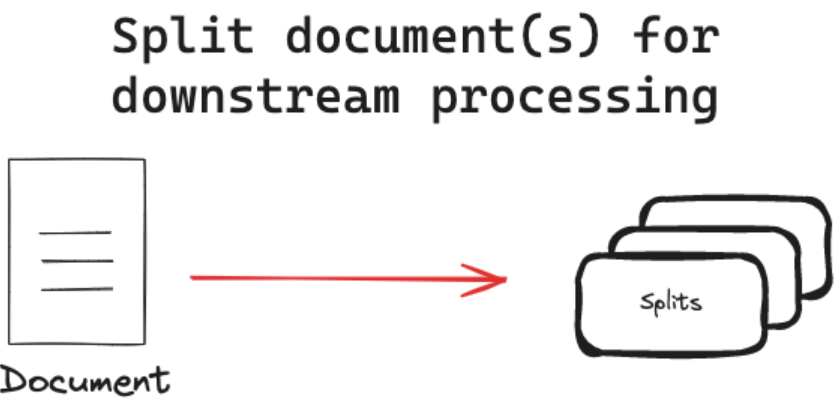

# Text Splitters

## Overview
- Document splitting is often a crucial preprocessing step.
- It invoves breaking down large texts into smaller, manageable chunks. This process offers several benefits, such as ensuring consistent processing of varying document lengths, overcoming input size of limitations of models and improving the quality of text representations used in retrieval systems.

## Key concepts

- Text splitters split documents into smaller chunks for use in downstream applications.

## Why split documents

- handling non-uniform document lengths: splitting ensures consistent processing across all documents.

- overcoming model limitations: splitting allows us to process documents that would otherwise exceed these limits.

- Improving representation quality: Splitting can lead to more focused and accurate representations of each section.

- Enhancing retrieval precision: Splitting allows for more precise matching of queries to relevant document sections.

- Optimizing computational resources: working with smaller chunks of text can be more memory-efficient and allow for better parallelization of processing tasks.

## Approaches

### Length-based
- splits on the basis of document's length.
- each chunk doesn't exceed a specified size limit.
- benefits
    - straightforward implementation
    - consistent chunk sizes
    - easily adaptable to different models
- types:
    - Token-based: splits text based ont the number of tokens, which is useful when working with language models.
    - Character-based: Splits text based on the number of characters, which can be more consistent across different types of text.
- Text-structured based

- Text is naturally organized into hierarchical units such as paragraphs, sentences, and words. We can leverage this inherent structure to inform our splitting strategy, creating split that maintain natural language flow, maintain semantic coherence within split, and adapts to varying levels of text granularity. LangChain's RecursiveCharacterTextSplitter implements this concept:

    - The RecursiveCharacterTextSplitter attempts to keep larger units (e.g., paragraphs) intact.
    - If a unit exceeds the chunk size, it moves to the next level (e.g., sentences).
    - This process continues down to the word level if necessary.

- Document-structured based
- Some documents have an inherent structure, such as HTML, Markdown, or JSON files. In these cases, it's beneficial to split the document based on its structure, as it often naturally groups semantically related text. Key benefits of structure-based splitting:

    - Preserves the logical organization of the document
    - Maintains context within each chunk
    - Can be more effective for downstream tasks like retrieval or summarization

- Examples of structure-based splitting:

    - Markdown: Split based on headers (e.g., #, ##, ###)
    - HTML: Split using tags
    - JSON: Split by object or array elements
    - Code: Split by functions, classes, or logical blocks

# Semantic meaning based

- Unlike the previous methods, semantic-based splitting actually considers the content of the text. While other approaches use document or text structure as proxies for semantic meaning, this method directly analyzes the text's semantics. There are several ways to implement this, but conceptually the approach is split text when there are significant changes in text meaning. As an example, we can use a sliding window approach to generate embeddings, and compare the embeddings to find significant differences:

    - Start with the first few sentences and generate an embedding.
    - Move to the next group of sentences and generate another embedding (e.g., using a sliding window approach).
    - Compare the embeddings to find significant differences, which indicate potential "break points" between semantic sections.

- This technique helps create chunks that are more semantically coherent, potentially improving the quality of downstream tasks like retrieval or summarization.

## References
- [textsplitters](https://python.langchain.com/docs/concepts/text_splitters/)
- [notebook](https://github.com/FullStackRetrieval-com/RetrievalTutorials/blob/main/tutorials/LevelsOfTextSplitting/5_Levels_Of_Text_Splitting.ipynb)