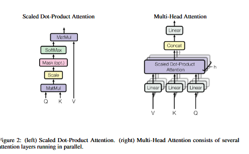
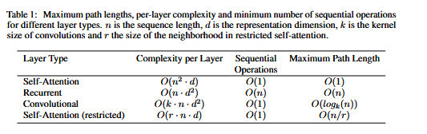

# Attention is All You Need

### Abstract

- The dominant sequence transduction models are based on complex recurrent or convolutional neural networks that include an encoder and a decoder. The best performing models also connect the encoder and decoder through an attention mechanism. This paper propposed a new simple network architecture, the Transformer, based solely on attention mechanisms, dispensing with recurrence and convolutions entirely. Experiments on two machine translation tasks showed these models to be superior in quality while being more parallelizable and requiring significantly less time to train.The model used acheived 28.4 BLEU on the WMT 2014 English-to-German translation task, improving over the existing best results, including ensembles, by over 2 BLEU. On the WMT 2014 English-to-French translation task, this model established a new single-model state-of-the-art BLEU score of 41.8 after training for 3.5 days on eight GPUs, a small fraction of the training costs of the best models from the literature. This showed that the Transformer generalizes well to other tasks by applying it successfully to English constituency parsing both with large and limited training data.

### 1. Introduction

- Recurrent Neural Networks, long short term memory and gated recurrent neural networks in particular have been firmly established as state of the art approaches in sequence modeling and transduction problems such as language modeling and machine translation. Numerous efforts have since continued to push the boundaries of recurrent language models and encoder-decoder architectures.

- Recurrent models typically factor computation along the symbol positions of the input and output sequences. Aligning the positions to steps in computation time, they generate a sequence of hidden states $h_{t}$, as a function of the previous hidden state $h_{t-1}$ and the input for position t. This inherently sequential nature precludes parallelization within training examples, which becomes critical at longer sequence lengths, as memory constraints limit batching across examples. Recent work has acheived significant improvements in computational efficiency through factorization tricks and conditional computation, while also improving model performance in case of the latter. The fundamental constraint of sequential computation, however, remains.

- Attention mechanisms have become an integral part of compelling sequence modeling and transduction models in various tasks, allowing modeling of dependencies without regard to their distance in the input or output sequences. In all but a few cases, however, such attention mechanisms were used in conjunction with  a recurrent network.

- This paper proposed the Transformer, a model architecture eschewing reccurrence and instead relying entirely on an attention mechanism to draw global dependencies between input and output. The transformer allows for significantly more parallelization and can reach a new state of the art in translation quality after being trained for as little as twelve hours on eight P100 GPUs.

### 2. Background

- The goal of reducing sequential computation also forms the foundation of the Extended Neural GPU, ByteNet and ConvS2S, all of which use convolutional neural networks as basic building block, computing hidden representations in parallel for all input and output positions. In these models, the number of operations required to relate signals from two arbitrary input or output positions grows in the distance between positions, linearly for ConvS2S and logarithmically for ByteNet. This makes it more difficult to learn dependencies between distant positions. In the transformer this is reduced to constant number of operations, albeit at the cost of reduced effective resolution due to averaging attention-weighted positions, an effect we counteract with Multi-Head Attention.

- Self attention, sometimes called intra-attention is an attention mechanism relating different positions of a single sequence in order to compute a representation of the sequence. Self-attention has been used successfully in a variety of tasks including reading comprehension, abstractive summarization, textual entailment and learning task-independent sentence representations.

- End-to-end memory networks are based on a recurrent attention mechanism instead of sequence-aligned recurrence and have been shown to perform well on simple-language question answering and language modeling tasks.

- To the best of our knowledge, however, the Transformer is the first transduction model relying entirely on self-attention to compute representations of its input and output without using sequence-aligned RNNs or convolution. 

### 3. Model Architecture

- Most competitive neural sequence transduction models have an encoder-decoder structure. Here, the encoder maps an input sequence of symbol representations($x_1,\dots,x_n$) to a sequence of continuous representations z.

x(Symbol representations) are converted to embeddings(vectors). These are processed by the encoder using self-attention and feed-forward layers to get the contextual representation z. This helps the transformer to understand the meaning behind the symbols and their relationship with each other. Then this is given to the decoder and it provides the output sequence Y of symbols one element at a time. It is auto-regressive in nature so it uses the previously generated tokens along with Z to generate the next token. The next token is determined by $P(y_t|y_{t-1},\dots,{y_0};Z)$. This autoregressive nature is why generation is sequential.

The encoder receives X'= X+P where X is the vector embeddings for the symbols and P is the positional embeddings. They are added and then given to the encoder. The encoder comprises of 6 layers where each layer has a multi-head attention, then a normalization layer, a feed forward layer and then again a normalization layer. These 6 layers are stacked on top of each other and thus the final contextual representation Z is produced after these 6 layers. This structure allows the transformer to completely understand the context behind the input sentence/tokens.

During training the decoder is given the target sentence/tokens but shifted to the right by using a start token <SOS> . This is done as the decoder always predicts the next token. These input tokens along with the positional encodings are given to the decoder. The decoder performs self attention on these input tokens but unlike the encoder it cannot look at the future tokens. Thus it is known as masked multi-head attention as every token can see the previous token and itself. Then there is a add and norm layer. 

Residual connection:
Input
   │
   ├─────────────┐
   ▼             │
Masked Attention │
   │             │
   └──── Add ◄───┘
         │
    LayerNorm

The next step is the Encoder-Decoder Attention(Cross-attention): The previous decoder output becomes the Queries(Q), the encoder output Z becomes the keys(k) and Values(V).

Then again a add and normalization layer is there, followed by a feed forward network
Linear
↓
ReLU
↓
Linear
and a add&layerNorm. Then there is a linear layer. Suppose the vocabulary has 50,000 words, the decoder output vectors have dimension d_model=512, the linear layer maps 
512
↓
50,000. So each position now has one score(logit) for every word in the vocabulary.

eg: 
dog      2.3
cat      8.9
house    0.1
love     1.8
...

Next step is softmax to convert logits into probabilities. 
dog      0.03
cat      0.91
house    0.01
love     0.02
...

The highest probability becomes the predicted next token

Shifted-right Output Embeddings + Positional Encoding
                    │
                    ▼
        Masked Multi-Head Self-Attention
                    │
             Add & LayerNorm
                    │
                    ▼
     Encoder–Decoder (Cross) Attention
        Q ← Decoder
        K,V ← Encoder Output Z
                    │
             Add & LayerNorm
                    │
                    ▼
          Position-wise Feed Forward
                    │
             Add & LayerNorm
                    │
                    ▼
          (Output of Decoder Layer)

Like the encoder there are 6 decoder layers stacked on top of each other and it looks like 

Final Decoder Output
        │
        ▼
     Linear Layer
        │
        ▼
      Softmax
        │
        ▼
Probability Distribution
        │
        ▼
Predicted Next Token

Output of each sublayer is LayerNorm(x+Sublayer(x)). In encoder , each of the 6 layers have 2 sublayers. To facilitate these residual connections, all sublayers in the model, as well as the embedding layers, produce output of dimension $d_{model}=512$.

### 4. Attention

- An attention function maps a query and a set of key-value pairs to an ooutput, where all of them are vectors. 

- 

- The output is computed as a weighted sum of the values, where the weight assigned to each value is computed by a compatibility function of the query with the corresponding key.

#### 4.1. Scaled Dot-Product Attention 

- The input consists of queries and keys of dimension $d_K$ and values of dimension $d_v$. We compute the dot products of the query with all keys, divide each by $\sqrt{d_k}$ and apply a softmax function to obtain the weights on the values.

- We compute attention function on a set of queries simultaneously, packed together into a matrix Q. The keys and values are also packed into matrices K and V.         $$Attention(Q,K,V)=softmax\left(\frac{QK^T}{\sqrt{d_k}}\right)V$$. 

The two most commonly used attention functions are additive attention and dot-product(multiplicative) attention. Dot product attention is same as this apart from the scaling factor of $\left(\frac{1}{\sqrt{d_k}}\right)$. 

Additive attention computes the compatibility function using a feed-forward network with a single hidden layer. Dot product attention is much faster and space efficient, since it can be implemented using highly optimized matrix multiplication.

For small values of $d_k$, both of them perform similar, but for larger values of $d_k$, the dot product grows large in magnitude, pushing the softmax function into regions where it has extremely small gradients. Therefore we scale the dot products by $\left(\frac{1}{\sqrt{d_k}}\right)$.

#### 4.2 Multi-Head Attention

A linear projection is just a matrix multiplication.

The projection matrices are not fixed mathematical transforms like PCA or SVD.

They are simply trainable weight matrices. During training, backpropagation learns the values of WQ, WK, WV​, and WO so that each head extracts useful information from the input.

 $$
\text{MultiHead}(Q,K,V) = \text{Concat}(head_1, \ldots, head_h) W^{O}
$$

$$
head_i = \text{Attention}(Q W_i^{Q},\, K W_i^{K},\, V W_i^{V})
$$
- where tthe projections are parameter matrices:

$$
W_i^{Q} \in \mathbb{R}^{d_{\text{model}} \times d_k},\,
W_i^{K} \in \mathbb{R}^{d_{\text{model}} \times d_k},\,
W_i^{V} \in \mathbb{R}^{d_{\text{model}} \times d_v},\,
W^{O} \in \mathbb{R}^{h d_v \times d_{\text{model}}}
$$

#### Applications of Attention

It is used in 3 different ways in transformer:

   - In encoder-decoder attention layers, the queries come from the previous decoder layer, and the memory keys and values come from the output of the encoder. This allows every position in the decoder to attend over all positions in the input sequence. 

   - The encoder contains self-attention layers. In a self-attention layer all of the keys, values and queries come from the same place, in this case, the output of the previous layer in the encoder. Each position in the encoder can attend to all positions in the previous layer of the encoder.

   - Similarly, self-attention layers in the decoder allow each position in the decoder to attend to all positions in the decoder up to and including that position. We prevent leftward information flow in the decoder to preserve the auto-regressive property by masking out(setting to $-\infty$) all values in the input of the softmax which correspond to illegal connections.

### 5. Position-wise Feed-Forward Networks

- In  addition to attention sub layers, each of the layers in the encoder and decoder consists a fully connected feed-forward network, which is applied to each position separately and identically. This has 2 linear transformations with a ReLU in between .
      $$FFN(x)=max(0,xW_1+b_1)W_2+b_2$$

- While the linear transformations are the same across different positions, they use different parameters from layer to layer. 

### 6. Embeddings and Softmax

### 7. Positional Encoding

- Since the model contains no recurrence and no convolution, in order for the model to make use of the order of the sequence, we must inject some information about the relative or absolute position of the tokens in the sequence. We add positional encodings to the input embeddings at the bottoms of the encoder and decoder stacks.The positional encodings have the same dimension as the embeddings , so that the two can be summed.
