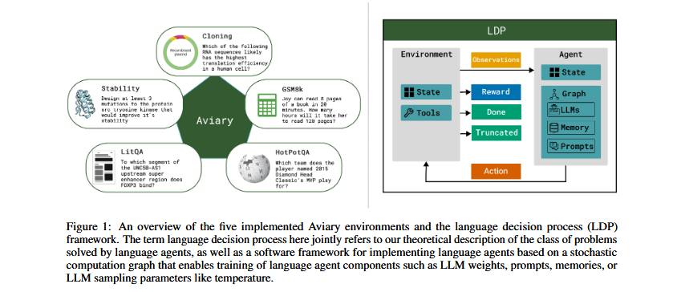

# AVIARY: Training Language Agents on Challenging Scientific Tasks

## Abstract

Solving complex real-world tasks requires cycles of actions and observations. This is particularly true in science where tasks require many cycles of analysis, tool use, and experimentation. Language agents are promising for automating intellectual tasks in science because they can interact with tools via natural language or code. Yet their flexibility creates conceptual and practical challenges for software implementations, since agents may comprise non-standard components such as internal reasoning, planning, tool usage, as well as the inherent stochasticity of temperature-sampled language models. Here, we introduce Aviary, an extensible gymnasium for language agents. We formalize agents as policies solving language-grounded partially observable Markov decision processes, which we term language decision processes. We then implement five environments, including three challenging scientific environments: (1) manipulating DNA constructs for molecular cloning, (2) answering research questions by accessing scientific literature, and (3) engineering protein stability. These environments were selected for their focus on multi-step reasoning and their relevance to contemporary biology research. Finally, with online training and scaling inference-time compute, we show that language agents backed by open-source,on-frontier LLMs can match and exceed both frontier LLM agents and human experts on multiple tasks at up to 100x lower inference cost.

## Introduction

Language agents are AI agents that integrate LLMs as core components. LLMs excel at zero-shot generalization, providing a notable advantage over tradiitional AI agents, such as those based on handcrafted rules or reinforcement learning, which often struggle to generalize to new environments. While LLMs can exhibit flawed reasoning and logic when used in isolation, constructing a language agent by grounding LLMs in an environment with observational feedback can mitigate these issues. Early work on language agents used LLMs to directly output actions in the external environment, while more recently, language agents have been augmented with internal reasoning, and planning procedures, as well as long-term memory storage.

An emergent research challenge is to pose a theoretical description of the learning problem solved by language agents and to develop efficient methods to optimize the components of a language agent. Here, we define common language agent tasks as language decision processes(LDPs) and frame language agents as stochastic computation graphs that may be trained to solve LDPs. We know that the pre-existing agents can be implemented with our stochastic computation graph framework and introduce a simple and extensible software package named LDP that enables modular interchange of environments, agents and optimizers, simplifying experimentation across a variety of settings.

In the problems we consider, we use the term optimization of language agents in the reinforcement sense to encompass procedures that yield iterative improvement of the language agent over time through feedback from an environment. An example of one such optimization algorithm is expert iteration(EI) which achieves learning through successive rounds of supervised fine tuning on (self-)generated trajectories from a progressively stronger language agent. Other approaches include outcome supervision, which is similar to rejection-sampled expert iteration, and process supervision, which still selects high-reward trajectories, but also focuses on the individual steps of the outcome.

In what follows, we introduce our definition of an environment, a language decision process, and optimization of agents baacked by a stochastic computation graph. The scientific environments integrated are (1) DNA construct engineering, where the task is to answer questions pertaining to molecular cloning, (2) scientific literature question answering, where the task is to answer a multiple choice question by finding a specific passage from the scientific literature, and (3) protein design, where the goal is to propose mutations to improve the stability of a given protein sequence. On the DNA construct design and scientific literature question answering environments, we demonstrate that language agents based on the small, open-source Llama-3.1-8B-Instruct model, when trained with expert iteration and using inference-time majority vote sampling, can exceed the performance of both human experts and frontier LLMs.

### 2 Related Work

**Language Agent Formalisms** Although language agents have achieved impressive empirical performance across a range of applications, there is still no univerally agreed upon theoretical framework for defining a language agent. In terms of conceptual models, the cognitive architectures for language agents(CoALA) framework, inspired by ideas from production systems and cognitive architectures, taxonomizes agents according to their information storage(working and long-term memories), decision making procedures e.g. planning, and action space(divided into internal and external actions). The author describes language agents as consisting of memory, planning and tool usage components. Theoretically, many works represent langauge agents as partially observable Markov decision processes, yet differ in their treatment of the action space, the authors partitions the action space into internal and external actions in a similar fashion to CoALA where internal actions are a family of functions that operate on the agent's memory and external actions elicit an interaction with the environment. By contrast the authors do not make a distinction between internal and external actions. The authors introduce a general framework for studying the design and analysis of LLM-based algorithms based on a computational graph where they assume LLM nodes are stateless, leaving considerations of aspects of language agnts such as memory to future work.

**Language Agent Optimization Frameworks** Optimization of language agents may involve the learning of prompts, tool usage, LLM weights , LLM inference hyperparameters such as temperature, as well as more exotic language agent components such as edges between nodes in multiagent computation graphs. Frameworks such as LangChain and LlamaIndex support manual optimization of prompts via human editing. Optimizers such as EcoOptiGen leverage black-box optimization schemes to learn LLM inference hyperparameters such as temperature, the maximum number of tokens, and the number of completions. Prompt Optimization comprises the optimization of white-box LLMs and black-box LLMs(LLMs that exist behind an API and for which numerical gradients are unavailbale). In white-box prompt optimization numerical gradients can be taken over soft prompts, the embedding representation of the text based hard prompt 