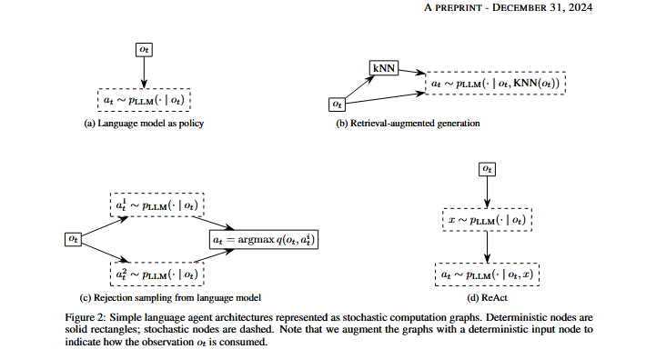
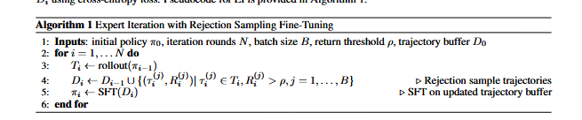
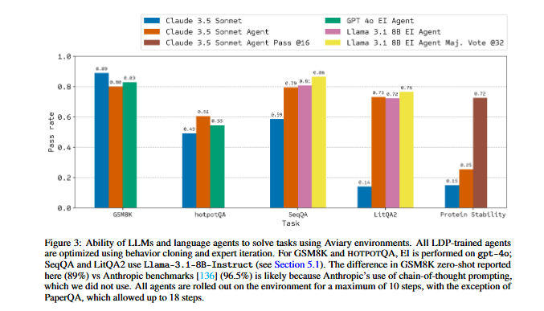
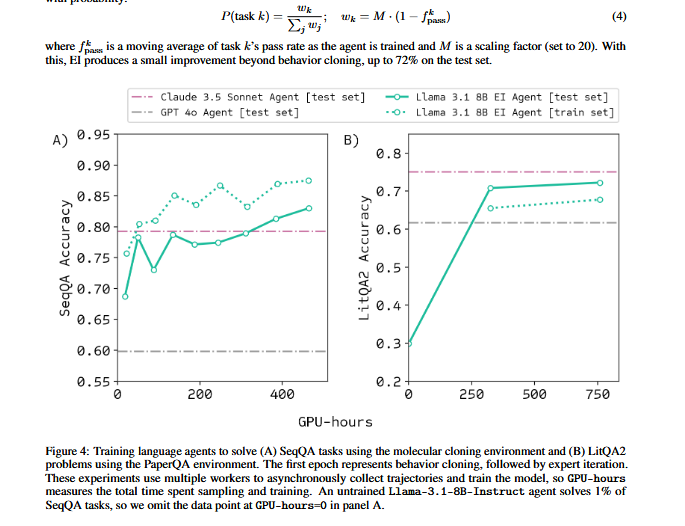
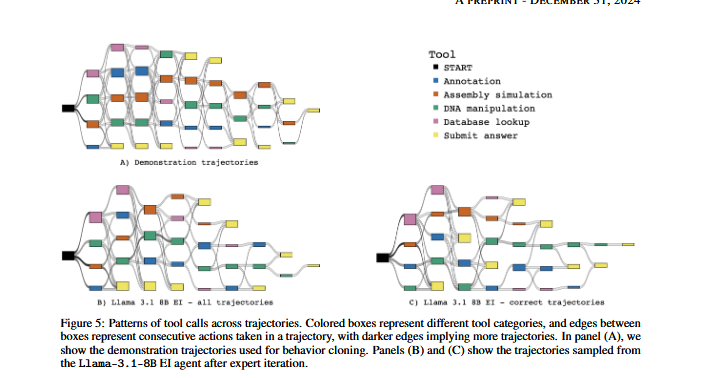
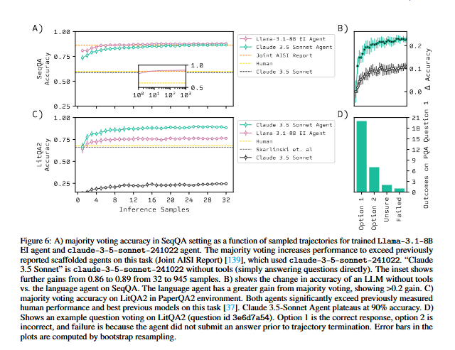

# AVIARY: Training Language Agents on Challenging Scientific Tasks

## Abstract

Solving complex real-world tasks requires cycles of actions and observations. This is particularly true in science where tasks require many cycles of analysis, tool use, and experimentation. Language agents are promising for automating intellectual tasks in science because they can interact with tools via natural language or code. Yet their flexibility creates conceptual and practical challenges for software implementations, since agents may comprise non-standard components such as internal reasoning, planning, tool usage, as well as the inherent stochasticity of temperature-sampled language models. Here, we introduce Aviary, an extensible gymnasium for language agents. We formalize agents as policies solving language-grounded partially observable Markov decision processes, which we term language decision processes. We then implement five environments, including three challenging scientific environments: (1) manipulating DNA constructs for molecular cloning, (2) answering research questions by accessing scientific literature, and (3) engineering protein stability. These environments were selected for their focus on multi-step reasoning and their relevance to contemporary biology research. Finally, with online training and scaling inference-time compute, we show that language agents backed by open-source,on-frontier LLMs can match and exceed both frontier LLM agents and human experts on multiple tasks at up to 100x lower inference cost.

## Introduction

Language agents are AI agents that integrate LLMs as core components. LLMs excel at zero-shot generalization, providing a notable advantage over tradiitional AI agents, such as those based on handcrafted rules or reinforcement learning, which often struggle to generalize to new environments. While LLMs can exhibit flawed reasoning and logic when used in isolation, constructing a language agent by grounding LLMs in an environment with observational feedback can mitigate these issues. Early work on language agents used LLMs to directly output actions in the external environment, while more recently, language agents have been augmented with internal reasoning, and planning procedures, as well as long-term memory storage.

An emergent research challenge is to pose a theoretical description of the learning problem solved by language agents and to develop efficient methods to optimize the components of a language agent. Here, we define common language agent tasks as language decision processes(LDPs) and frame language agents as stochastic computation graphs that may be trained to solve LDPs. We know that the pre-existing agents can be implemented with our stochastic computation graph framework and introduce a simple and extensible software package named LDP that enables modular interchange of environments, agents and optimizers, simplifying experimentation across a variety of settings.

In the problems we consider, we use the term optimization of language agents in the reinforcement sense to encompass procedures that yield iterative improvement of the language agent over time through feedback from an environment. An example of one such optimization algorithm is expert iteration(EI) which achieves learning through successive rounds of supervised fine tuning on (self-)generated trajectories from a progressively stronger language agent. Other approaches include outcome supervision, which is similar to rejection-sampled expert iteration, and process supervision, which still selects high-reward trajectories, but also focuses on the individual steps of the outcome.

In what follows, we introduce our definition of an environment, a language decision process, and optimization of agents baacked by a stochastic computation graph. The scientific environments integrated are (1) DNA construct engineering, where the task is to answer questions pertaining to molecular cloning, (2) scientific literature question answering, where the task is to answer a multiple choice question by finding a specific passage from the scientific literature, and (3) protein design, where the goal is to propose mutations to improve the stability of a given protein sequence. On the DNA construct design and scientific literature question answering environments, we demonstrate that language agents based on the small, open-source Llama-3.1-8B-Instruct model, when trained with expert iteration and using inference-time majority vote sampling, can exceed the performance of both human experts and frontier LLMs.

### 2 Related Work

**Language Agent Formalisms** Although language agents have achieved impressive empirical performance across a range of applications, there is still no univerally agreed upon theoretical framework for defining a language agent. In terms of conceptual models, the cognitive architectures for language agents(CoALA) framework, inspired by ideas from production systems and cognitive architectures, taxonomizes agents according to their information storage(working and long-term memories), decision making procedures e.g. planning, and action space(divided into internal and external actions). The author describes language agents as consisting of memory, planning and tool usage components. Theoretically, many works represent langauge agents as partially observable Markov decision processes, yet differ in their treatment of the action space, the authors partitions the action space into internal and external actions in a similar fashion to CoALA where internal actions are a family of functions that operate on the agent's memory and external actions elicit an interaction with the environment. By contrast the authors do not make a distinction between internal and external actions. The authors introduce a general framework for studying the design and analysis of LLM-based algorithms based on a computational graph where they assume LLM nodes are stateless, leaving considerations of aspects of language agnts such as memory to future work.

**Language Agent Optimization Frameworks** Optimization of language agents may involve the learning of prompts, tool usage, LLM weights , LLM inference hyperparameters such as temperature, as well as more exotic language agent components such as edges between nodes in multiagent computation graphs. Frameworks such as LangChain and LlamaIndex support manual optimization of prompts via human editing. Optimizers such as EcoOptiGen leverage black-box optimization schemes to learn LLM inference hyperparameters such as temperature, the maximum number of tokens, and the number of completions. Prompt Optimization comprises the optimization of white-box LLMs and black-box LLMs(LLMs that exist behind an API and for which numerical gradients are unavailbale). In white-box prompt optimization numerical gradients can be taken over soft prompts, the embedding representation of the text based hard prompt. In black box prompt optimization a multitude of techniques have been applied which attempt to overcome the absence of gradients. 

**Language Agent Benchmarks** Existing language agent benchmarks fetaure a broad range of applications including machine learning tasks, data science, data analysis, quantitative reasoning, and causal reasoning. In Aviary, we place particular focus on scientific tasks. Relevant work in this area included DiscoveryBench, a benchmark for data driven hypothesis generation, ChemBench which focuses on chemistry tasks, BLADE which is considered with data-driven science, SciAgent a benchmark for scientific reasoning, DISCOVERYWORLD which concentrates on cycles of scientific discovery, and ScienceWorld which is considered with scientific reasoning. For a review focused on scientifically-relevant agents the reader is directed to. In Avairy we focus on sequential decision-making tasks that necessitate multiple steps of agent-environment interactions. We construct environments from the pre-existing datasets such as GSM8K, HOTPOTQA and LitQA2 by casting them as parameterizable tools manipulating an environment state.

Our principal contributions are: (1) A precise definition of language decision processes(LDPs) for language-agent tasks and encompass many proposed agent architectures as stochastic computation graphs. (2) We introduce Aviary, a gym framework that emphasizes multi-step reasoning and tool usage, and provide five gym implementations. (3) We demonstrate that non-frontier LLMs, trained online with inference time sampling, can match or exceed the performance of frontier models on these tasks with a modest compute budget. (4) We release Aviary and our LDP framework as open-source software libraries to enable broader use and experimentation.

### 3 Theory

##### 3.1 Language Decision Processes 

A language decision process is a partially observable markov decision process whose action and observation spaces are represented in natural language. It can be defined as a tuple of a non-empty alphabet, state space , action space, observation space, transition function, observation function, reward function and discount factor.

Unlike traditional reinforcement learning agents, feedback for language agents is "grounded" in the sense that environment observations must be converted to text. As such, the alphabet is an important component of the LDP definition. The solution to an LDP is a policy where the set of policy parameters is abstract and encapsulates any optimizable parameter of the language agent that may impact the action chosen such as LLM weights, inference hyperparameters such as temperature, as well as parameterized procedures such as internal reasoning.

In contrast to previous works which demarcate between internal and external actions, where internal actions include reasoning and memory retrieval, in our problem framing we consider the action space to strictly constitute interactions with the external environment, allowing our parameter set to subsume optimizable procedures that are internal to the language agents such as memeory retrieval and internal reasoning. Practically, it is worth noting that the complexity of our environments is such that we donot expect to optain the globally optimal policy. Our more modest goal is to be able to optimize the parameter set in a direction that improves the policy over time.

The observation in all environments we consider are deterministic functions of the state and so the reader may assume Z-1 henceforth. For example, the environment may involve executing code and the observation is side-effects of the code. The state S would include all information necessary to include the Markov property of the transition function: the file system, the version of packages, any environment variables, the hardware etc. However, the observation is just the output message of the executed code.

##### 3.2 Stochastic Computation Graphs

In the general case, a language agent may include both stochastic and deterministic operations. We build on the formalism of stochastic computation graphs (SCG): directed, acyclic graphs with nodes corresponding to computations and edges corresponding to arguments.

Note that inputs to the graph can be treated as constant (deterministic) nodes. Outputs of the graph are leaf nodes.
A language agent’s policy is simply an SCG with a string input (the observation) and a string output (the action). Language agent architectures can be easily expressed as SCGs by combining deterministic and stochastic nodes.

(a) Language model as policy: a single stochastic node corresponding to sampling from the language model.
(b) Retrieval-augmented generation (RAG): a deterministic node (document retrieval) leading to a stochastic node(LLM sampling).
(c) Rejection sampling from LLM: several stochastic nodes (LLM samples), all leading to a deterministic node(selecting the preferred sample).
(d) ReAct: two consecutive stochastic nodes, corresponding to sampling a reasoning string and an action(tool call).

##### 3.3 Training Methods

Below we describe commonly used imitation learning mehtods employed to improve language agent performance on our environments. These training methods do not optimize the SCG graph directly, instead we optimize only the language model node in the SCG.

**Behavior cloning** BC refers to a general imitation learning technique that derives a policy by supervised learning on high quality trajectories termed expert demonstrations. In the context of language agents this is typically achieved by supervised fine-tuning (SFT) of an LLM on either human trajectories or trajectories generated from a stronger LLM. We use it to initialize the trajectory buffer for an expert iteration loop on Llama-3.1-8B-Instruct, due to its instability to self generate successful trajectories prior to training.

**Expert Iteration** It performs behavior cloning in an iterative fashion, improving the demonstration data each iteration. The inputs to the EI algorithm are a basr LLM represented as an intial policy $\pi_{\theta}$ and a trajectory buffer $D_{0}$ which may either be empty or consist of an initial set of demonstrations generated by a human expert or a stronger LLM. At each round of EI, first a batch B of trajectories are sampled from the current policy $\pi_i$ (via rollout). Then these trajectories ${(T_i^{(j)})}_{j=1}^B$ are filtered (the rejection sampling step) based on return R exceeding a threshold value p. The filtered trajectories are then appended to the trajectory buffer $D_i$ and the current LLM, $\pi_i$ is fine-tuned on $D_i$ using cross-entropy loss.

**Inference Compute Scaling** Scaling inference-time compute to improve LLM performance is now a frequently-
employed technique . There are two common settings: oracle-verified (pass@k) and majority vote
(consensus@k). if an oracle verifier can identify any correct solution – namely,if you can obtain just one correct answer among k – then it is possible to scale across multiple orders of magnitude. Without an oracle verifier, majority voting can be used. 

Majority voting is simply the consensus response, which requires some natural binning of responses. Although oracle verification scales to very large numbers of completions , majority voting plateaus more quickly than oracle verification . In this work, we omit any unsure or truncated trajectories (trajectories for which the agent did not submit an answer) from majority voting.

### Results

Using ldp, we train language agents in the environments described above. Since these environments are challenging, expert iteration initially rejects the majority of trajectories, leading to very slow learning. We therefore begin with a period of behavior cloning, using high-quality trajectories collected by rejection-sampling from a larger LLM. Once the language agent can solve a reasonable fraction of training problems, we switch to expert iteration. All experiments are conducted with Llama-3.1-8B-Instruct as the base language model, using Nvidia A100 GPUs.
##### Behavioral Cloning and Expert Iteration

##### Inference Compute Scaling

##### Inference Cost Scaling
