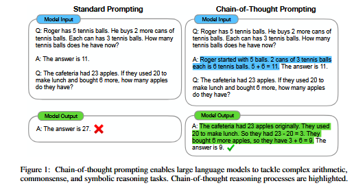
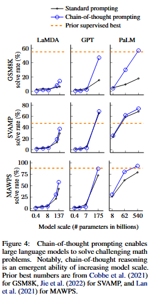
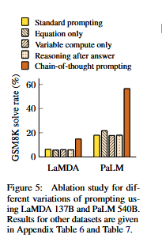
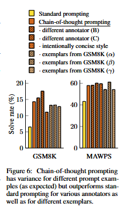
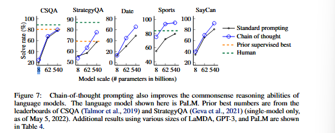
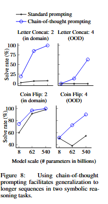
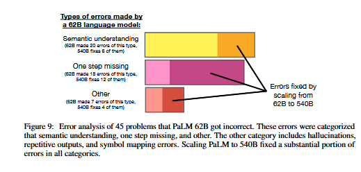

# Chain-of Thought Prompting Elicits Reasoning in Large Language Models

## Abstract

- We explore how generating a chain of thought—a series of intermediate reasoning steps—significantly improves the ability of large language models to perform complex reasoning. In particular, we show how such reasoning abilities emerge naturally in sufficiently large language models via a simple method called chain-of- thought prompting, where a few chain of thought demonstrations are provided as exemplars in prompting.

Experiments on three large language models show that chain-of-thought prompting improves performance on a range of arithmetic, commonsense, and symbolic reasoning tasks. The empirical gains can be striking. For instance, prompting a PaLM 540B with just eight chain-of-thought exemplars achieves state-of-the-art
accuracy on the GSM8K benchmark of math word problems, surpassing even finetuned GPT-3 with a verifier.

### 1. Introduction

- The NLP landscape has recently been revolutionized by language models. Scaling up the size of language models has been shown to confer a range of benefits, such as improved performance and sample efficiency. However, scaling up model size alone has not proved sufficient for achieving high performance on challenging tasks such as arithmetic, commonsense, and symbolic reasoning.

- This work explores how the reasoning abillity of llms can be unlocked by a simple method motivated by two ideas. First, techniques for arithmetic reasoning can benefit from generating natural language ratioanles that lead to the final answer. Prior work has given models the ability to generate natural language intermediate steps by training from scratch or finetuning a pretrained model, in addition to neuro-symbolic methods that use formal languages isntead of natural language. Second, large language models offer the exciting prospect of in-context few-shot learning via prompting. That is, instead of fine-tuning a separate langauge model checkpoint for each new task, one can simply "prompt" the model with a few input-output exemplars demonstrating the task. Remarkably, this has been successful for a range of simple question-answering tasks.

- Both of the above ideas, however, have key limitations. For rationale-augmented training and finetuning methods, it is costly to create a large set of high quality rationales, which is much more complicated than simple input–output pairs used in normal machine learning. For the traditional few-shot prompting method used in Brown et al. (2020), it works poorly on tasks that require reasoning abilities, and often does not improve substantially with increasing language model scale. In this paper, we combine the strengths of these two ideas in a way that avoids their limitations. Specifically, we explore the ability of language models to perform few-shot prompting for reasoning tasks, given a prompt that consists of triples: 〈input, chain of thought, output〉. A chain of thought is a series of intermediate natural language reasoning steps that lead to the final output, and we refer to this approach as chain-of-thought prompting. We present empirical evaluations on arithmetic, commonsense, and symbolic reasoning benchmarks, showing that chain-of-thought prompting outperforms standard prompting, sometimes to a striking degree. Chain-of-thought prompting with PaLM 540B outperforms standard prompting by a large margin and achieves new state-of-the-art performance. A prompting only approach is important because it does not require a large training dataset and because a single model checkpoint can perform many tasks without loss of generality. This work underscores how large language models can learn via a few examples with natural language data about the task (c.f. automatically learning the patterns underlying inputs and outputs via a large training dataset).

### 2. Chain-of-Thought Prompting

- Consider one’s own thought process when solving a complicated reasoning task such as a multi-step math word problem. It is typical to decompose the problem into intermediate steps and solve each before giving the final answer: “After Jane gives 2 flowers to her mom she has 10 . . . then after she gives 3 to her dad she will have 7 . . . so the answer is 7.” The goal of this paper is to endow language models with the ability to generate a similar chain of thought—a coherent series of intermediate reasoning steps that lead to the final answer for a problem. We will show that sufficiently large langugage models can generate chains of thought if demonstrations of chain-of-thought reasoning are provided in the exemplars for few-shot prompting.

Chain-of-thought prompting has several attractive properties as an approach for facilitating reasoning in language models.
    1. First, chain of thought, in principle, allows models to decompose multi-step problems into intermediate steps, which means that additional computation can be allocated to problems that require more reasoning steps.
    2. Second, a chain of thought provides an interpretable window into the behaviour of the model, suggesting how it might have arrived at a particular answer and providing opportunities to debug where the reasoning path went wrong.
    3. Third, chain-of-thought reasoning can be used for tasks such as math word problems, commonsense reasoning, and symbolic manipulation, and is potentially applicable to any task that humans can solve via language.
    4. Finally, chain-of-thought reasoning can be readily elicited in sufficiently large off-the-shelf language models simply by including examples of chain of thought sequences into the exemplars of few-shot prompting.

#### 3. Arithmetic Reasoning
Strikingly, chain-of-thought prompting when used with the 540B parameter language model performs comparably with task-specific finetuned models on several tasks, even achieving new state of the art on the challenging
GSM8K benchmark.
##### 3.1 Experimental Setup
We explore chain-of-thought prompting for various language models on multiple benchmarks.

**Standard Prompting**: For the baseline, we consider standard few-shot prompting, in which a language model is given in-context exemplars of input-output pairs before outputting a prediction for a test-time example. Exemplars are formatted as questions and answers. The model gives the answer directly.

**Chain-of-thought prompting**: Our proposed approach is to augment each exemplar in few-shot prompting with a chain of thought for an associated answer. As most of the datasets only have an evaluation split, we manually composed a set of eight few-shot exemplars with chain-of-thought prompting. To investigate whether chain-of-thought prompting in this form can successfully elicit successful reasoning across a range of math world problems, we used this single set of eight chain of thought exemplars for all benchmarks, except AQuA, which is a multiple choice instead of free response.

**Language Models**: We evaluate five large language models. The first is GPT3. Second is LaMDA, and third is PaLM, fouth is UL2 20B and the fifth is codex.

#### 3.2 Results

- Chain-of-thought prompting doesnot positively impact performance for small models, and only yields performance gains when used with models of $\approx$ 100B parameters. We qualitatively found that the models of smaller scale produced fluent but illogical chains of thought, leading to lower performance than standard prompting.

- Seond, chain-of-thought prompting has larger performance gains for more complicated problems. For instance, for GSM8K (the dataset with the lowest baseline performance), performance more than doubled for the largest GPT and PaLM models. On the other hand, for SingleOp, the easiest subset of MAWPS which only requires a single step to solve, performance improvements were either negative or very small.

- Third, chain-of-thought prompting via GPT-3 175B and PaLM 540B compares favorably to prior state of the art, which typically finetunes a task-specific model on a labeled training dataset. On the other two datasets, AQuA and ASDiv, PaLM with chain-of-thought prompting reaches within 2% of the state of the art.

The summary of this analysis is that 46% of the chains of thought were almost correct, barring minor mistakes (calculator error, symbol mapping error, or one reasoning step missing), and that the other 54% of the chains of thought had major errors in semantic understanding or coherence. To provide a small insight into why scaling improves chain-of-thought reasoning ability, we performed a similar analysis of errors made by PaLM 62B and whether those errors were fixed by caling to PaLM 540B. The summary is that scaling PaLM to 540B fixes a large portion of one-step missing and semantic understanding errors in the 62B model.

#### 3.3 Ablation Study

**Equation Only**:One reason for why chain-of-thought prompting might help is that it produces the mathematical equation to be evaluated, and so we test a variation where the model is prompted to output only a mathematical equation before giving the answer.equation
only prompting does not help much for GSM8K, which implies that the semantics of the questions in GSM8K are too challenging to directly translate into an equation without the natural language reasoning steps in chain of thought. For datasets of one-step or two-step problems, however, we find that equation only prompting does improve performance, since the equation can be easily derived from the question.

**Variable compute only**: Another intuition is that chain of thought allows the model to spend more computation on harder problems. To isolate the effect of varibale computation from chain-of-thought reasoning, we test a configuration where the model is prompted to output a sequence of dots equal to the number of characters in the equation needed to solve the problem. This variant performs about the same as the baseline, which suggests that variable computation by itself is not the reason for the success of chain-of-thought prompting and that there appears to be utility from expressing intermediate steps via natural language.

**Chain of thought after answer**: Another potential benefit of chain-of-thought prompting could simply be that such prompts allow the model to better access relevant knowledge acquired during pretraining. Therefore, we test an alternative configuration where the chain of thought prompt is only given after the answer, isolating whether the model actually depends on the produced chain of thought to give the final answer. This variant performs aboout the same as the baseline, which suggests that the sequential reasoning embodied in the chain of thought is useful for reasons beyond just activating knowledge.

#### 3.4 Robustness of Chain of Thought

Sensitivity to exemplars is a key consideration of prompting approaches- for instance, varying the permutation of few-shot exemplars can cause the accuracy of GPT-3 on SST-2 to range from near chance(54.3%) to near state of the art(93.4%). In this final subsection, we evaluate robustness to chains of thought written by different annotators.In addition to the results above, which used chains of thought written by an Annotator A, two other co-authors of this paper independently wrote chains of thought for the same few-shot exemplars. 

Although there is variance among different chain of thought annotations, as would be expected when using exemplar-based prompting, all sets of chain of thought prompts outperform the standard baseline by a large margin. This result implies that successful use of chain of thought doesnot depend on a particular linguistic style.

To confirm that successful chain-of-thought prompting
works for other sets of exemplars, we also run experiments with three sets of eight exemplars randomly sampled from the GSM8K training set, an independent source. 

In addition to robustness to annotators independently-written chains of thought, different exemplars,and various language models, we also find that chain-of-thought prompting for arithmetic reasoning
is robust to different exemplar orders and varying numbers of exemplars.

### 4. Commonsense Reasoning

- Although chain of thought is particularly suitable for math word problems, the language-based nature of chain thought actually makes it applicable to a broad class of commonsense reasoning problems, which involve reasoning about physical and human interactions under the presumption of general background knowledge. Commonsense reasoning is key for interacting with the world and is still beyond the reach of current natural language understanding systems.

**Prompts** We follow the same experimental setup as the prior section. For CSQA and StrategyQA, we randomly selected examples from the training set and manually composed chains of thought for them to use as few-shot exemplars. The two BIG-bench tasks do not have training sets, so we selected the first ten examples as exemplars in the evalaution set as few-shot exemplars and report numbers on the rest of the evaluation set.

**Results** For all tasks, scaling up model size improved the performance of standard prompting; chain-of-thought prompting led to further gains, with improvements appearing to be largest for PaLM 540B. With chain-of-thought prompting, PaLM 540B achieved strong
performance relative to baselines, outperforming the prior state of the art on StrategyQA (75.6% vs 69.4%) and outperforming an unaided sports enthusiast on sports understanding (95.4% vs 84%). These results demonstrate that chain-of-thought prompting can also improve performance on tasks requiring a range of commonsense reasoning abilities (though note that gain was minimal on CSQA).

### 5. Symbolic Reasoning

Our final experimental evaluation considers symbolic reasoning, which is simple for humans but potentially challenging for language models. We show that chain-of-
thought prompting not only enables language models to
perform symbolic reasoning tasks that are challenging in
the standard prompting setting, but also facilitates length generalization to inference-time inputs longer than those seen in the few-shot exemplars.

**Tasks**: 
    - **Last Letter Concatenation**:This task asks the model to concatenate the last letters of words in a name (e.g.,“Amy Brown” → “yn”). It is a more challenging version of first letter concatenation, which language models can already perform without chain of thought.3 We generate full names by randomly concatenating names from the top one-thousand first and last names from name census.
    - **Coin flip**:This task asks the model to answer whether a coin is still heads up after people either flip or don’t flip the coin (e.g., “A coin is heads up. Phoebe flips the coin. Osvaldo does not flip the coin. Is the coin still heads up?”→ “no”).

As the construction  of these symbolic reasoning tasks is
well-defined, for each task we consider an in-domain test
set for which examples had the same number of steps as
the training/few-shot exemplars, as well as an out-of-domain (OOD) test set, for which evaluation
examples had more steps than those in the exemplars. For last letter concatenation, the model only sees exemplars of names with two words, and then performs last letter concatenation on names with 3 and 4 words.4 We do the same for the number of potential flips in the coin flip task. Our experimental setup uses the same methods and models as in the prior two sections. We again manually compose chains of thought for the few-shot exemplars for each task.

ote that these in-domain evaluations are “toy tasks” in the
sense that perfect solution structures are already provided by the chains of thought in the few-shot
exemplars; all the model has to do is repeat the same steps with the new symbols in the test-time
example. And yet, small models still fail—the ability to perform abstract manipulations on unseen
symbols for these three tasks only arises at the scale of 100B model parameters.
As for the OOD evaluations, standard prompting fails for both tasks. With chain-of-thought prompting, language models achieve upward scaling curves (though performance is lower than in the in-domain setting). Hence, chain-of-thought prompting facilitates length generalization beyond seen chains of thought for language models of sufficient scale.

### 6. Discussion

We have explored chain-of-thought prompting as a simple mechanism for eliciting multi-step reasoning behavior in large language models. We first saw that chain-of-thought prompting improves performance by a large margin on arithmetic reasoning, yielding improvements that are much stronger than ablations and robust to different annotators, exemplars, and language models.

For many reasoning tasks where standard prompting has a flat scaling curve, chain-of-thought prompting leads to dramatically increasing scaling curves. Chain-of-thought prompting appears to expand the set of tasks that large language models can perform successfully—in other words, our work underscores that standard prompting only provides a lower bound on the capabilities of large language models. This observation likely raises more questions than it answers—for instance, how much more can we expect reasoning ability to improve with a further increase in model scale? What other prompting methods might expand the range of tasks that language models can solve?

As for limitations, we first qualify that although chain of thought emulates the thought processes of human reasoners, this does not answer whether the neural network is actually “reasoning,” which we leave as an open question. Second, although the cost of manually augmenting exemplars with chains of thought is minimal in the few-shot setting, such annotation costs could be prohibitive for finetuning (though this could potentially be surmounted with synthetic data generation, or zero-shot generalization). Third, there is no guarantee of correct reasoning paths, which can lead to both correct and incorrect answers; improving factual generations of language models is an open direction for future work.Finally, the emergence of chain-of-thought reasoning only at large model scales makes it costly to serve in real-world applications; further research could explore how to induce reasoning in smaller models.

### 7. Conclusions

We have explored chain-of-thought prompting as a simple and broadly applicable method for enhancing reasoning in language models. Through experiments on arithmetic, symbolic, and commonsense reasoning, we find that chain-of-thought reasoning is an emergent property of model scale that allows sufficiently large language models to perform reasoning tasks that otherwise have flat scaling curves. Broadening the range of reasoning tasks that language models can perform will hopefully inspire further work on language-based approaches to reasoning.

**Q. Why does increasing model scale improve chain-of-thought pompting?**

- The finding that successful chain-of-thought reasoning predictably emerges only at certain model scales is intriguing.caling up language models has been shown to confer benefits such as improved performance and sample efficiency, but chain-of-thought reasoning is emergent in the sense that its success cannot be predicted only by extrapolating the performance of small scale models,as chain of thought actually hurts performance for most models smaller than 10B parameters.

- The question of why model scale improves chain-of-thought prompting is certainly multi-faceted, and we made a preliminary attempt to shed insight into it via error analysis. This small analysis involved manually reading 45 errors made by PaLM 62B and categorizing them into semantic understanding (20 errors), one step missing (18 errors), and other errors (7 errors). The “other category” included hallucinations, repetitive outputs, and symbol mapping errors. This categorization is a coarse one borrowed from the initial error analysis done on LaMDA, for which categories were conceived based on what improvements were needed to make the chain of thought correct.

- There are also three notable points regarding why small language models fail. The first observation is that small language models fail at even relatively easy symbol mapping tasks. As demonstrated in Section 5, for even symbolic reasoning tasks that only require generalization to new examples using the same chain of thought logical structure that was given in the few-shot exemplars, small language models still failed. The second observation is that small language models seem to have inherently weaker arithmetic abilities, the ability to do simple arithmetic operations (without semantic understanding) requires sufficient model scale. Finally, we noticed qualitatively that small language models often did not generate a final answer that could be parsed, due to either repetitions or logic that never arrived at a final answer.

- In summary, the success of chain-of-thought reasoning as a result of model scale is a complicated phenomena that likely involves a variety of emergent abilities (semantic understanding, symbol mapping, staying on topic, arithmetic ability, faithfulness, etc). Future work could more thoroughly investigate what properties of pretraining data, model architecture, and optimization objective causally enable such reasoning capabilities.

**Q. What is the role of prompt engineering?**

- One of the key considerations of prompting is sensitivity to the exact prompt. There is no shortage of work showing that prompts affect language models in unexpected ways.The general way that we created chain of thought annotations was by taking eight exemplars from the training set and decomposing the reasoning process into multiple steps leading to the final answer. To analyze how sensitive chain of thought is to prompt engineering, we performed robustness experiments with respect to various factors.

**Different Annotators**
**Annotators without machine learning background**
**Different exemplars**
**Different order of exemplars**
**Different number of exemplars**
**Different language models**

Prompt engineering still matters, though. Although the results are relatively robust to the prompt for arithmetic reasoning, we want to be clear that prompt engineering still does matter, and can improve performance significantly in many cases. Though most chain of thought annotations outperform standard prompting, there is large variation in many cases. For instance, for the coin flip task, the performance varied from 99.6% for Annotator A to 71.4% for Annotator C, though both were above standard prompting = 50.0% (see Table 7). There are even tasks where prompt engineering is a requirement for good performance. In preliminary experiments, we tried using chain of thought to enable language models to reverse the order of a list of 5 items. While two co-authors were not able to write chain of thought prompts that solved the task despite their best attempts, a third co-author was able to write a chain of thought that perfectly solved the task.

How to generate chain of thought annotations in a robust fashion could be an interesting direction for future work. For instance, an idea here could be to use a large language model to automatically generate chains of thought via prompting (and potentially optimize this over a validation set).

**Will chain-of-thought prompting improve performance for my task of interest?**

While chain-of-thought prompting is in principle applicable for any text-to-text task, it is more
helpful for some tasks than others. Based on the experiments in this paper, our intuition is that chain
of thought helps the most when three conditions are met: (1) the task is challenging and requires multi-step reasoning, (2) a large language model is used, and (3) the scaling curve is relatively flat. Conversely, the benefits are smaller when one or more of these conditions are not met.

These intuitions are perhaps supported by the arithmetic reasoning results. The performance gain from chain-of-thought prompting is largest for PaLM 540B on GSM8K (challenging multi-step problems, flat scaling curve), which meets these conditions. The performance gain is small for the subsets of MAWPS that only require one or two steps (SingleOP, SingleEq, and AddSub), for which PaLM 540B already achieves performance of 90% or higher (and it is also generally true that there is
less headroom for improvement when performance is already strong).

Although in this paper we focused on multi-step reasoning tasks (arithmetic, commonsense, and symbolic), chain-of-thought prompting can potentially be applied to any task for which humans use a “chain of thought” to solve (at least in principle). We leave the empirical evaluation of chain-of-thought prompting on such diverse tasks (e.g., machine translation, etc.) to future work.

**Why is prompting with the equation only not enough for some arithmetic reasoningdatasets?**

Prompting with the equation only as an intermediate step does help on many datasets, especially when
the datasets only require a few reasoning steps (SVAMP, ASDiv, MAWPS). For GSM8K, however, using the equation only did not improve performance substantially. Based on qualitative analysis, we believe that these questions are too semantically challenging for the model to directly translate them into a math equation. Consider this example from LaMDA 137B:
It is hard for the model to directly translate all of the semantics into a single equation, but chain of thought allows it to better reason about each part of the question via intermediate steps in natural language.