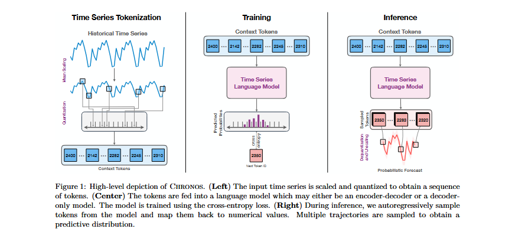

# Chronos

## Abstract 

- A simple framework fo pretrained probabilistic time series models. CHRONOS tokenizes time series values using scaling and quantization into a fixed vocabulary and trains existing transformer-based language model architectures on these tokenized time series via the cross-entropy loss.

## Introduction 

- Time series forecasting is an essential component of decision-making across various domains, including retail, energy,finance, healthcare, climate science, among others. 

- _Deep Forecasters_ : have the ability to extract patterns out of a large collection of time series. Despite their impressive performance, deep forecasters still operate in the standard regime of training and prediction on the same dataset. 

- Despite the apparent distinction - tokens from a finite dictionary versus values from an unbounded, ususally continuous domain-- both endeavors fundamentally aim to model the sequential structure of the data to predict future patterns. 

- CHRONOS tokenizes time series into discrete bins through simple scaling and quantization of real values. 

- **DATA AUGMENTATION STRATEGIES**: TSMixup, KernelSynth.

- *TSMixup*: It randomly samples a set of base time series from different training datasets, and generates new time series based on a convex combination of them.

- *KernelSynth*: It uses Gaussian processes to generate synthetic time series by randomly composing kernel functions.

## Background

- **Time Series forecasting** concerns using historical data from a quantity of interest to predict their future values.

- Formally, given a uniformly-spaced time series $x_{1:C}$=[$x_1,\dots,x_C$], we are interested in predicting, the joint distribution of the next H steps, $p(x_{C+1:C+H}|x_{1:C})$. In this work, we focus on _univariate_ forecasting, where the observations are scalars, i.e., $x_i \epsilon R$ for all i.

- Time series forecasting can be addressed with a variety of different methods which can be broadly categorized into classical forecasting methods and deep learning methods. 

- Classical forecasting methods such as ETS, ARIMA, Theta fit a separate model to each time series independently. In contrast, deep learning forecasting models learn across time series in a given dataset(global models).

- Apart from the choice of architecture, these approaches differ in the way they model the target, with some modeling the density function while others directly predicting a set of quantiles.
 
- Not all models produce probabilistic forecasts: notably, models such as Informer and DLinear only produce point forecasts.

- The original transformer structure is an encoder-decoder