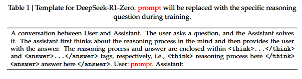
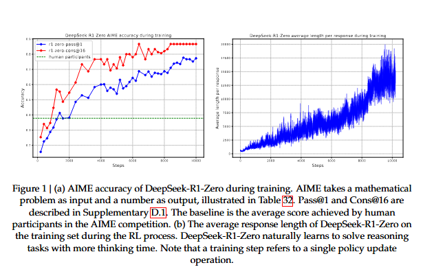
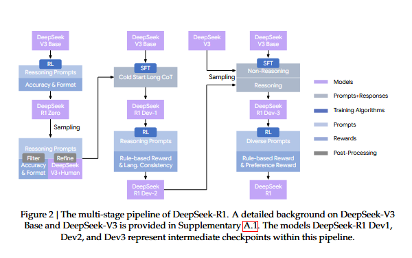
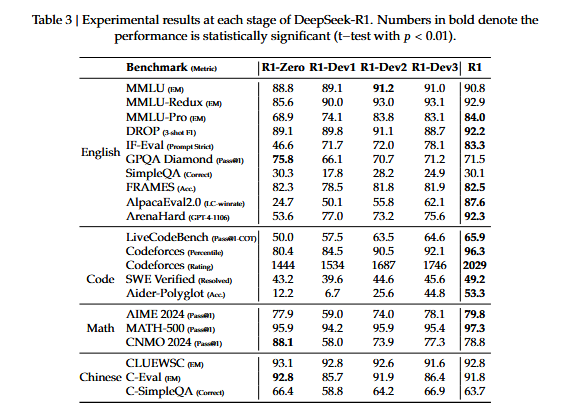

# DeepSeek-R1: Incentivizing Reasoning Capability in LLMs via Reinforcement Learning

### Abstract

General reasoning represents a long-standing and formidable challenge in artificial intelligence. Recent breakthroughs, exemplified by large language models(LLMs) and chain of thought prompting, have achieved considerable success on foundational reasoning tasks. However, this success is heavily contingent upon extensive human-annotated demonstrations,and model's capabilities are still insufficient for more complex problems. Here we show that the reasoning abilities of LLMs can be incentivized through pure reinforcement learning, obviating the need for human-labeled reasoning trajectories. The proposed RL framework facilitates the emergent development of advanced reasoning patterns, such as self-reflection, verification, and dynamic strategy adaptation. Consequently, the trained model achieves superior performance on verifiable tasks such as mathematics,coding competitions and STEM fields, surpassing its counterparts trained via conventional supervised learning on human demonstrations. Moreover, the emergent reasoning patterns exhibited by these large-scale models can be systematically harnessed to guide and enhance the reasoning capabilities of smaller models.

### 1. Introduction

Reasoning capability, the cornerstone of human intelligence, enables complex cognitive tasks ranging from mathematical problem-solving to logical deduction and programming. Recent advances in artificial intelligence have demonstrated that large language models can exhibit emergent behaviors, including reasoning abilities, when scaled to a sufficient size. However, achieving such capabilities in pre-training typically demands substantial computational resources. In parallel, a complementary line of research has demonstrated that large language models can be effectively augmented through chain-of-thought prompting. This technique, which involves either providing carefully designed few-shot examples or using minimalistic prompts such as "Let's think step by step" enables models to produce intermediate reasoning steps, thereby substantially enhancing their performance on complex tasks. Similarly, further performance gains have been observed when models learn high-quality, multi-step reasoning trajectories during the post-training phase. Despite their effectiveness, these approaches exhibit notable limitations. Their dependence on human-annotated reasoning traces hinders scalability and introduces cognitive biases. Furthermore, by constraining models to replicate human thought processes, their performance is inherently capped by the human-provided exemplars, which prevents the exploration of superior, non-human-like reasoning pathways.

To tackle these issues, we aim to explore the potential of LLMs for developing reasoning abilities through self-evolution in an RL framework, with minimal reliance on human labeling efforts. Specifically, we build upon DeepSeek-V3-Base and employ Group Relative Policy Optimization(GRPO) as our RL framework. The reward signal is solely based on the correctness of final predictions against ground truth answers, without imposing constraints on the reasoning process itself. Notably, we bypass the conventional supervised fine-tuning phase before RL training. This design choice stems from our hypothesis that human-defined reasoning patterns may limit model exploration, whereas unrestricted RL training can better incentivize the emergence of novel reasoning capabilities in LLMs. Through this process, our model naturally developed diverse and sophisticated reasoning behaviors. In solving reasoning problems, the model exhibits a tendency to generate longer responses, incorporating verification, reflection and the exploration of alternative approaches witihin each response. Although we do not explicitly teach the model how to reason, it successfully learns improved reasoning strategies through reinforcement learning.

Although DeepSeek-R1-Zero demonstrates excellent reasoning capabilities, it faces challenges such as poor readability and language mixing, occasionally combining English and Chinese within a single chain-of-thought response. Furthermore, the rule-based RL training stage of DeepSeek-R1-Zero is narrowly focused on reasoning taks, resulting in limited performance in broader areas such as writing and open-domain question answering. To address these challenges, we introduce DeepSeek-R1, a model trained through a multi-stage learning framework that integrates rejection sampling, reinforcement learning, and supervised fine-tuning. This training pipeline enables DeepSeek-R1 to inherit the reasoning capabilities of its predecessor, DeepSeek-R1-Zero, while aligning model behavior with human preferences through additional non-reasoning data.

### 2. DeepSeek-R1-Zero

We begin by elaborating on the training of DeepSeek-R1-Zero, which relies exclusively on reinforcement learning without supervised fine-tuning. To facilitate large-scale RL efficiently, we adopt Group Relative Policy Optimization(GRPO)

##### 2.1 Group Relative Policy Optimizaiton

GRPO is the reinforcement learning algorithm that we adpot to train DeepSeek-R1-Zero and DeepSeek-R1.It was originally proposed to simplify the training process and reduce the resource consumption of Proximal Policy Optimization which is widely used in the RL stage of LLMs.

For each question q, GRPO samples a group of outputs{$o_1,o_2,\dots,o_G$} from the old policy $\pi_{\theta_{old}}$ and then optimizes the policy model $\pi_{\theta}$ by maximizing the following objective:

$$\mathcal{J}_{\mathrm{GRPO}}(\theta)
=
\mathbb{E}_{\left[
q \sim P(Q),\,
\{o_i\}_{i=1}^{G} \sim \pi_{\theta_{\mathrm{old}}}(O|q)
\right]}$$

$$
\left[
\frac{1}{G}
\sum_{i=1}^{G}
\left(
\min
\left(
\frac{\pi_{\theta}(o_i|q)}
{\pi_{\theta_{\mathrm{old}}}(o_i|q)}
A_i,
\operatorname{clip}
\left(
\frac{\pi_{\theta}(o_i|q)}
{\pi_{\theta_{\mathrm{old}}}(o_i|q)},
1-\epsilon,
1+\epsilon
\right)
A_i
\right)
-
\beta D_{\mathrm{KL}}(\pi_{\theta}\|\pi_{\mathrm{ref}})
\right)
\right]
\tag{1}$$

$$
D_{\mathrm{KL}}(\pi_{\theta}\|\pi_{\mathrm{ref}})
=
\frac{\pi_{\mathrm{ref}}(o_i|q)}
{\pi_{\theta}(o_i|q)}
-
\log
\frac{\pi_{\mathrm{ref}}(o_i|q)}
{\pi_{\theta}(o_i|q)}
-1
\tag{2}
$$

where $\pi_{\mathrm{ref}}$ is a reference policy, $\epsilon and \beta$ are hyper-parameters, and $A_i$ is the advantage, computed using a group of rewards ${r_1,r_2,\dots,\r_G}$ corrsponding to the outputs within each group:

$$A_i
=
\frac{
r_i-\operatorname{mean}(\{r_1,r_2,\ldots,r_G\})
}{
\operatorname{std}(\{r_1,r_2,\ldots,r_G\})
}
\tag{3}$$

To train DeepSeek-R1-Zero, we set the learning rate to 3e-6, the KL coefficient to 0.001, and the sampling temperature to 1 for rollout. For each question, we sample 16 outputs with a maximum length of 32,768 tokens before the 8.2k step and 65,536 tokens afterward. As a result, both the performance and response length of DeepSeek-R1-Zero exhibit a significant jump at the 8.2k step, with training continuing for a total of 10,400 steps corresponding to 1.6 training epochs. Each training step consists of 32 unique questions, resulting in a training batch size of 512.Every 400 steps, we replace the reference model with the latest policy model. To accelerate training, each rollout generates 8,192 outputs, which are randomly split into 16 mini-batches and trained for only a single inner epoch.

##### 2.2 Reward Design

The reward is the source of the training signal, which decides the direction of RL optimization. For DeepSeek-R1-Zero, we employ rule-based rewards to deliver precise feedback for data in mathematical, coding and logical reasoning domains. Our rule-based reward system mainly consists of two types of rewards: accuracy rewards and format rewards.

**Accuracy rewards** evaluate whether the response is correct. For example, in the case of math problems with deterministic results, the model is required to provide the final answer in a specified format, enabling reliable rule-based verification of correctness. Similarly, for code competition prompts, a compiler can be utilized to evaluate the model's responses against a suite of predefined test cases, thereby generating objective feedback on correctness.

**Format rewards** complement the accuracy reward model by enforcing specific formatting requirements. In particular, the model is incentivized to encapsulate its reasoning process within designated tags, specifically '<think>' and '</think>'. This ensures that the model's thought process is explicitly delineated, enhancing interpretability and facilitating subsequent analysis.

$$Reward_{rule}=Reward_{acc}+Reward_{format}$$

The accuracy, reward and format reward are combined with the same weight. Notably, we abstain from applying neural reward models - whether outcome-based or process-based - to reasoning tasks. This decision is predicated on our observation that neural reward models are susceptible to reward hacking during large-scale reinforcement learning. Moreover, retraining such models necessitates substantial computational resources and introduces additional complexity into the training pipeline, thereby complicating the overall optimization process.

##### 2.3 Incentivize Reasoning Capability in LLMs

Specifically, we apply the RL technique on the DeepSeek-V3 base to train DeepSeek-R1-Zero. During training, we design a straightforward template, to require DeepSeek-R1-Zero to first produce a reasoning process, followed by the final answer. We intentionally limit our constraints to this structural format, avoiding any content-specific biases to enusre that we can accurately observe the model's natural progression during the RL process.

DeepSeek-R1-Zero exhibits a steady increase in thinking time throughout training, driven solely by intrinsic adaptation rather than external modifications. Leveraging long CoT, the model progressively refines its reasoning, generating hundreds to thousands of tokens to explore and improve its problem-solving strategies.

The increase in thinking time fosters the autonomous development of sophisticated behaviors. Specifically, DeepSeek-R1-Zero increasingly exhibits advanced reasoning strategies such as reflective reasoning and systematic exploration of alternative solutions, significantly boosting its performance on verifiable tasks like math and coding. 

The self-evolution of DeepSeek-R1-Zero underscores the power and beauty of RL: rather than explicitly teaching the model how to solve a problem, we simply provide it with the right incentives, and it autonomously develops advanced problem-solving strategies. This serves as a reminder of the potential of RL to unlock higher levels of capabilities in LLMs, paving the way for more autonomous and adaptive models in the future.

### 3. DeepSeek-R1

Although DeepSeek-R1-Zero exhibits strong reasoning capabilities, it faces several issues. DeepSeek-R1-Zero struggles with challenges like poor readability, and language mixing, as DeepSeek-V3-Base is trained on multiple languages, especially English and Chinese. To address these issues, we develop DeepSeek-R1.

In the initial stage, we collect thousands of cold-start data that exhibits a conversational, human-aligned thinking process. RL training is then applied to improve the model performance with the converational thinking process and language consistency. Subsequently, we apply rejection sampling and SFT once more. This stage incorporates both reasoning and non-reasoning datasets into the SFT process, enabling the model to not only excel in reasoning tasks but also demonstrate advanced writing capabilities. To further align the model with human preferences, we implement a secondary RL stage designed to enhance the model's helpfulness and harmlessness while simultaneously refining its reasoning capabilities.

##### 3.1 Model-based Rewards

For general data, we resort to reward models to capture human preferences in complex and nuanced scenarios. We build upon the DeepSeek-V3 pipeline and adopt a similar distribution of preference pairs and training prompts. For helpfulness, we focus exclusively on the final summary, ensuring that the assessment emphasizes the utility and relevance of the response to the user while minimizing interference with the underlying reasoning process. For harmlessness, we evaluate the entire response of the model, including both the reasoning process and the summary, to identify and mitigate any potential risks, biases, or harmful content that may arise during the generation process.

**Helpful Reward Model** Regarding helpful reward model training,we first generate preference pairs by prompting DeepSeek-V3 using the arena-hard prompt format, where each pair consists of a user query along with two candidate responses. For each preference pair, we query DeepSeek-V3 four times, randomly assigning the responses as either Response A or Response B to mitigate positional bias. The final preference score is determined by averaging the four independent judgements, retaining only those pairs where the score difference $(\triangle)$ exceeds 1 to ensure meaningful distinctions. Additionally to minimize the length-related biases, we ensure that the chosen and rejected responses of the whole dataset have comparable lengths. In total, we curated 66,000 data pairs for training the reward model. The prompts used in this dataset are all non-reasoning questions and are sourced either from publicly available open-source datasets or from users who have explicitly consented to share their data for the purpose of model development. The architecture of our reward model is consistent with that of DeepSeek-R1, with the addition of a reward head designed to predict scalar preference scores.

$$Reward_{helpful}= RM_{helpful}(Response_A,Response_B) \tag{5}$$

The helpful reward models were trained with a batch size of 256, a learning rate of 6e-6, and for a single epoch over the training dataset. The maximum sequence length during training is set to 8192 tokens, whereas no explicit limit is imposed during reward model inference.

**Safety Reward Model** To assess and improve mdoel safety, we curate a dataset of 106,000 prompts with model-generated responses annotated as "safe" or "unsafe" according to predefined safety guidelines. Unlike the pairwise loss employed in the helpfulness reward model, the safety reward model was trained using a point-wise methodology to distinguish between safe and unsafe responses. The training hyperparameters are the same as the helpful reward model.
$$Reward_{safety}=RM_{safety}(Response) \tag{6}$$

For general queries, each instance is categorized as belonging to either the safety dataset or the helpfulness dataset. The general reward, $Reward_{General}$, assigned to each query corresponds to the respective reward defined within the associated dataset.

##### 3.2 Training Details

###### 3.2.1 Training Details of the First RL Stage

In the first stage of RL, we set the learning rate to 3e-6, the KL coefficient to 0.001, the GRPO clip ratio $\epsilon$ to 10, and the sampling temperature to 1 for rollout.For each question, we sample 16 outputs with a maximum length of 32,768. Each training step consists of 32 unique questions, resulting in a training batch size of 512 per step. Every 400 steps, we replace the reference model with the latest policy model. To accelerate training, each rollout generates 8,192 outputs, which are randomly split into 16 minibatches and trained for only a single inner epoch. However, to mitigate the issue of language mixing, we introduce a language consistency reward during RL
training, which is calculated as the proportion of target language words in the CoT.

$$Reward_{language}=\left(\frac{Num(Words_{target})}{Num(Words)}\right)$$

Although ablation experiments show that such alignment results in a slight degradation in the model's performance, this reward aligns with human preferences, making it more readable. We apply the language consistency reward to both reasoning and non-reasoning data by directly adding it to the final reward.
Note that the clip ratio plays a crucial role in training. A lower value can lead to the truncation of gradients for a significant number of tokens, thereby degrading the model’s performance, while a higher value may cause instability during training.

###### 3.2.2 Training Details of the Second RL Stage

Specifically, we train the model using a combination of reward signals and diverse prompt distributions. For reasoning data, we follow the methodology outlined in DeepSeek-R1-Zero, which employs rule-based rewards to guide learning in mathematical, coding and logical reasoning domains. During the training process, we observe that CoT often exhibits language mixing, particularly when RL prompts involve multiple languages. For general data, we utilize reward models to guide training. Ultimately, the integration of reward signals with diverse data distributions enables us to develop a model that not only excels in reasoning but also prioritizes helpfulness and harmlessness. Given a batch of data, the reward can be formulated as

$$Reward=Reward_{reasoning}+Reward_{general}+Reward_{language} \tag{8}$$

$$where , Reward_{reasoning} = Reward_{rule} \tag{9}$$
$$Reward_{general}= Reward_{reward_model}+ Reward_{format} \tag{10}$$

The second stage of RL retains most of the parameters from the first stage, with the key difference being a reduced temperature of 0.7, as we find that higher temperatures in this stage lead to incoherent generation. The stage comprises a total of 1700 training steps, during which general instruction data and preference based rewards are incorporated exclusively in the final 400 steps. We find that more training steps with the model based preference reward signal may lead to reward hacking.

### 4. Experiment

A comparison between DeepSeek-R1-Zero and DeepSeek-R1 Dev1 reveals substantial improvements in instruction-following, as evidenced by higher scores on
the IF-Eval and ArenaHard benchmarks. However, due to the limited size of the cold-start dataset, Dev1 exhibits a partial degradation in reasoning performance compared to DeepSeek-R1-Zero, most notably on the AIME benchmark. In contrast, DeepSeek-R1 Dev2 demonstrates marked performance enhancements on benchmarks that require advanced reasoning skills,
including those focused on code generation, mathematical problem solving, and STEM-related tasks. Benchmarks targeting general-purpose tasks, such as AlpacaEval 2.0, show marginal improvement. These results suggest that reasoning-oriented RL considerably enhances reasoning capabilities while exerting limited influence on user preference-oriented benchmarks.

DeepSeek-R1 Dev3 integrates both reasoning and non-reasoning datasets into the SFT pipeline, thereby enhancing the model’s proficiency in both reasoning and general language generation tasks. Compared to Dev2, DeepSeek-R1 Dev3 achieves notable performance im-
provements on AlpacaEval 2.0 and Aider-Polyglot, attributable to the inclusion of large-scale
non-reasoning corpora and code engineering datasets. Finally, comprehensive RL training on DeepSeek-R1 Dev3 using mixed reasoning-focused and general-purpose data produced the final DeepSeek-R1. Marginal improvements occurred in code and mathematics benchmarks, as substantial reasoning-specific RL was done in prior stages. The primary advancements in the final DeepSeek-R1 were in general instruction-following and user-preference benchmarks, with AlpacaEval 2.0 improving by 25% and ArenaHard by 17%.

### 5. Ethics and Safety Statement

With the advancement in the reasoning capabilities of DeepSeek-R1, we deeply recognize the potential ethical risks. For example, R1 can be subject to jailbreak attacks, leading to the generation of dangerous content such as explosive manufacturing plans, while the enhanced reasoning capabilities enable the model to provide plans with better operational feasibility
and executability. Besides, a public model is also vulnerable to further fine-tuning that could compromise inherent safety protections.

we present a comprehensive safety report from multiple perspectives, including performance on open-source and in-house safety evaluation benchmarks, and safety levels across multiple languages and against jailbreak attacks. These comprehensive safety analyses conclude that the inherent safety level of the DeepSeek-R1 model, compared to other state-of-the-art models, is generally at a moderate level (comparable to GPT-4o (2024-05-13)). Besides, when coupled with the risk control system, the model’s safety level is elevated to a superior standard.

### 6. Conclusion, Limitation and Future Work

We present DeepSeek-R1-Zero and DeepSeek-R1, which rely on large-scale RL to incentivize model reasoning behaviors. Our results demonstrate that pre-trained checkpoints inherently possess substantial potential for complex reasoning tasks. We believe that the key to unlocking this potential lies not in large-scale human annotation but in the provision of hard reasoning
questions, a reliable verifier, and sufficient computational resources for reinforcement learning.
Sophisticated reasoning behaviors, such as self-verification and reflection, appeared to emerge
organically during the reinforcement learning process.

Even if DeepSeek-R1 achieves frontier results on reasoning benchmarks, it still faces several capability limitations, as outlined below:

**Structural Output and Tool Use**: Currently, the structural output capabilities of DeepSeek-R1 remain suboptimal compared to existing models. Moreover, DeepSeek-R1 cannot leverage tools, such as search engines and calculators, to improve the performance of output. However, it is not hard to build an RL environment for structure output and tool use.

**Token efficiency**: Unlike conventional test-time computation scaling approaches, such as majority voting or Monte Carlo Tree Search, DeepSeek-R1 dynamically allocates computational resources during inference according to the complexity of the program at hand. Specifically, it uses fewer tokens to solve simpler tasks, while generating more tokens for complex tasks. Nevertheless, there remains room for further optimization in terms of token efficiency, as
instances of excessive reasoning—manifested as overthinking—are still observed in response to
simpler questions.

**Language Mixing**: DeepSeek-R1 is currently optimized for Chinese and English, which may result in language mixing issues when handling queries in other languages. For instance, DeepSeek-R1 might use English for reasoning and responses, even if the query is in a language other than English or Chinese. We aim to address this limitation in future updates. The limitation may be related to the base checkpoint, DeepSeek-V3-Base, mainly utilizes Chinese and English,
so that it can achieve better results with the two languages in reasoning.

**Prompt Engineering**: When evaluating DeepSeek-R1, we observe that it is sensitive to prompts. Few-shot prompting consistently degrades its performance. 

**Software Engineering Tasks**: Due to the long evalaution times, which impact the efficiency of the RL process, large-scale RL has not been applied extensively in software engineering tasks. As a result, DeepSeek-R1 has not demonstrated a huge improvement over DeepSeek-V3 on software engineering benchmarks. 

Beyond specific capability limitations, the pure RL methodology itself also presents inherent challenges:

**Reward Hacking**:The success of pure RL depends on reliable reward signals. In this study, we ensure reward reliabilty through a reasoning-domain rule-based reward model. However such dependable RMs are difficult to construct for certain tasks, such as writing.  If the reward signal is assigned by a model instead of predefined rules, it becomes more susceptible to exploitation as training progresses, which means the policy model may find shortcuts to hack the reward model. Consequently, for complex tasks that cannot be effectively evaluated by a reliable reward model,scaling up pure RL methods remains an open challenge. 

In this work, for tasks that cannot obtain a reliable signal, DeepSeek-R1 uses human annotation to create supervised data, and only conduct RL for hundreds of steps. 

Furthermore, leveraging tools during the reasoning process holds significant promise. Whether it's utilizing tools like compilers or search engines to retrieve or compute necessary information, or employing external tools - such as biological or chemical reagents, to validate final results in the real world, this integration of tool-augmented reasoning could dramatically enhance the scope and accuracy of machine-driven solutions.

### A. Background

##### A.1. DeepSeek-V3

DeepSeek V3 is an advanced open-source LLM developed by DeepSeek.  DeepSeek V3 represents a significant leap forward in AI innovation, designed to rival leading models like OpenAI’s GPT-4 and Meta’s Llama 3.1, while maintaining remarkable cost efficiency and performance. Built on a Mixture-of-Experts (MoE) architecture, DeepSeek V3 has 671 billion total parameters, with 37 billion activated per token, optimizing both efficiency and capability. It was pre-trained on an expansive dataset of 14.8 trillion high-quality, diverse tokens, followed by supervised fine-tuning and reinforcement learning to enhance its abilities across various domains. The model incorporates innovative features like Multi-head Latent Attention (MLA) for efficient inference, an auxiliary-loss-free load-balancing strategy, and Multi-Token Prediction (MTP) to boost performance, particularly in tasks like mathematics and coding.

For the training data of DeepSeek-V3-Base, we exclusively use plain web pages and e-books, without incorporating any synthetic data. However, we have observed that some web pages contain a significant number of OpenAI-model-generated answers, which may lead the base model to acquire knowledge from other powerful models indirectly. However, we did not
intentionally include synthetic data generated by OpenAI during the pre-training cooldown phase; all data used in this phase were naturally occurring and collected through web crawling. The pre-training dataset contains a substantial amount of mathematical and code-related content, indicating that DeepSeek-V3-Base has been exposed to a significant volume of reasoning trace data. This extensive exposure equips the model with the capability to generate plausible solution candidates, from which reinforcement learning can effectively identify and optimize high-quality outputs. 

In this paper, we use the notation DeepSeek-V3-Base as the base model, DeepSeek-V3 as the instructed model. Notably, DeepSeek-R1 and DeepSeek-R1-Zero are trained on top of DeepSeek-V3-Base and DeepSeek-R1 leverages non-reasoning data from DeepSeek-V3 SFT data.DeepSeek-R1-Dev1, DeepSeek-R1-Dev2, DeepSeek-R1-Dev3 are intermediate checkpoints of DeepSeek-R1.

##### A.2. Conventional Post-Training Paradigm

Post-training has emerged as an essential step in refining pre-trained LLMs to meet specific performance goals and align with human expectations. A widely adopted two-stage post-training framework is SFT followed by RL.

Supervised Fine-Tuning refines a pre-trained LLM by training it on a curated dataset of input-output pairs tailored to specific tasks. The process employs a supervised learning objective, typically minimizing cross-entropy loss between the model’s predictions and labeled ground truth. For instance, in conversational applications, SFT might utilize dialogue datasets where desired responses are explicitly provided, enabling the model to adapt its outputs to predefined standards. SFT offers several compelling benefits. First, it achieves precise task alignment by leveraging high-quality examples, allowing the model to excel in domains such as customer support or technical documentation (Radford et al., 2019).
Second, its reliance on pre-trained weights ensures computational efficiency, requiring fewer
resources than training from scratch. Finally, the use of explicit input-output mappings enhances
interpretability, as the model’s learning process is directly tied to observable data, minimizing the risk of erratic behavior. Despite its strengths, the performance of SFT hinges on the quality and diversity of the training dataset; narrow or biased data can impair the model’s ability to generalize to novel contexts . Additionally, SFT’s static nature—optimizing for fixed outputs—may fail to capture evolving human preferences or nuanced objectives. The labor-intensive process of curating high-quality datasets further complicates its scalability, as errors or inconsistencies in the data can propagate into the model’s behavior.

Following SFT, Reinforcement Learning further refines the LLM by optimizing its outputs against a reward signal. In this stage, the model interacts with an environment—often a reward model trained on human feedback—and adjusts its behavior to maximize cumulative rewards. A prominent instantiation of this approach is Reinforcement Learning from Human Feedback
(RLHF), where the reward function encodes human preferences. RL thus shifts the focus from static supervision to dynamic optimization. Notably, RL reduces the need for extensive annotated resources; while SFT demands a fully labeled dataset for every
input-output pair, RL can operate with a smaller set of human evaluations or a trained reward model, even rule-based reward model, significantly lowering the annotation burden.

The sequential application of SFT and RL combines their complementary strengths. SFT establishes a robust, task-specific baseline by grounding the model in curated examples, while RL refines this foundation to align with broader, human-centric objectives.
For example, SFT might ensure grammatical accuracy in a dialogue system, while RL optimizes for engagement and brevity, as demonstrated in the development of InstructGPT . This hybrid approach has proven effective in producing models that are both precise and
adaptable.

In this study, we demonstrate that the SFT stage may impede a model’s ability to explore and develop effective reasoning strategies. This limitation arises because human-provided responses, which serve as targets during SFT, are not always optimal for model learning; they often omit critical reasoning components such as explicit reflection and verification steps. To address this, DeepSeek-R1-Zero enables direct exploration of reasoning patterns by the model itself, independent of human priors. The reasoning trajectories discovered through this self-
exploration are subsequently distilled and used to train other models, thereby promoting the acquisition of more robust and generalizable reasoning capabilities.

