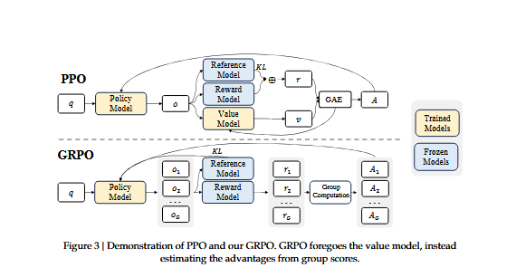
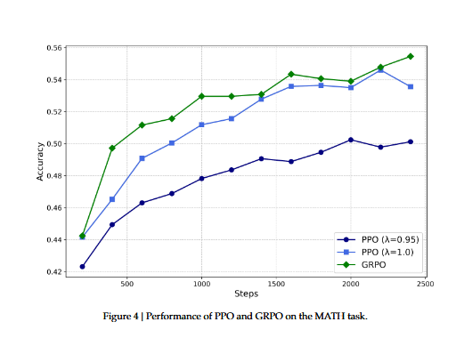
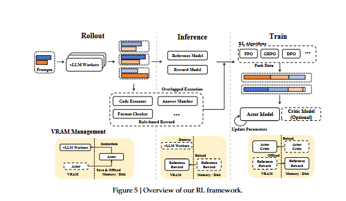
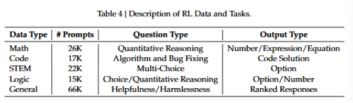
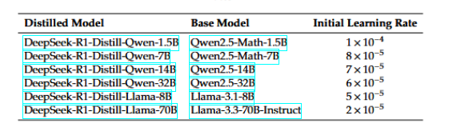
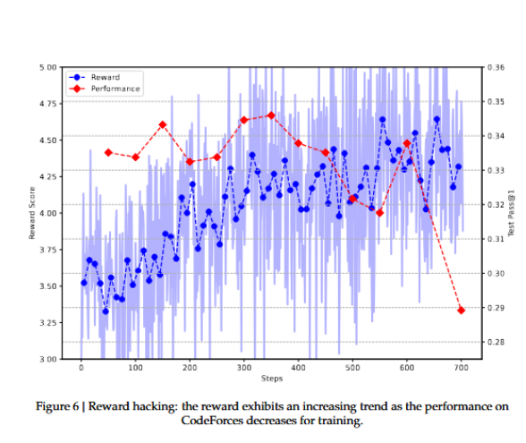
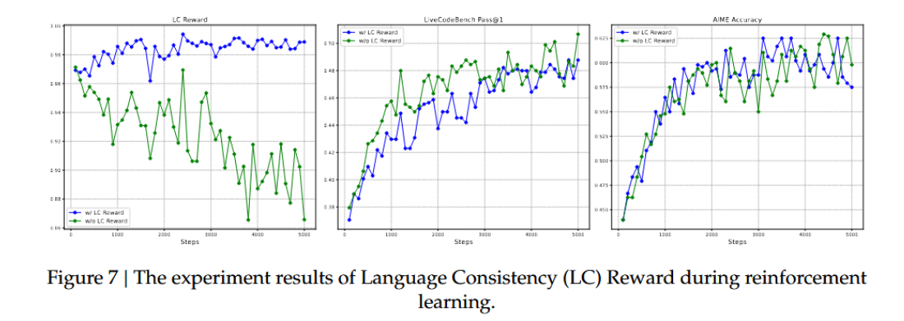
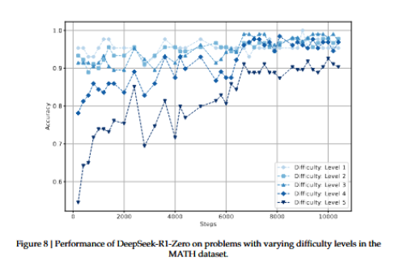
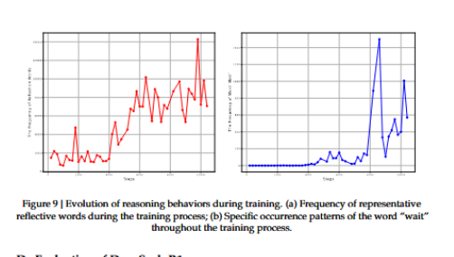
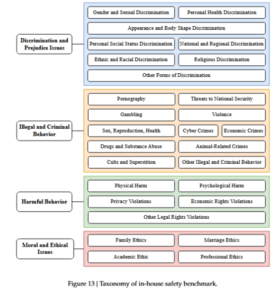

# DeepSeek-R1: Incentivizing Reasoning Capability in LLMs via Reinforcement Learning

### Abstract

General reasoning represents a long-standing and formidable challenge in artificial intelligence. Recent breakthroughs, exemplified by large language models(LLMs) and chain of thought prompting, have achieved considerable success on foundational reasoning tasks. However, this success is heavily contingent upon extensive human-annotated demonstrations,and model's capabilities are still insufficient for more complex problems. Here we show that the reasoning abilities of LLMs can be incentivized through pure reinforcement learning, obviating the need for human-labeled reasoning trajectories. The proposed RL framework facilitates the emergent development of advanced reasoning patterns, such as self-reflection, verification, and dynamic strategy adaptation. Consequently, the trained model achieves superior performance on verifiable tasks such as mathematics,coding competitions and STEM fields, surpassing its counterparts trained via conventional supervised learning on human demonstrations. Moreover, the emergent reasoning patterns exhibited by these large-scale models can be systematically harnessed to guide and enhance the reasoning capabilities of smaller models.

### 1. Introduction

Reasoning capability, the cornerstone of human intelligence, enables complex cognitive tasks ranging from mathematical problem-solving to logical deduction and programming. Recent advances in artificial intelligence have demonstrated that large language models can exhibit emergent behaviors, including reasoning abilities, when scaled to a sufficient size. However, achieving such capabilities in pre-training typically demands substantial computational resources. In parallel, a complementary line of research has demonstrated that large language models can be effectively augmented through chain-of-thought prompting. This technique, which involves either providing carefully designed few-shot examples or using minimalistic prompts such as "Let's think step by step" enables models to produce intermediate reasoning steps, thereby substantially enhancing their performance on complex tasks. Similarly, further performance gains have been observed when models learn high-quality, multi-step reasoning trajectories during the post-training phase. Despite their effectiveness, these approaches exhibit notable limitations. Their dependence on human-annotated reasoning traces hinders scalability and introduces cognitive biases. Furthermore, by constraining models to replicate human thought processes, their performance is inherently capped by the human-provided exemplars, which prevents the exploration of superior, non-human-like reasoning pathways.

To tackle these issues, we aim to explore the potential of LLMs for developing reasoning abilities through self-evolution in an RL framework, with minimal reliance on human labeling efforts. Specifically, we build upon DeepSeek-V3-Base and employ Group Relative Policy Optimization(GRPO) as our RL framework. The reward signal is solely based on the correctness of final predictions against ground truth answers, without imposing constraints on the reasoning process itself. Notably, we bypass the conventional supervised fine-tuning phase before RL training. This design choice stems from our hypothesis that human-defined reasoning patterns may limit model exploration, whereas unrestricted RL training can better incentivize the emergence of novel reasoning capabilities in LLMs. Through this process, our model naturally developed diverse and sophisticated reasoning behaviors. In solving reasoning problems, the model exhibits a tendency to generate longer responses, incorporating verification, reflection and the exploration of alternative approaches witihin each response. Although we do not explicitly teach the model how to reason, it successfully learns improved reasoning strategies through reinforcement learning.

Although DeepSeek-R1-Zero demonstrates excellent reasoning capabilities, it faces challenges such as poor readability and language mixing, occasionally combining English and Chinese within a single chain-of-thought response. Furthermore, the rule-based RL training stage of DeepSeek-R1-Zero is narrowly focused on reasoning taks, resulting in limited performance in broader areas such as writing and open-domain question answering. To address these challenges, we introduce DeepSeek-R1, a model trained through a multi-stage learning framework that integrates rejection sampling, reinforcement learning, and supervised fine-tuning. This training pipeline enables DeepSeek-R1 to inherit the reasoning capabilities of its predecessor, DeepSeek-R1-Zero, while aligning model behavior with human preferences through additional non-reasoning data.

### 2. DeepSeek-R1-Zero

We begin by elaborating on the training of DeepSeek-R1-Zero, which relies exclusively on reinforcement learning without supervised fine-tuning. To facilitate large-scale RL efficiently, we adopt Group Relative Policy Optimization(GRPO)

##### 2.1 Group Relative Policy Optimizaiton

GRPO is the reinforcement learning algorithm that we adpot to train DeepSeek-R1-Zero and DeepSeek-R1.It was originally proposed to simplify the training process and reduce the resource consumption of Proximal Policy Optimization which is widely used in the RL stage of LLMs.

For each question q, GRPO samples a group of outputs{$o_1,o_2,\dots,o_G$} from the old policy $\pi_{\theta_{old}}$ and then optimizes the policy model $\pi_{\theta}$ by maximizing the following objective:

$$\mathcal{J}_{\mathrm{GRPO}}(\theta)
=
\mathbb{E}_{\left[
q \sim P(Q),\,
\{o_i\}_{i=1}^{G} \sim \pi_{\theta_{\mathrm{old}}}(O|q)
\right]}$$

$$
\left[
\frac{1}{G}
\sum_{i=1}^{G}
\left(
\min
\left(
\frac{\pi_{\theta}(o_i|q)}
{\pi_{\theta_{\mathrm{old}}}(o_i|q)}
A_i,
\operatorname{clip}
\left(
\frac{\pi_{\theta}(o_i|q)}
{\pi_{\theta_{\mathrm{old}}}(o_i|q)},
1-\epsilon,
1+\epsilon
\right)
A_i
\right)
-
\beta D_{\mathrm{KL}}(\pi_{\theta}\|\pi_{\mathrm{ref}})
\right)
\right]
\tag{1}$$

$$
D_{\mathrm{KL}}(\pi_{\theta}\|\pi_{\mathrm{ref}})
=
\frac{\pi_{\mathrm{ref}}(o_i|q)}
{\pi_{\theta}(o_i|q)}
-
\log
\frac{\pi_{\mathrm{ref}}(o_i|q)}
{\pi_{\theta}(o_i|q)}
-1
\tag{2}
$$

where $\pi_{\mathrm{ref}}$ is a reference policy, $\epsilon and \beta$ are hyper-parameters, and $A_i$ is the advantage, computed using a group of rewards ${r_1,r_2,\dots,\r_G}$ corrsponding to the outputs within each group:

$$A_i
=
\frac{
r_i-\operatorname{mean}(\{r_1,r_2,\ldots,r_G\})
}{
\operatorname{std}(\{r_1,r_2,\ldots,r_G\})
}
\tag{3}$$

To train DeepSeek-R1-Zero, we set the learning rate to 3e-6, the KL coefficient to 0.001, and the sampling temperature to 1 for rollout. For each question, we sample 16 outputs with a maximum length of 32,768 tokens before the 8.2k step and 65,536 tokens afterward. As a result, both the performance and response length of DeepSeek-R1-Zero exhibit a significant jump at the 8.2k step, with training continuing for a total of 10,400 steps corresponding to 1.6 training epochs. Each training step consists of 32 unique questions, resulting in a training batch size of 512.Every 400 steps, we replace the reference model with the latest policy model. To accelerate training, each rollout generates 8,192 outputs, which are randomly split into 16 mini-batches and trained for only a single inner epoch.

##### 2.2 Reward Design

The reward is the source of the training signal, which decides the direction of RL optimization. For DeepSeek-R1-Zero, we employ rule-based rewards to deliver precise feedback for data in mathematical, coding and logical reasoning domains. Our rule-based reward system mainly consists of two types of rewards: accuracy rewards and format rewards.

**Accuracy rewards** evaluate whether the response is correct. For example, in the case of math problems with deterministic results, the model is required to provide the final answer in a specified format, enabling reliable rule-based verification of correctness. Similarly, for code competition prompts, a compiler can be utilized to evaluate the model's responses against a suite of predefined test cases, thereby generating objective feedback on correctness.

**Format rewards** complement the accuracy reward model by enforcing specific formatting requirements. In particular, the model is incentivized to encapsulate its reasoning process within designated tags, specifically '<think>' and '</think>'. This ensures that the model's thought process is explicitly delineated, enhancing interpretability and facilitating subsequent analysis.

$$Reward_{rule}=Reward_{acc}+Reward_{format}$$

The accuracy, reward and format reward are combined with the same weight. Notably, we abstain from applying neural reward models - whether outcome-based or process-based - to reasoning tasks. This decision is predicated on our observation that neural reward models are susceptible to reward hacking during large-scale reinforcement learning. Moreover, retraining such models necessitates substantial computational resources and introduces additional complexity into the training pipeline, thereby complicating the overall optimization process.

##### 2.3 Incentivize Reasoning Capability in LLMs

Specifically, we apply the RL technique on the DeepSeek-V3 base to train DeepSeek-R1-Zero. During training, we design a straightforward template, to require DeepSeek-R1-Zero to first produce a reasoning process, followed by the final answer. We intentionally limit our constraints to this structural format, avoiding any content-specific biases to enusre that we can accurately observe the model's natural progression during the RL process.

DeepSeek-R1-Zero exhibits a steady increase in thinking time throughout training, driven solely by intrinsic adaptation rather than external modifications. Leveraging long CoT, the model progressively refines its reasoning, generating hundreds to thousands of tokens to explore and improve its problem-solving strategies.

The increase in thinking time fosters the autonomous development of sophisticated behaviors. Specifically, DeepSeek-R1-Zero increasingly exhibits advanced reasoning strategies such as reflective reasoning and systematic exploration of alternative solutions, significantly boosting its performance on verifiable tasks like math and coding. 

The self-evolution of DeepSeek-R1-Zero underscores the power and beauty of RL: rather than explicitly teaching the model how to solve a problem, we simply provide it with the right incentives, and it autonomously develops advanced problem-solving strategies. This serves as a reminder of the potential of RL to unlock higher levels of capabilities in LLMs, paving the way for more autonomous and adaptive models in the future.

### 3. DeepSeek-R1

Although DeepSeek-R1-Zero exhibits strong reasoning capabilities, it faces several issues. DeepSeek-R1-Zero struggles with challenges like poor readability, and language mixing, as DeepSeek-V3-Base is trained on multiple languages, especially English and Chinese. To address these issues, we develop DeepSeek-R1.

In the initial stage, we collect thousands of cold-start data that exhibits a conversational, human-aligned thinking process. RL training is then applied to improve the model performance with the converational thinking process and language consistency. Subsequently, we apply rejection sampling and SFT once more. This stage incorporates both reasoning and non-reasoning datasets into the SFT process, enabling the model to not only excel in reasoning tasks but also demonstrate advanced writing capabilities. To further align the model with human preferences, we implement a secondary RL stage designed to enhance the model's helpfulness and harmlessness while simultaneously refining its reasoning capabilities.

##### 3.1 Model-based Rewards

For general data, we resort to reward models to capture human preferences in complex and nuanced scenarios. We build upon the DeepSeek-V3 pipeline and adopt a similar distribution of preference pairs and training prompts. For helpfulness, we focus exclusively on the final summary, ensuring that the assessment emphasizes the utility and relevance of the response to the user while minimizing interference with the underlying reasoning process. For harmlessness, we evaluate the entire response of the model, including both the reasoning process and the summary, to identify and mitigate any potential risks, biases, or harmful content that may arise during the generation process.

**Helpful Reward Model** Regarding helpful reward model training,we first generate preference pairs by prompting DeepSeek-V3 using the arena-hard prompt format, where each pair consists of a user query along with two candidate responses. For each preference pair, we query DeepSeek-V3 four times, randomly assigning the responses as either Response A or Response B to mitigate positional bias. The final preference score is determined by averaging the four independent judgements, retaining only those pairs where the score difference $(\triangle)$ exceeds 1 to ensure meaningful distinctions. Additionally to minimize the length-related biases, we ensure that the chosen and rejected responses of the whole dataset have comparable lengths. In total, we curated 66,000 data pairs for training the reward model. The prompts used in this dataset are all non-reasoning questions and are sourced either from publicly available open-source datasets or from users who have explicitly consented to share their data for the purpose of model development. The architecture of our reward model is consistent with that of DeepSeek-R1, with the addition of a reward head designed to predict scalar preference scores.

$$Reward_{helpful}= RM_{helpful}(Response_A,Response_B) \tag{5}$$

The helpful reward models were trained with a batch size of 256, a learning rate of 6e-6, and for a single epoch over the training dataset. The maximum sequence length during training is set to 8192 tokens, whereas no explicit limit is imposed during reward model inference.

**Safety Reward Model** To assess and improve mdoel safety, we curate a dataset of 106,000 prompts with model-generated responses annotated as "safe" or "unsafe" according to predefined safety guidelines. Unlike the pairwise loss employed in the helpfulness reward model, the safety reward model was trained using a point-wise methodology to distinguish between safe and unsafe responses. The training hyperparameters are the same as the helpful reward model.
$$Reward_{safety}=RM_{safety}(Response) \tag{6}$$

For general queries, each instance is categorized as belonging to either the safety dataset or the helpfulness dataset. The general reward, $Reward_{General}$, assigned to each query corresponds to the respective reward defined within the associated dataset.

##### 3.2 Training Details

###### 3.2.1 Training Details of the First RL Stage

In the first stage of RL, we set the learning rate to 3e-6, the KL coefficient to 0.001, the GRPO clip ratio $\epsilon$ to 10, and the sampling temperature to 1 for rollout.For each question, we sample 16 outputs with a maximum length of 32,768. Each training step consists of 32 unique questions, resulting in a training batch size of 512 per step. Every 400 steps, we replace the reference model with the latest policy model. To accelerate training, each rollout generates 8,192 outputs, which are randomly split into 16 minibatches and trained for only a single inner epoch. However, to mitigate the issue of language mixing, we introduce a language consistency reward during RL
training, which is calculated as the proportion of target language words in the CoT.

$$Reward_{language}=\left(\frac{Num(Words_{target})}{Num(Words)}\right)$$

Although ablation experiments show that such alignment results in a slight degradation in the model's performance, this reward aligns with human preferences, making it more readable. We apply the language consistency reward to both reasoning and non-reasoning data by directly adding it to the final reward.
Note that the clip ratio plays a crucial role in training. A lower value can lead to the truncation of gradients for a significant number of tokens, thereby degrading the model’s performance, while a higher value may cause instability during training.

###### 3.2.2 Training Details of the Second RL Stage

Specifically, we train the model using a combination of reward signals and diverse prompt distributions. For reasoning data, we follow the methodology outlined in DeepSeek-R1-Zero, which employs rule-based rewards to guide learning in mathematical, coding and logical reasoning domains. During the training process, we observe that CoT often exhibits language mixing, particularly when RL prompts involve multiple languages. For general data, we utilize reward models to guide training. Ultimately, the integration of reward signals with diverse data distributions enables us to develop a model that not only excels in reasoning but also prioritizes helpfulness and harmlessness. Given a batch of data, the reward can be formulated as

$$Reward=Reward_{reasoning}+Reward_{general}+Reward_{language} \tag{8}$$

$$where , Reward_{reasoning} = Reward_{rule} \tag{9}$$
$$Reward_{general}= Reward_{reward_model}+ Reward_{format} \tag{10}$$

The second stage of RL retains most of the parameters from the first stage, with the key difference being a reduced temperature of 0.7, as we find that higher temperatures in this stage lead to incoherent generation. The stage comprises a total of 1700 training steps, during which general instruction data and preference based rewards are incorporated exclusively in the final 400 steps. We find that more training steps with the model based preference reward signal may lead to reward hacking.

### 4. Experiment

A comparison between DeepSeek-R1-Zero and DeepSeek-R1 Dev1 reveals substantial improvements in instruction-following, as evidenced by higher scores on
the IF-Eval and ArenaHard benchmarks. However, due to the limited size of the cold-start dataset, Dev1 exhibits a partial degradation in reasoning performance compared to DeepSeek-R1-Zero, most notably on the AIME benchmark. In contrast, DeepSeek-R1 Dev2 demonstrates marked performance enhancements on benchmarks that require advanced reasoning skills,
including those focused on code generation, mathematical problem solving, and STEM-related tasks. Benchmarks targeting general-purpose tasks, such as AlpacaEval 2.0, show marginal improvement. These results suggest that reasoning-oriented RL considerably enhances reasoning capabilities while exerting limited influence on user preference-oriented benchmarks.

DeepSeek-R1 Dev3 integrates both reasoning and non-reasoning datasets into the SFT pipeline, thereby enhancing the model’s proficiency in both reasoning and general language generation tasks. Compared to Dev2, DeepSeek-R1 Dev3 achieves notable performance im-
provements on AlpacaEval 2.0 and Aider-Polyglot, attributable to the inclusion of large-scale
non-reasoning corpora and code engineering datasets. Finally, comprehensive RL training on DeepSeek-R1 Dev3 using mixed reasoning-focused and general-purpose data produced the final DeepSeek-R1. Marginal improvements occurred in code and mathematics benchmarks, as substantial reasoning-specific RL was done in prior stages. The primary advancements in the final DeepSeek-R1 were in general instruction-following and user-preference benchmarks, with AlpacaEval 2.0 improving by 25% and ArenaHard by 17%.

### 5. Ethics and Safety Statement

With the advancement in the reasoning capabilities of DeepSeek-R1, we deeply recognize the potential ethical risks. For example, R1 can be subject to jailbreak attacks, leading to the generation of dangerous content such as explosive manufacturing plans, while the enhanced reasoning capabilities enable the model to provide plans with better operational feasibility
and executability. Besides, a public model is also vulnerable to further fine-tuning that could compromise inherent safety protections.

we present a comprehensive safety report from multiple perspectives, including performance on open-source and in-house safety evaluation benchmarks, and safety levels across multiple languages and against jailbreak attacks. These comprehensive safety analyses conclude that the inherent safety level of the DeepSeek-R1 model, compared to other state-of-the-art models, is generally at a moderate level (comparable to GPT-4o (2024-05-13)). Besides, when coupled with the risk control system, the model’s safety level is elevated to a superior standard.

### 6. Conclusion, Limitation and Future Work

We present DeepSeek-R1-Zero and DeepSeek-R1, which rely on large-scale RL to incentivize model reasoning behaviors. Our results demonstrate that pre-trained checkpoints inherently possess substantial potential for complex reasoning tasks. We believe that the key to unlocking this potential lies not in large-scale human annotation but in the provision of hard reasoning
questions, a reliable verifier, and sufficient computational resources for reinforcement learning.
Sophisticated reasoning behaviors, such as self-verification and reflection, appeared to emerge
organically during the reinforcement learning process.

Even if DeepSeek-R1 achieves frontier results on reasoning benchmarks, it still faces several capability limitations, as outlined below:

**Structural Output and Tool Use**: Currently, the structural output capabilities of DeepSeek-R1 remain suboptimal compared to existing models. Moreover, DeepSeek-R1 cannot leverage tools, such as search engines and calculators, to improve the performance of output. However, it is not hard to build an RL environment for structure output and tool use.

**Token efficiency**: Unlike conventional test-time computation scaling approaches, such as majority voting or Monte Carlo Tree Search, DeepSeek-R1 dynamically allocates computational resources during inference according to the complexity of the program at hand. Specifically, it uses fewer tokens to solve simpler tasks, while generating more tokens for complex tasks. Nevertheless, there remains room for further optimization in terms of token efficiency, as
instances of excessive reasoning—manifested as overthinking—are still observed in response to
simpler questions.

**Language Mixing**: DeepSeek-R1 is currently optimized for Chinese and English, which may result in language mixing issues when handling queries in other languages. For instance, DeepSeek-R1 might use English for reasoning and responses, even if the query is in a language other than English or Chinese. We aim to address this limitation in future updates. The limitation may be related to the base checkpoint, DeepSeek-V3-Base, mainly utilizes Chinese and English,
so that it can achieve better results with the two languages in reasoning.

**Prompt Engineering**: When evaluating DeepSeek-R1, we observe that it is sensitive to prompts. Few-shot prompting consistently degrades its performance. 

**Software Engineering Tasks**: Due to the long evalaution times, which impact the efficiency of the RL process, large-scale RL has not been applied extensively in software engineering tasks. As a result, DeepSeek-R1 has not demonstrated a huge improvement over DeepSeek-V3 on software engineering benchmarks. 

Beyond specific capability limitations, the pure RL methodology itself also presents inherent challenges:

**Reward Hacking**:The success of pure RL depends on reliable reward signals. In this study, we ensure reward reliabilty through a reasoning-domain rule-based reward model. However such dependable RMs are difficult to construct for certain tasks, such as writing.  If the reward signal is assigned by a model instead of predefined rules, it becomes more susceptible to exploitation as training progresses, which means the policy model may find shortcuts to hack the reward model. Consequently, for complex tasks that cannot be effectively evaluated by a reliable reward model,scaling up pure RL methods remains an open challenge. 

In this work, for tasks that cannot obtain a reliable signal, DeepSeek-R1 uses human annotation to create supervised data, and only conduct RL for hundreds of steps. 

Furthermore, leveraging tools during the reasoning process holds significant promise. Whether it's utilizing tools like compilers or search engines to retrieve or compute necessary information, or employing external tools - such as biological or chemical reagents, to validate final results in the real world, this integration of tool-augmented reasoning could dramatically enhance the scope and accuracy of machine-driven solutions.

### A. Background

##### A.1. DeepSeek-V3

DeepSeek V3 is an advanced open-source LLM developed by DeepSeek.  DeepSeek V3 represents a significant leap forward in AI innovation, designed to rival leading models like OpenAI’s GPT-4 and Meta’s Llama 3.1, while maintaining remarkable cost efficiency and performance. Built on a Mixture-of-Experts (MoE) architecture, DeepSeek V3 has 671 billion total parameters, with 37 billion activated per token, optimizing both efficiency and capability. It was pre-trained on an expansive dataset of 14.8 trillion high-quality, diverse tokens, followed by supervised fine-tuning and reinforcement learning to enhance its abilities across various domains. The model incorporates innovative features like Multi-head Latent Attention (MLA) for efficient inference, an auxiliary-loss-free load-balancing strategy, and Multi-Token Prediction (MTP) to boost performance, particularly in tasks like mathematics and coding.

For the training data of DeepSeek-V3-Base, we exclusively use plain web pages and e-books, without incorporating any synthetic data. However, we have observed that some web pages contain a significant number of OpenAI-model-generated answers, which may lead the base model to acquire knowledge from other powerful models indirectly. However, we did not
intentionally include synthetic data generated by OpenAI during the pre-training cooldown phase; all data used in this phase were naturally occurring and collected through web crawling. The pre-training dataset contains a substantial amount of mathematical and code-related content, indicating that DeepSeek-V3-Base has been exposed to a significant volume of reasoning trace data. This extensive exposure equips the model with the capability to generate plausible solution candidates, from which reinforcement learning can effectively identify and optimize high-quality outputs. 

In this paper, we use the notation DeepSeek-V3-Base as the base model, DeepSeek-V3 as the instructed model. Notably, DeepSeek-R1 and DeepSeek-R1-Zero are trained on top of DeepSeek-V3-Base and DeepSeek-R1 leverages non-reasoning data from DeepSeek-V3 SFT data.DeepSeek-R1-Dev1, DeepSeek-R1-Dev2, DeepSeek-R1-Dev3 are intermediate checkpoints of DeepSeek-R1.

##### A.2. Conventional Post-Training Paradigm

Post-training has emerged as an essential step in refining pre-trained LLMs to meet specific performance goals and align with human expectations. A widely adopted two-stage post-training framework is SFT followed by RL.

Supervised Fine-Tuning refines a pre-trained LLM by training it on a curated dataset of input-output pairs tailored to specific tasks. The process employs a supervised learning objective, typically minimizing cross-entropy loss between the model’s predictions and labeled ground truth. For instance, in conversational applications, SFT might utilize dialogue datasets where desired responses are explicitly provided, enabling the model to adapt its outputs to predefined standards. SFT offers several compelling benefits. First, it achieves precise task alignment by leveraging high-quality examples, allowing the model to excel in domains such as customer support or technical documentation. Second, its reliance on pre-trained weights ensures computational efficiency, requiring fewer resources than training from scratch. Finally, the use of explicit input-output mappings enhances interpretability, as the model’s learning process is directly tied to observable data, minimizing the risk of erratic behavior. Despite its strengths, the performance of SFT hinges on the quality and diversity of the training dataset; narrow or biased data can impair the model’s ability to generalize to novel contexts. Additionally, SFT’s static nature—optimizing for fixed outputs—may fail to capture evolving human preferences or nuanced objectives. The labor-intensive process of curating high-quality datasets further complicates its scalability, as errors or inconsistencies in the data can propagate into the model’s behavior.

Following SFT, Reinforcement Learning further refines the LLM by optimizing its outputs against a reward signal. In this stage, the model interacts with an environment—often a reward model trained on human feedback—and adjusts its behavior to maximize cumulative rewards. A prominent instantiation of this approach is Reinforcement Learning from Human Feedback
(RLHF), where the reward function encodes human preferences. RL thus shifts the focus from static supervision to dynamic optimization. Notably, RL reduces the need for extensive annotated resources; while SFT demands a fully labeled dataset for every
input-output pair, RL can operate with a smaller set of human evaluations or a trained reward model, even rule-based reward model, significantly lowering the annotation burden.

The sequential application of SFT and RL combines their complementary strengths. SFT establishes a robust, task-specific baseline by grounding the model in curated examples, while RL refines this foundation to align with broader, human-centric objectives.
For example, SFT might ensure grammatical accuracy in a dialogue system, while RL optimizes for engagement and brevity, as demonstrated in the development of InstructGPT . This hybrid approach has proven effective in producing models that are both precise and
adaptable.

In this study, we demonstrate that the SFT stage may impede a model’s ability to explore and develop effective reasoning strategies. This limitation arises because human-provided responses, which serve as targets during SFT, are not always optimal for model learning; they often omit critical reasoning components such as explicit reflection and verification steps. To address this, DeepSeek-R1-Zero enables direct exploration of reasoning patterns by the model itself, independent of human priors. The reasoning trajectories discovered through this self-
exploration are subsequently distilled and used to train other models, thereby promoting the acquisition of more robust and generalizable reasoning capabilities.

##### A.3 A Comparison of GRPO and PPO

Group Relative Policy Optimization(GRPO) is the reinforcement learning algorithm that we adopt to train DeepSeek-R1-Zero and DeepSeek-R1. It was originally proposed to simplify the training process and reduce the resource consumption of Proximal Policy Optimization(PPO), which is widely used in the RL stage of LLMs.

For each question q, GRPO samples a group of outputs {$o_1,o_2,\dots,o_G$} from the old policy $\pi_{\theta_{old}}$ and then optimizes the policy model $\pi_{\theta}$ by maximizing the following objective:

$$\mathcal{J}_{\mathrm{GRPO}}(\theta)
=
\mathbb{E}_{\left[
q \sim P(Q),\,
\{o_i\}_{i=1}^{G} \sim \pi_{\theta_{\mathrm{old}}}(O|q)
\right]}$$

$$
\left[
\frac{1}{G}
\sum_{i=1}^{G}
\left(
\min
\left(
\frac{\pi_{\theta}(o_i|q)}
{\pi_{\theta_{\mathrm{old}}}(o_i|q)}
A_i,
\operatorname{clip}
\left(
\frac{\pi_{\theta}(o_i|q)}
{\pi_{\theta_{\mathrm{old}}}(o_i|q)},
1-\epsilon,
1+\epsilon
\right)
A_i
\right)
-
\beta D_{\mathrm{KL}}(\pi_{\theta}\|\pi_{\mathrm{ref}})
\right)
\right]
\tag{11}$$

$$
D_{\mathrm{KL}}(\pi_{\theta}\|\pi_{\mathrm{ref}})
=
\frac{\pi_{\mathrm{ref}}(o_i|q)}
{\pi_{\theta}(o_i|q)}
-
\log
\frac{\pi_{\mathrm{ref}}(o_i|q)}
{\pi_{\theta}(o_i|q)}
-1
\tag{12}
$$

where $\pi_{\mathrm{ref}}$ is a reference policy, $\epsilon and \beta$ are hyper-parameters, and $A_i$ is the advantage, computed using a group of rewards ${r_1,r_2,\dots,\r_G}$ corrsponding to the outputs within each group:

$$A_i
=
\frac{
r_i-\operatorname{mean}(\{r_1,r_2,\ldots,r_G\})
}{
\operatorname{std}(\{r_1,r_2,\ldots,r_G\})
}
\tag{13}$$

In contrast, in PPO the advantage is typically computed by applying the Generalized Advantage Estimation, based not only on the rewards but also on a learned value model. Since the value model is usually of similar size as the policy model, it introduces a significant memory and computational overhead. Additionally, the training objective of the value model is to predict the expected cumulative reward from the current position onward, based on the tokens generated from the beginning up to the current position. This is inherently difficult, especially when only the final outcome reward is available. The challenge becomes even more pronounced when training long chain-of-thought reasoning models. As the output length increases, the model is more likely to engage in behaviors such as reflection and revision during generation ,meaning that the content initially generated may later be revised or contradicted, which makes it even less feasible to predict the final reward based on a partial response.

Another key difference between GRPO and PPO is how Kullback-Leibler(KL) divergence between the trained policy and the reference policy is incorporated into the training process. In GRPO, an unbiased estimator of the KL divergence is directly added in the loss, while in PPO the per-token KL penalty is added as a dense reward at each token. Since the optimization goal of reinforcement learning is to maximize cumulative rewards, PPO's approach penalizes the cumulative KL divergence, which may implicitly penalize the length of the response and thereby prevent the model's response length from increasing. In addition, as we may train thousands of steps in the scenario of training long chain-of-thought reasoning models, the trained policy can diverge significantly
from the initial reference policy. In order to balance the scope that the training policy can explore and the stability of the training, we periodically update the reference policy to the latest policy during the actual training process.

Unlike GRPO, PPO requires additional hyperparameter tuning—particularly of the 𝜆 coefficient in GAE—and is highly sensitive to this parameter. When 𝜆 is set to 0.95 (the default value in most open-source PPO implementations), PPO performs considerably worse than GRPO. However, with careful tuning (setting 𝜆 to 1.0),
PPO’s performance improves substantially, nearing that of GRPO. 

While PPO can achieve comparable performance when appropriately tuned, it demands additional computational cost for hyperparameter optimization. Moreover, considering the memory and computational overhead associated with training an additional value model, GRPO presents a more practical alternative, especially when training large-scale models with
constrained resources.

### B. Training Details

##### B.1. RL Infrastructure

Conducting RL training on large models places high demands on the infrastructure. Our RL framework is architected with a decoupled and extensible structure to facilitate seamless integration of diverse models and algorithms. Within this framework, we have incorporated both intra-modular and inter-modular optimization techniques, to ensure training efficiency and scalability.

The framework is partitioned into four distinct modules, each corresponding to a specific phase of the RL pipeline:

- **Rollout Module**: Prompts are loaded from training dataset and uniformly dispatched across multiple vLLM workers, each equipped with the actor model, to sample multiple responses. For DeepSeek-V3 MoE architecture, we implement expert parallelism strategy across nodes to reduce memory access overhead, and deploy redundant copies of hotspot experts to balance computational loads among different experts. Multi-Token Prediction component is also leveraged for self-speculative decoding, significantly accelerating the decoding speed and effectively minimizing the completion time for the longest samples.

- **Inference Module**: This module loads the reward model and reference to perform a forward pass on the samples generated during the rollout phase, thereby obtaining model-based rewards and other essential information.

- **Rule-based Reward Module**:This module computes rule-based rewards for the model-generated responses. A unified interface has been designed to accomodate diverse implementations. Although this module does not require loading models into GPU memory, its execution tends to be time consuming. To tackle this issue, an asynchronous scheduling approach is employed to overlap its execution with the Rollout and Inference modules, effectively hiding the associated latency.

- **Training Module**: This module loads the actor model and the critic model(if required), to compute loss and update model parameters. It provides flexible support for a variety of RL algorithms(e.g PPO,GRPO,DPO, etc). To minimize computational waste caused by sequnce padding and balance the workload across devices, we design the following data packing strategy: first, all data in a global batch is sorted by length and distributed across processes within the data parallel group; subsequently, within each process, the Best-Fit strategy is applied to pack the data into fixed-length chunks with minimal padding; finally, the number of chunks is adjusted to be equal across all processes. Additionally, we have integrated the DualPipe algorithm, utilized in DeepSeek-V3 training, to achieve efficient pipeline paralleilsm.

Notably upon completion of each module (excluding the Rule-based Reward module), the model instances utilized in that phase are automatically offloaded from VRAM to either system memory or disk storage, thereby freeing up VRAM for the subsequent phase.

##### B.3. Data Recipe
###### B.3.1 RL Data

Reasoning RL data includes four categories: mathematics, coding, STEM, and logic problems. In addition, we also incorporate general RL data to improve the helpfulness and harmlessness of the model in the training of DeepSeek-R1. All questions are in Chinese or English. 

- **Mathematics** dataset consists of 26k quantitative reasoning questions, including math exam questions and competition problems. The average number of prompt tokens is 122. The dataset covers various mathematical domains such as algebra, calculus, probability, and geometry. Problems range in difficulty from regional contests to international Olympiads. For each problem, the model is expected to produce a step-by-step reasoning process culminating in a final answer, which can be a numerical value (e.g., “5”), a mathematical expression (e.g., “𝑥2 + 3𝑥 − 2”), or an equation (e.g., “𝑦 = 2𝑥 + 1”). Mathematical proofs are excluded because it is difficult to determine their correctness. For reinforcement learning purposes, we calculate the reward of a reasoning process by matching the predicted answer with the reference answer. If the answer aligns with the reference, the reward is assigned a value of 1; otherwise, it is assigned a value of 0.

- **Coding** dataset includes 17k algorithm competition questions, along with 8k bug fixing problems. The algorithm competition questions are similar to problems found on platforms like Codeforces or LeetCode. Each problem typically includes a detailed problem description, constraints, and multiple input-output examples. The task is to write a complete function or program that can solve the problem correctly and efficiently, passing a comprehensive set of hidden test cases that assess both correctness and performance. These problems test algorithmic skills, including dynamic programming, graph theory, string manipulation, and data structure usage. The bug-fixing problems are extracted from real-world GitHub issues. Each task provides an issue description, a buggy version of the source code, and a set of unit tests that partially or completely fail. The goal is to understand the intent of the issue, locate and fix the defect in the code, and ensure that the corrected version passes all unit tests.

- **STEM** dataset comprises 22k choice questions that cover topics such as physics, chemistry, and biology. Each question in the STEM task presents a subject-specific problem accompanied by four to eight answer options. The model is required to select the most scientifically accurate answer based on the given context and domain knowledge. The average number of prompt tokens is 161. Specifically, the dataset includes 15.5% physics, 30.7% biology, 46.5% chemistry, and 7.3% other topics such as health and medicine. Since all STEM questions are multiple-choice, a binary reward is assigned based on whether the correct option is matched.

- **Logic dataset** contains 15k questions designed to evaluate a model’s reasoning capabilities across a broad spectrum of logical challenges. The dataset includes both real-world and synthetically generated problems. All problems support automatic evaluation, and the average prompt length is approximately 420 tokens. The real-world portion of the dataset comprises a diverse selection of problems sourced from the web, including brain teasers, classical logic puzzles, and knowledge-intensive questions. These questions are presented in a multiple-choice format to ensure objective and consistent assessment. The synthetic portion consists primarily of two categories: code-IO problems and puzzle tasks. Code-IO problems are generated using the data pipeline introduced, which converts competitive coding problems and their corresponding input-output test cases into verifiable logical reasoning problems. The puzzle tasks include problems intended to assess specific reasoning competencies. For example, cryptography puzzles are designed to evaluate a model’s ability to identify and apply patterns in cipher schemes or perform string manipulations; logic puzzles focus on deductive reasoning over complex constraints, such as inferring valid conclusions from a fixed set of premises (e.g., the Zebra puzzle); and arithmetic puzzles test the model’s numerical reasoning (e.g. probability questions and 24 game).

- **General dataset** consists of 66k questions designed to assess helpfulness, spanning various categories such as creative writing, editing, factual question answering, and role-playing. Additionally, the dataset includes 12,000 questions focused on evaluating harmlessness. To ensure robust verification, two reward models are utilized, each trained on a curated dataset of ranked responses generated by models in relation to helpfulness and harmlessness, respectively. We trained the helpful reward model for a single epoch with a maximum sequence length of 8192 tokens during the training phase. However, when deploying the model to generate reward signals, we did not impose any explicit length constraints on the input sequences being evaluated.

###### B.3.2 DeepSeek-R1 Cold Start

For DeepSeek-R1, we construct and collect a small amount of long CoT data to fine-tune the model as the initial RL actor. The motivation is primarily product-driven, with a strong emphasis on enhancing user experience. Users tend to find responses more intuitive and engaging when the reasoning process aligns with first-person perspective thought patterns. For example, DeepSeek-R1-Zero is more likely to employ the pronoun ’we’ or avoid first-person pronouns altogether during problem solving, whereas DeepSeek-R1 tends to use ’I’ more frequently. Furthermore, we acknowledge that such patterns may elicit unwarranted trust from users. Here, we would like to emphasize that the observed vivid reasoning patterns primarily reflect DeepSeek-engineered heuristics, rather than indicating that the model has inherently acquired
human-like intelligence or autonomous problem-solving capabilities.

In cold start data creation, we prefer the thinking process that begins with comprehending the problem, followed by detailed reasoning that incorporates reflection and verification. The language employed throughout the thinking process is presented in the first-person perspective. Additionally, maintaining language consistency is crucial for an optimal user experience. Without proper control, model responses may contain a mixture of different languages, regardless of the language used in the query. Such inconsistencies can disrupt comprehension and reduce user satisfaction. Therefore, careful refinement is essential to ensure that responses remain coherent and aligned with user intent. Nevertheless, we acknowledge that the raw Chain-of-Thought (CoT) reasoning produced by DeepSeek-R1-Zero may possess potential that extends beyond the limitations of current human priors. Specifically, we first engage human annotators to convert the reasoning trace into a more natural, human conversational style. The modified data pairs are then used as examples to prompt an LLM to rewrite  additional data in a similar style. All LLM-generated outputs subsequently undergo a second round of human verification to ensure quality and consistency.

Specifically, we begin by gathering thousands of high-quality, diverse reasoning prompts. For each prompt, we generate multiple reasoning trajectories using DeepSeek-R1-Zero with a relatively high temperature of 1.0. Next, we filter these generations to retain only those with correct final answers and a readable format. For mathematical outputs, we use sympy
(https://www.sympy.org/) for parsing and expression comparison; and for formatting, we apply rules such as repetition detection and language-mixing filtering. Finally, we prompt DeepSeek-V3 to refine both the reasoning and the summaries to ensure proper formatting and a human-friendly expression. In particular, to resolve language mixing, we instruct DeepSeek-V3 to “Translate the thinking process to the same language as the question.” Since DeepSeek-R1-Zero’s summary only provided the final answer, we use the summary prompt in Listing 1 to produce a concise, human-readable solution that outlines both the reasoning steps and the final result.

For code data, we collect a large set of competitive programming problems. In detail, We have compiled an extensive collection of competitive programming problems from multiple online judge (OJ) platforms, specifically 5151 problems from Codeforces and 2504 problems from AtCoder. Since the original test cases are not publicly available from these platforms, we developed a methodology to create reliable test cases for each problem.

Our approach involves using DeepSeek-V2.5 to generate candidate test cases, followed by a rigorous validation process. Specifically, we prompted DeepSeek-V2.5 to write Python programs that generate test cases tailored to each problem’s requirements as shown in Listing 2. After obtaining numerous candidate test cases, we implemented a two-phase filtering procedure. First, we used correct submissions to eliminate invalid test cases that produced incorrect outputs. Then, we strategically selected subsets of test cases that successfully identified flaws in incorrect submissions. This process ensured our final test cases properly differentiated between correct and incorrect solutions for each problem.

##### B.4. Hyper-Parameters
###### B.4.1 Hyper-parameters of DeepSeek-R1-Zero-Qwen-32B

To train DeepSeek-R1-Zero-Qwen-32B, we set the learning rate to 2e-6, the KL coefficient to 0.001, and the sampling temperature to 1 for rollout. For each question, we sample 16 outputs with a maximum length of 32,768. Each training step consists of 32 unique questions, resulting in a training batch size of 512 per step. Every 400 steps, we replace the reference model with the latest policy model. To accelerate training, each rollout generates 8,192 outputs, which are randomly split into 16 mini-batches and trained for only a single inner epoch.

###### B.4.2. Hyper-parameters of SFT

For code-start SFT and the second-stage SFT, we fine-tune DeepSeek-V3-Base for 2-3 epochs using the curated dataset. We employ a cosine decay learning rate scheduler,starting at 5 × 10−5 and gradually decreasing to 5 × 10−6. The maximum context length is set to 32,768 tokens, and the batch size is 128.

###### B.4.3. Hyper-Parameters of Distillation

For distillation, we fine-tune the corresponding base model for 2–3 epochs using the 800k data. We employ a cosine decay learning rate scheduler that gradually decreases the learning rate to one-tenth of its initial value. The maximum context length is 32,768 tokens, and the batch size is 64.

###### B.4.4. Training Cost

Regarding our research on DeepSeek-R1, we utilized the A100 GPUs to prepare for the experiments with a smaller model (30B parameters). The results from this smaller model have been promising, which has allowed us to confidently scale up to 660B R1-Zero and R1. For the training of DeepSeek-R1-Zero, we employed 64*8 H800 GPUs, and the process required approximately 198 hours. Additionally, during the training phase of DeepSeek-R1, we utilized the same 64 *8 H800 GPUs, completing the process in about 4 days, or roughly 80 hours. To create the SFT datasets, we use 5K GPU hours.

###### Reward Hacking

In the context of LLM training, reward hacking refers to the phenomenon wherein a model exploits flaws or biases in the reward function, thereby achieving high reward scores without truly aligning with the underlying human intent. In our work, we observe such reward hacking behavior when employing the helpful reward model. Specifically, if the reward model contains systematic biases or inaccuracies, the LLM may learn to generate responses that are rated highly by the model but diverge from authentic human preferences. This misalignment can manifest in performance degradation on tasks requiring complex reasoning

##### C. Self-Evolution of DeepSeek-R1-Zero

###### C.1. Evolution of Reasoning Capability in DeepSeek-R1-Zero during Training

We analyzed DeepSeek-R1-Zero’s performance on the MATH dataset stratified by difficulty levels (1-5).Easy problems (levels 1-3) quickly reach high accuracy (0.90-0.95) and remain stable throughout training, while difficult problems show remarkable improvement - level 4 problems improve from near 0.78 to 0.95, and the most challenging level 5 problems demonstrate the most dramatic improvement from near 0.55 to 0.90.

One may find it counterintuitive that the model’s accuracy on harder questions (levels 3-4) occasionally surpasses its performance on easier questions (level 1) by a small margin. This apparent anomaly stems from several dataset characteristics. The MATH dataset is unevenly distributed, with level-1 questions comprising only 43 of 500 examples, while higher levels
contain approximately 100 questions each. Consequently, the model’s 95-97% accuracy on level-1 represents just 1-2 unsolved problems, primarily in geometry, where the model still struggles. Furthermore, the distribution of mathematical categories (geometry, algebra, etc.) varies across difficulty levels due to the dataset’s construction methodology. It’s also worth noting that these difficulty levels were annotated based on human perception of problem complexity rather than machine learning considerations.

Despite these nuances in comparing raw accuracy percentages across difficulty levels, the training trends still demonstrate that while simpler reasoning tasks (for humans) are mastered early in training, the model’s capability on complex reasoning problems (level 3-5) significantly improves over time.

###### C.2. Evolution of Advanced Reasoning Behaviors in DeepSeek-R1-Zero during Training

we counted some representative reflective words, including “wait”, “mistake”, “however”, “but”, “retry”, “error”, “verify”, “wrong”, “evaluate”, and “check”. These reflective words were selected by 3 human experts, who are asked to think of several reflective words and then merge them into a final word list. As is shown, there is a gradual increase in the frequency of reflective behaviors as training progresses. Specifically, the count of the reflective words rises 5- to 7-fold compared to the start of training, suggesting that RL plays a key role in generating long-chain intermediate tokens.

Second, specific reflective behaviors may appear at particular points in training. The analysis of the word “wait” demonstrates this clearly. This reflective strategy was nearly absent during early training, showed occasional usage between steps 4000-7000, and then exhibited significant spikes after step 8000. This suggests that the model learns different forms of reflection at specific stages of development. In conclusion, we observe a gradual increase in the model’s reflective behavior during training, while certain reflection patterns like the use of “wait” emerge at specific points in the training process.

##### D. Evaluation of DeepSeek-R1

###### D.1. Experiment Setup

**Benchmarks** Specifically, MMLU, MMLU-Redux, MMLU-Pro, C-Eval, and CMMLU are multiple-choice benchmarks designed to assess model performance on general encyclopedic knowledge. Higher scores on these benchmarks indicate a broader understanding of world knowledge and the ability to correctly answer questions in a multiple-choice format. SimpleQA and C-SimpleQA evaluate model performance on long-tail knowledge, while GPQA assesses the ability to solve Ph.D.-level tasks in physics, chemistry, and biology. IFEval is designed to evaluate the model’s capacity to generate outputs in a required format. FRAMES and DROP focus on assessing model performance in processing and reasoning over long documents. In addition to these standard benchmarks, we also evaluate our models on open-ended generation tasks, employing LLM as judges. We follow the original evaluation protocols of AlpacaEval 2.0 and Arena-Hard, utilizing GPT-4-Turbo-1106 for pairwise comparisons. To mitigate length bias, only the final summary is provided to the evaluation model. 

LiveCodeBench and Codeforces are designed to measure model performance on algorithmic competition tasks, whereas SWE-Verified and Aider assess the model’s capabilities on real-world software engineering problems. Finally, AIME, MATH-500, and CNMO 2024 comprise mathematics problems that test the model’s reasoning abilities in mathematical domains.

**Decontamination** To prevent benchmark contamination, we implemented comprehensive decontamination procedures for both pre-training and post-training data. DeepSeek-V3 base has a knowledge cutoff date of July 2024, predating evaluation benchmarks like CNMO 2024, and we filtered out any text segments (including web pages and GitHub files) that contained matching 10-gram sequences from evaluation questions or reference solutions. As one example of our decontamination efforts, in the mathematics domain alone, our decontamination process identified and removed approximately six million potential pre-training texts. For post-training, mathematical SFT data and RL training prompts were sourced exclusively from pre-2023 competitions and underwent the same n-gram filtering protocol used in pre-training, ensuring no overlap between training and evaluation data. These measures ensure our model evaluation results reflect genuine problem-solving capabilities rather than memorization of test data.

However, we acknowledge that the n-gram based decontamination method cannot prevent the paraphrase of testset. Therefore, it is possible that benchmarks released before 2024 may suffer from contamination issues.

**Evaluation Prompts** Following the setup in DeepSeek-V3, standard benchmarks such as MMLU, DROP, GPQA Diamond, and SimpleQA are evaluated using prompts from the simple-evals framework. For MMLU-Redux, we adopt the Zero-Eval prompt format in a zero-shot setting. In terms of MMLU-Pro, C-Eval and CLUE-WSC, since the original prompts are few-shot, we slightly modify the prompt to the zero-shot setting. The CoT in few-shot may hurt the performance of DeepSeek-R1. Other datasets follow their original evaluation protocols with default prompts provided by their creators. For code and math benchmarks, the HumanEval-Mul dataset covers eight mainstream programming languages (Python, Java, C++,C#, JavaScript, TypeScript, PHP, and Bash). Model performance on LiveCodeBench is evaluated using CoT format, with data collected between August 2024 and January 2025. The Codeforces dataset is evaluated using problems from 10 Div.2 contests, along with expert-crafted test cases, after which the expected ratings and percentages of competitors are calculated. SWE-Bench verified results are obtained via the agentless framework. AIDER-related benchmarks are measured using a "diff" format. DeepSeek-R1 outputs are capped at a maximum of 32,768 tokens for each benchmark.

**Baselines** We conduct comprehensive evaluations against several strong baselines, including DeepSeek-V3, Claude-Sonnet-3.5-1022, GPT-4o-0513, OpenAI-o1-mini, and OpenAI-o1-1217. Since accessing the OpenAI-o1-1217 API is challenging in mainland China, we report its performance based on official reports. For distilled models, we also compare the open-source model QwQ-32B-Preview.
We set the maximum generation length to 32,768 tokens for the models. We found that using greedy decoding to evaluate long-output reasoning models results in higher repetition rates and significant variability across different checkpoints. Therefore, we default to pass@𝑘 evaluation and report pass@1 using a non-zero temperature. Specifically, we use a sampling temperature of 0.6 and a top-𝑝 value of 0.95 to generate 𝑘 responses (typically between 4 and 64, depending on the test set size) for each question. Sepcifically, we use 𝑘 = 64 for AIME and GPQA, 𝑘 = 16 for MATH and CodeForces, and 𝑘 = 8 for LCB. Pass@1 is then calculated as
$$
\mathrm{pass@1} = \frac{1}{k}\sum_{i=1}^{k} p_i
$$
where 𝑝𝑖 denotes the correctness of the 𝑖-th response. This method provides more reliable performance estimates. For AIME 2024, we also report consensus (majority vote) results using 64 samples, denoted as cons@64.

##### D.3. DeepSeek-R1 Safety Report

###### D.3.1 Risk control system for DeepSeek-R1

Generally, beyond the intrinsic safety of models, model-based services typically implement an external risk control system to enhance system-level security. In this subsection, we introduce the risk control system deployed in the official DeepSeek services. In the comparative experiments presented later in this chapter, we will report the results of DeepSeek-R1 with and without risk control measures. For models from other manufacturers, the results represent the comprehensive safety performance that integrates both the model’s intrinsic safety mechanisms and external
risk control systems.

**Potential Risky Dialogue Filtering** After each round of conversation, the user’s query is automatically matched against a predefined keyword list. This list contains commonly used terms in ethical and safety scenarios and is designed to ensure comprehensive coverage of potential safety issues. Conversations that match these keywords are flagged as potentially unsafe dialogues.

**Model-based Risk Review** Subsequently, these potentially unsafe dialogues are concatenated with a preset risk review prompt and sent to the DeepSeek-V3 model (considering the balance between effectiveness and efficiency). The system then determines whether the dialogue should be retracted based on the risk review results. We have meticulously designed this risk review prompt to effectively cover various safety scenarios and maintain good scalability.

The subsequent experimental results show that with the addition of a risk control system, the overall safety of services significantly improves, particularly against dangerous tactics such as jailbreak attacks. Therefore, we recommend that developers deploying DeepSeek-R1 for services implement a similar risk control system to mitigate ethical and safety concerns associated with the model. Developers can achieve more flexible security protection by customizing safety
standards within the risk review pipelines.

###### D.3.2 Robustness against jailbreaking

In real-world application scenarios, malicious users may employ various jailbreaking techniques to circumvent a model’s safety alignment and elicit harmful responses. Therefore, beyond evaluating model safety under direct questioning, we place significant emphasis on examining the model’s robustness when confronted with jailbreaking attacks. Thus, we constructed a dedicated test suite for jailbreaking evaluation. Specifically, we developed a template collection consisting of 2,232 jailbreaking instructions. We then randomly concatenated these jailbreaking prompts with questions from the original safety testset and further examined the performance differences in the model’s responses when confronted with original unsafe questions versus newly formulated questions with jailbreaking elements. When evaluating the results, we followed the LLM-as-a-Judge safety assessment while improving the safety evaluation prompts to focus more specifically on identifying manipulative traps in jailbreak attempts. Each question-answer pair was classified into one of
three categories: safe, unsafe, or rejected.

##### E. DeepSeek-R1 Distillation

LLMs are energy-intensive, requiring substantial computational resources, including high-performance GPUs and considerable electricity, for training and deployment. These resource demands present a significant barrier to democratizing access to AI-powered technologies, particularly in under-resourced or marginalized communities.

To address this challenge, we adopt a model distillation approach, a well-established technique for efficient knowledge transfer Specifically, we fine-tune open-source foundation models such as Qwen and LLaMA using a curated dataset comprising 800,000 samples generated with DeepSeek-R1. We find that models distilled from high-quality teacher outputs consistently outperform those trained directly on human-generated data, corroborating prior findings on the efficacy of distillation. For distilled models, we apply only SFT and do not include an RL stage, even though incorporating RL could substantially boost model performance.

we can draw two conclusions: First, distilling more powerful models into smaller ones yields excellent results, whereas smaller models relying on the large-scale RL mentioned in this paper require enormous computational power and may not even achieve the performance of distillation. Second, while distillation strategies are both economical and effective, advancing beyond the boundaries of human intelligence may still require more powerful base models and larger-scale reinforcement learning.

##### F. Key Findings

**The importance of base checkpoint**: During the initial phase of our development, we experimented with smaller-scale models, specifically a 7B dense model and a 16B Mixture-of-Experts (MoE) model, as the foundational architectures for RL training. However, these configurations consistently failed to yield meaningful improvements when evaluated on the AIME benchmark, which we employed as the primary validation set. We observed that as response lengths increased, these smaller models exhibited a tendency toward repetition and were unable to effectively leverage long chains of thought (CoT) to improve reasoning accuracy.

To address these limitations, we transitioned to larger-scale models, including a 32B dense model (Qwen, 2024b), a 230B MoE model (DeepSeek-AI, 2024a), and a 671B MoE model (DeepSeek-AI, 2024b). With these more capable architectures, we finally observed substantial performance gains attributable to pure RL training. These findings suggest that the effectiveness of reinforcement learning from base models is highly dependent on the underlying model capacity. We therefore recommend that future research in this area prioritize the use of sufficiently large and expressive models when aiming to validate the efficacy of RL from scratch. 

**The importance of verifiers**: The effectiveness of DeepSeek-R1-Zero is highly contingent upon the reliability and fidelity of the reward signal used during training. To date, our investigations indicate that two approaches—rule-based reward models (RMs) and LLMs to assess an answer’s correctness against a predefined ground-truth—serve as robust mechanisms for mitigating issues related to reward hacking. The LLM-based evaluation framework demonstrates particular effectiveness for tasks with well-defined, concise answers, such as single-sentence or phrase-level responses. However, this method exhibits limited generalizability to more complex tasks, including open-ended generation and long-form writing, where the notion of correctness is inherently more subjective and nuanced.
**Iterative pipeline**: We propose a multi-stage training pipeline comprising both SFT and RL stages. The RL component enables the model to explore and discover optimal reasoning trajectories for tasks capabilities that cannot be fully realized through human-annotated reasoning traces alone. In particular, without the RL stage, long-chain reasoning patterns, such as those required in complex Chain-of-Thought (CoT) prompting, would remain largely unexplored. Conversely, the SFT stage plays a crucial role in tasks where reliable reward signals are difficult to define or model, such as open-ended question answering and creative writing. Therefore, both RL and SFT are indispensable components of our training pipeline. Exclusive reliance on RL can lead to reward hacking and suboptimal behavior in ill-posed tasks, while depending solely on SFT may prevent the model from optimizing its reasoning capabilities through exploration.
