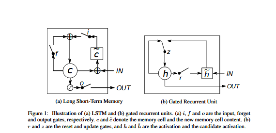

# Empirical Evaluation of Gated Recurrent Neural Networks on Sequence Modeling

## Abstract

In this paper we compare different types of recurrent neural networks(RNNs). Especially, we focus on more sophisticated units that implement a gating mechanism, such as a long short-term memory (LSTM) unit and gated recurrent unit(GRU). We evaluate these recurrent units on the tasks of polyphonic music modeling and speech signal modeling. Our experiments revealed that these advanced recurrent units are indeed better than more traditional recurrent units such as tanh units. Also, we found GRU to be comparable to LSTM.

### 1 Introduction

Recurrent neural networks have recently shown promising results in many mahcine learning tasks, especially when input and/or output are of variable length. More recently, papers reported that recurrent neural networks are able to perform as well as the existing, well developed systems on a challengin task of machine translation.

One interesting observation, we make from these recent successes is that almost none of these successes were achieved with a vanilla recurrent neural network. Rather, it was a recurrent neural network with sophisticated recurrent hidden units, such as long short-term memory units.

Among these sophisticated recurrent units, we are interested in evaluating two closely related variants including long short-term memory unit and a gated recurrent unit. It is well established in the field that the LSTM unit works well on sequence-based tasks with long-term dependencies, but the latter has only recently been introduced and used in the context of machine translation.

### 2 Background: Recurrent Neural Network

A recurrent neural network is an extension of a conventional feedforward neural network, which is able to handle a variable-length sequence input. The RNN handles the variable-length sequence by having a recurrent hidden state whose activation at each time is dependent on that of the previous time.

More formally, given a sequence $x=(x_1,x_2,\dots,x_T)$, the RNN updates its recurrent hidden state $h_t$ by

$$h_t= \begin{cases}
0, & t=0 \\[6pt] \tag{1}
\phi(h_{t-1},x_t), & otherwise
\end{cases}$$
where $\phi$ is a nonlinear function such as composition of a logistic sigmoid with an affine transformation. Optionally, the RNN may have an output $y=(y_1,y_2,\dots,y_T)$ which may again be of variable length.

Traditionally, the update of the recurrent hidden state is implemented as 

$$h_t=g(W_{X_t}+Uh_{t-1}), \tag{2}$$

where g is a smooth, bounded function such as a logistic sigmoid function or a hyperbolic tangent function.

A generative RNN outputs a probability distribution over the next element of the sequence, given its current state $h_t$, and this generative model can capture a distribution over sequences of variable length by using a special output symbol to represent the end of the sequence. The sequence probability can be decomposed into

$$p(x_1,\dots,x_T)=p(x_1)p(x_2|x_1)p(x_3|x_1,x_2)\dots p(x_T|x_1,\dots,x_{T-1}) \tag{3}$$

where the last element is a special end-of-sequence value. We model each conditional probability distribution with 

$$p(x_t|x_1,\dots,x_{t-1})=g(h_t),$$

Unfortunately, it has been observed that it is difficult to train RNNs to capture long-term dependencies because the gradients tend to either vanish or explod. This makes gradient-based optimization method struggle, not just because of the variations in gradient magnitudes but because of the effect of long-term dependencies is hidden (being exponentially smaller with respect to sequence length) by the effect of short-term dependencies. There have been two dominant approaches by which many researchers have tried to reduce the negative impacts of this issue. One such approach is to devise a better learning algorithm than a simple stochastic gradient descent, for example using the very simple clipped gradient, by which the norm of the gradient vector is clipped, or using second-order methods which may be less sensitive to the issue if the second derivatives follow the same growth pattern as the first derivatives.

The other approach, in which we are more interested, is to design a more sophisticated activation function than a usual activation function, consisting of affine transformation followed by a simple element-wise nonlinearity by using gating units. The earliest attempt in this direction resulted in an activation function, or a recurrent unit, called a long short-term memory unit. More recently, another type of recurrent unit, to which we refer as a gated recurrent unit (GRU) was proposed. RNNs employing either of these recurrent units have been shown to perform well in tasks that require capturing long-term dependencies. Those tasks include, but are not limited to, speech recognition and machine translation.

### 3 Gated Recurrent Neural Networks

In this paper, we are interested in evaluating the performance of those recently proposed recurrent units (LSTM unit and GRU) on sequence modeling. Before the empirical evaluation, we first describe each of those recurrent units in this section.

##### 3.1 Long Short-Term Memory Unit

Unlike to the recurrent unit which simply computes a weighted sum of the input signal and applies a nonlinear function, each j-th LSTM unit maintains a memory $c_t^j$ at time t. The output $h_t^j$, or the
activation, of the LSTM unit is then

$$h_t^j=o_t^j tanh(c_t^j)$$,

where $o_t^j$ is an output gate that modulates the amount of memory content exposure. The output gate is computed by

$$o_t^j= \sigma(W_ox_t+ U_oh_{t-1}+V_oc_t)^j$$,

where $\sigma$ is a logistic sigmoid function. $V_o$ is a diagonal matrix.

The memory cell $c_t^j$ is updated by partially forgetting the existing memory and adding a new memory content $c_t^{-j}$:

$$c_t^j= f_t^jc_{t-1}^j+ i_t^jc_t^{-j}, \tag{4}$$

where the new memory content is 

$$c_t^{-j}=tanh(W_cx_t+U_ch_{t-1})^j$$

The extent to which the existing memory is forgotten is modulated by a forget gate $f_t^j$ and the degree to which the new memory content is added to the memory cell is modulated by an input gate $i_t^j$. Gates are computed by

$$f_t^j=\sigma(W_fx_t+U_fh_{t-1}+V_fc_{t-1})^j$$,
$$i_t^j= \sigma(W_ix_t+U_ih_{t-1}+V_ic_{t-1})^j$$

Note that $V_f$ and $V_i$ are diagonal matrices.

Unlike to the traditional recurrent unit which overwrites its content at each time-step, an LSTM unit is able to decide whether to keep the existing memory via the introduced gates. Intuitively, if the LSTM unit detects an important feature from an input sequence at early stage, it easily carries this information over a long distance, hence, capturing potential long-distance dependencies.

##### 3.2 Gated Recurrent Unit

A gated recurrent unit was proposed to make each recurrent unit to adaptively capture dependencies of different time scales. Similarly to the LSTM unit, the GRU has gating units that modulate the flow of information inside the unit, however, without having a separate memory cells.

The activation $h_t^j$ of the GRU at time t is a linear interpolation between the previous activation $h_{t-1}^j$ and the candidate activation $h_t^{-j}$:

$$h_t^j=(1-z_t^j)h_{t-1}^j+z_t^jh_t^{-j} \tag{5}$$

where an update gate $z_t^j$ decides how much the unit updates its activation or content. The update gate is computed by

$$z_t^j= \sigma(W_zx_t+U_zh_{t-1})^j$$

This procedure of taking a linear sum between the existing state and the newly computed state is similar to the LSTM unit. The GRU, however, does not have any mechanism to control the degree to which its state is exposed, but exposes the whole state each time.

The candidate activation $h_t^{-j}$ is computed similarly to that of the traditional recurrent unit.

$$h_t^{-j}=tanh(Wx_t+U(r_.h_{t-1}))^j$$

where $r_t$ is a set of reset gates and . is an element-wise multiplication. When off ($r_t^j$ close to 0), the reset gate effectively makes the unit act as if it is reading the first symbol of an input sequence, allowing it to forget the previously computed state.

The reset gate $r_t^j$ is computed similarly to the update gate:

$$r_t^j = \sigma(W_rx_t + U_rh_{t-1})^j$$

##### 3.3 Discussion'

The most prominent feature shared between these units is the additive component of their update from t to t+1, which is lacking in the traditional recurrent unit. The traditional recurrent unit always replaces the activation, or the content of a unit with a new value computed from the current input and the previous hidden state. On the other hand, both LSTM unit and GRU keep the existing content and add the new content on top of it.

This additive nature has two advantages. First, it is easy for each unit to remember the existence of a specific feature in the input stream for a long series of steps. Any important feature, decided by either the forget gate of the LSTM unit or the update gate of the GRU, will not be overwritten but be maintained as it is.

Second, and perhaps more importantly, this addition effectively creates shortcut paths that bypass multiple temporal steps. These shortcuts allow the error to be back-propagated easily without too quickly vanishing (if the gating unit is nearly saturated at 1) as a result of passing through multiple, bounded nonlinearities, thus reducing the difficulty due to vanishing gradients.

These two units however have a number of differences as well. One feature of the LSTM unit that is missing from the GRU is the controlled exposure of the memory content. In the LSTM unit, the amount of the memory content that is seen, or used by other units in the network is controlled by the output gate. On the other hand the GRU exposes its full content without any control.

Another difference is in the location of the input gate, or the corresponding reset gate. The LSTM unit computes the new memory content without any separate control of the amount of information flowing from the previous time step. Rather, the LSTM unit controls the amount of the new memory content being added to the memory cell independently from the forget gate. On the other hand, the GRU controls the information flow from the previous activation when computing the new, candidate activation, but does not independently control the amount of the candidate activation being added (the control is tied via the update gate).

### 4. Conclusion 

In this paper we empirically evaluated recurrent neural networks (RNN) with three widely used recurrent units; (1) a traditional tanh unit, (2) a long short-term memory (LSTM) unit and (3) a recently proposed gated recurrent unit (GRU). Our evaluation focused on the task of sequence modeling on a number of datasets including polyphonic music data and raw speech signal data. 

The evaluation clearly demonstrated the superiority of the gated units; both the LSTM unit and GRU, over the traditional tanh unit. This was more evident with the more challenging task of raw speech signal modeling. However, we could not make concrete conclusion on which of the two gating units was better.
