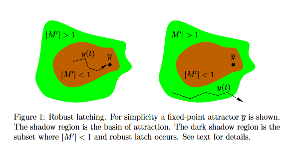

# Gradient Flow in Recurrent Nets: the Difficulty of Learning Long-Term Dependencies

## Introduction

Recurrent networks can, in principle, use their feedback connections to store representations of recent input events in the form of activations. The most widely used algorithms for learning what to put in short term memory, however, take too much time to be feasible or do not work well at all, especially when minimal time lags between inputs and corresponding teacher signals are long. Although theoretically fascinating, they do not provide clear practical advantages, say, backdrop in feedforward networks with limited time windows. With conventional "algorithms based on the computation of the complete gradient", such as "Back-Propagation Through Time" or "Real-Time Recurrent Learning" error signals "flowing backwards in time" tend to either (1) blow up or (2) vanish: the temporal evolution of the backpropagated error exponentially depends on the size of the weights. Case(1) may lead to oscillating weights, while in Case(2) learning to bridge long time lags takes a prohibitive amount of time, or doesnot work at all.

In what follows, we give a theoretical analysis of this problem by studying the asymptotic behavior of error gradients as a function of time lags. 

### 2 Exponential error decay

#### Gradients of the error function

The results we are going to prove hold regardless of the particular kind of cost function used(as long as its continuous in the output) and regardless of the particular algorithm which is employed to compute the gradient. 

**BPTT algorithm**:

The error at time t is denoted by E(t). Consider only the error at time t, output unit k's error signal is

$$\delta_k(t)=\frac{\partial E(t)}{\partial net_k(t)}$$

and some unit j's backpropagated error signal at time $\mathcal{T}<t$ is
$$\delta_j(\mathcal{T})=f'_j(net_j(\mathcal{T}))(\sum_i w_{ij} \delta_i(\mathcal{T}+1)),$$

where
$$net_i(\mathcal{T})=\sum_j w_{ij}a_j(\mathcal{T}-1)$$

is unit i's current net input,
$$a_i(\mathcal{T})=f_i(net_i(\mathcal{T}))$$

is the activation of a non-input unit i with differentiable transfer function $f_i , and w_{ij}$ is the weight on the connection from unit j to i. The corresponding contribution at time $\mathcal{T}<t$     to $w_{jl}'s$ total weight update is $\eta \delta_j(\mathcal{T})a_l(\mathcal{T}-1),$ where $\eta$ is the learning rate, and l stands for an arbitrary unit connected to unit j.

#### Error path integral

Suppose we have a fully connected net whose non-input unit indices range from 1 to n. Let us focus on local error flow from output unit k to arbitrary unit v. The error occuring at k time step t is propagated "back in time" for t-s time steps, to an arbitrary unit v at times s<t. This scales the error by the following factor:

$$\frac{\partial \delta_v(s)}{\partial \delta_k(t)}
=
\begin{cases}
f_v'\bigl(net_v(t-1)\bigr)\,w_{kv}, & t-s=1 \\[6pt]
f_v'\bigl(net_v(s)\bigr)
\left(
\displaystyle\sum_{l=1}^{n}
\frac{\partial \delta_l(s+1)}{\partial \delta_k(t)}\,w_{lv}
\right), & t-s>1
\end{cases}
\tag{1}
$$

In order to solve the above recurrence, we will expand it by unrolling over time. In particular, for s<$\mathcal{T}$<t let $l_{\mathcal{T}}$ denote the index of a generic non input unit in the replica of the network at time $\mathcal{T}$. Moreover, let $l_s=v$ and $l_t=k$. We obtain:

$$\frac{\partial \delta_v(s)}{\partial \delta_k(t)}=\sum_{l_{t-1}=1}^n \dots \sum_{l_{s+1}=1}^n (w_{l_tl_{t-1}}(\prod_{\mathcal{T}=t-1}^{s+1} f_{l_{\mathcal{T}}}'(net_{l_{\mathcal{T}}}(\mathcal{T})) w_{l_{\mathcal{T}}l_{\mathcal{T}-1}})f_{l_s}'(net_{l_s}(s))) \tag{2}$$

It can be immediately shown that if the local error vanishes, then the global error vanishes too.

### 3 Dillema: A voiding gradient decay prevents long term latching

The analysis of the problem of gradient decays is generalized to parameterized dynamical systems (hence including second order and other recurrent architectures). The main theorem shows that a sufficient condition to obtain gradient decay is also a necessary condition for the system to robustly store discrete state information for the long-term. In
other words, when the weights and the state trajectory are such that the network can “latch” on information in its hidden units (i.e., represent long-
term dependencies), the problem of gradient decay is obtained. When the long-term gradients decay exponentially, it is very difficult to learn such long-term dependencies because the total gradient is the sum of long-term and short-term influences and the short-term influences then completely dominate the gradient.

### 4 Remedies

The above theoretical investigations indicate a basic limitation of gradient descent as a search procedure for finding optimal weights in a RNN. Several proposals have been made to cope with the problem of long-term dependencies, some attempting to solve the optimization problem using alternative search algorithms, other trying to devise alternative architectures. In the following we give a brief accounts of these proposals.

##### Time constants

To deal with long time lags, Mozer uses time constants influencing changes of unit activations (deVries and Principe’s related approach may be viewed as a mixture of time-delay neural networks (TDNN) and time constants). For long time lags, however, the time constants need external fine tuning. An alternative approach updates the activation of a recurrent unit by adding the old activation and the(scaled) current net input. The net input, however, tends to perturb the stored information, which makes long-term storage impractical. Gradient flow in this architecture can be improved because embedded memories effectively introduce “shortcuts” in the error propagation
path through time. The same idea can be applied to other architectures, by inserting multiple delays in the connections among hidden state units rather
than output units. However, these architectures cannot solve the general problem since they can only increase by a constant multiplicative factor the duration of the temporal dependencies that can be learned. Finally, looked at hierarchically organized recurrent neural networks with different levels of time-constants or time-delays.

##### Long Short-Term Memory

There is a novel, efficient, gradient-based method called “Long Short-Term Memory” (LSTM). LSTM is designed to get rid of the vanishing error problem. Truncating the gradient where this does not do harm, LSTM can learn to bridge minimal time lags in excess of 1000 discrete time steps by enforcing constant error flow through “constant error carrousels” within special units. Multiplicative gate units learn to open and close access to the constant error flow. LSTM is local in space and time; its computational complexity per time step and weight is O(1). So far, experiments with artificial data involved local, distributed, real-valued, and noisy pattern representations. In comparisons with RTRL, BPTT, Recurrent  Cascade-Correlation, Elman networks, and Neural Sequence Chunking, LSTM led to many more successful runs, and learned much faster. LSTM also solved complex, artificial long time lag tasks that have never been solved by previous recurrent network algorithms. It will be interesting to examine to which extent LSTM is applicable to real world problems such as language separation from prosody and speech recognition.

##### Conclusions

In principle, RNNs represent the most general and powerful sequence processing method. For instance, unlike Hidden Markov Models  they are not limited to discrete internal states but allow for continuous, distributed sequence representations. Hence they can solve tasks no other current method can solve. The problem of vanishing gradients, however, makes conventional RNNs hard to train. We suspect this is why feedforward neural networks outnumber RNNs in terms of successful real-world applications. Some of the remedies outlined in this chapter may lead to more effective learning systems. However, long lime lag research still seems to be in an early stage — no commercial applications of any of these methods have been reported so far.
Long time lags pose problems to any soft computing method, not just RNNs. For instance, when dealing with long sequences (e.g., speech or biological data), HMMs mostly rely on localized representation of time by means of highly constrained non ergodic transition diagrams (different states are designed for different portions of a sequence). Belief propagation over long time lags does not effectively occur, a phenomenon called diffusion of credit, which closely resembles the vanishing gradients problem in RNNs.
