# Language Models are Few-Short Learners

## Abstract

- Recent work has demonstrated substantial gain on many NLP tasks and benchmarks by pre-training on a large corpus of text followed by fine-tuning on a specific task. While typically task-agnostic in architecture, this method still requires task-specific fine-tuning datasets of thosuands or tens of thousands of examples. By contrast, humans can generally perform a new language task from only a few examples or a few simple instructions. This paper shows scaling up language models greatly improves task-agnostic, few-shot performance, sometimes even reaching competitiveness with prior state-of-the-art fine-tuning approaches.

### Introduction

- Recent years have featured a trend towards pre-trained language representations in NLP systems, applied in increasingly flexible and task-agnostic way for downstream transfer. First, single layer representations were learned using word vectors and fed to task-specific architectures, then RNNs with multiple layers of representations and contextual state were used to form stronger representations(though still applied to task-specific architectures) and more recently pre-trained recurrent or transformer language models have been directly fine-tuned, entirely removing the need for task-specific architectures.

- This last paradigm has led to substantial progress on many challenging NLP tasks such as reading comprehension, question answering, textual entailment, and many others, and has continued to advance based on new architectures and algorithms. However, a major limitation to this approach is that while the architecture is task-agnostic, there is still a need for task-specific datasets and task-specific fine-tuning: to achieve strong performance on a desired task typically requires fine-tuning on a dataset of thousands to hundreds of thousands of examples specific to that task. Removing this limitation would be desirable, for several reasons.

- First, from a practical perspective, the need for a large dataset of labeled examples for every new task limits the applicability of language models. There exists a very wide range of possible useful language tasks, encompassing anything from correcting grammar, to generating examples of an abstract concept, to critiquing a short story. For many of these tasks it is difficult to collect a large supervised training dataset, especially when the process must be repeated for every new task.

- Second, the potential to exploit spurious correlations in training data fundamentally grows with the expressiveness of the model and the narrowness of the training distribution. This can create problems for the pre-training plus fine-tuning paradigm, where models are designed to be large to absorb information during pre-training, but are then fine-tuned on very narrow task distributions. For instance observe that larger models do not necessarily generalize better out-of-distribution. There is evidence that suggests that the generalization achieved under this paradigm can be poor because the model is overly specific to the training distribution and doesnot generalize well outside it. Thus, the performance of fine-tuned models on specific benchmarks, even when it is nominally human level, may exaggerate actual performance on the underlying task.

- Third, humans do not require large supervised datasets to learn most language tasks - a brief directive in natural language( e.g "please tell me if this sentence describes something happy or something sad") or at modt a tiny number of demonstrations(e.g. "here are 2 examples of people acting brave; please give a third example of bravery") is often sufficient to enable a human to perform a new task to at least a reasonable degree of competence. Aside from pointing to a conceptual limitation in our current NLP techniques, this adaptibility has practical advantages - it allows humans to seamlessly mix together or switch between many tasks and skills, for example performing addition during a lengthy dialogue. To be broadly useful, we would someday like our NLP systems to have this same fluidity and generality.

- One potential route towards addressing these issues is **meta-learning** - which in the context of language models means the model develops a broad set of skills and pattern recognition abilities at training time, and then uses those abilities at infernece time to rapidly adapt to or recognize the desired task. Recent work attempts to do this via what we call "in-context learning", using the text input of a pretrained language model as a form of task specification: the model is conditioned on a natural language instruction and/or a few demonstrations of the task and is then expected to complete further instances of the task simply by predicting what comes next.

- While it has shown some intial promise, this approach still achieves results far inferior to fine-tuning.

- Each increase in the number of parameters of a model has brought improvements in text synthesis and/or downstream NLP tasks, and there is evidence suggesting that log loss, which correlates well with many downstream tasks, follows a smooth trend of improvement with scale. Since in-context learning involves absorbing many skills and tasks within the parameters of the model, it is plausible that in-context learning abilities might show similarly strong gains with scale.

- In the context of language models this has sometimes been called “zero-shot transfer”, but this term is potentially ambiguous: the method is “zero-shot” in the sense that no gradient updates are performed, but it often involves providing inference-time demonstrations to the model, so is not truly learning from zero examples. To avoid this confusion, we use the term “meta-learning” to capture the inner-loop / outer-loop structure of the general method, and the term “in context-learning” to refer to the inner loop of meta-learning. We further specialize the description to “zero-shot”, “one-shot”, or “few-shot” depending on how many demonstrations are provided at inference time. These terms are intended to remain agnostic on the queston of whether the model learns new tasks from scratch at inference time or simply recognizes patterns seen during training – this is an important issue which we discuss later in the paper, but “meta-learning” is intended to encompass both possibilities, and simply describes the inner-outer loop structure.

- In this paper, we test this hypothesis by training a 175 billion parameter autoregressive language model, which we call GPT-3, and measuring its in-context learning abilities. Specifically, we evaluate GPT-3 on over two dozen NLP datasets,as well as several novel tasks designed to test rapid adaptation to tasks unlikely to be directly contained in the training set. For each task, we evaluate GPT-3 under 3 conditions: (a) “few-shot learning”, or in-context learning where we allow as many demonstrations as will fit into the model’s context window (typically 10 to 100), (b) “one-shot learning”, where we allow only one demonstration, and (c) “zero-shot” learning, where no demonstrations are allowed and only an instruction in natural language is given to the model. GPT-3 could also in principle be evaluated in the traditional fine-tuning setting, but we leave this to future work.

- Model performance improves with the addition of a natural language task description, and with the number of examples in the model’s context, K. Few-shot learning also improves dramatically with model size. Though the results in this case are particularly striking, the general trends with both model size and number of examples in-context hold for most tasks we study. We emphasize that these “learning” curves involve no gradient updates or fine-tuning, just increasing numbers of demonstrations given as conditioning.

- Broadly, on NLP tasks GPT-3 achieves promising results in the zero-shot and one-shot settings, and in the the few-shot setting is sometimes competitive with or even occasionally surpasses state-of-the-art (despite state-of-the-art being held by fine-tuned models). For example, GPT-3 achieves 81.5 F1 on CoQA in the zero-shot setting, 84.0 F1 on CoQA in the one-shot setting, 85.0 F1 in the few-shot setting. Similarly, GPT-3 achieves 64.3% accuracy on TriviaQA in the zero-shot setting, 68.0% in the one-shot setting, and 71.2% in the few-shot setting, the last of which is state-of-the-art relative to fine-tuned models operating in the same closed-book setting.

- GPT-3 also displays one-shot and few-shot proficiency at tasks designed to test rapid adaption or on-the-fly reasoning, which include unscrambling words, performing arithmetic, and using novel words in a sentence after seeing them defined only once. We also show that in the few-shot setting, GPT-3 can generate synthetic news articles which human evaluators have difficulty distinguishing from human-generated articles.

### 2. Approach

- Our basic pre-training approach, including model,data and training inovlves straightforward scaling up of the model size, dataset size and diversity and length of training. Our use of in-context learning involves systematically exploring different settings for learning within the context. 

- **Fine-tuning** has been the most common approach in recent years, and involves updating the weights of a pretrained model by training on a supervised dataset specific to the desired task. Typically thousands to hundreds of thousands labeled examples are used. The main advantage of fine-tuning is strong performance on many benchmarks. The main disadvantages are the need for a new large dataset for every task, the potential for poor generalization out-of-distribution, and the potential to exploit spurious features of the training data, potentially resulting in an unfair comparison with human performance. In this work we do not fine-tune GPT-3 because our focus is on task-agnostic performance, but GPT-3 can be fine-tuned in principle and this is a promising direction for future work.

- **Few-Shot** is the term we will use to refer to the setting where the model is given a few demonstrations of the task at  inference time as conditioning, but no weight updates are allowed.For a typical dataset an example has a context and a desired completion, and few shot works by giving K examples of context and completion and then one final example of context,with the model expected to provide the completion. We typically set K in the range of 10 to 100 as this is how many examples can fit in the model's context window. The main advantages of few-shot are a major reduction in the need for task-specific  data and reduced potential to learn an overly narrow distribution from a large but narrow fine-tuning dataset. The main disadvantage is that results from this method have so far been much worse than state-of-the-art fine-tuned models. Also , a small amount of task specific data is still required.

- **One-Shot** is the same as few-shot except that only one demonstration is allowed, in addition to a natural language description of the task. The reason to distinguish one-shot from few-shot and zero-shot is that it most closely matches the way in which some tasks are communicated to humans. For example, when asking humans to generate a dataset on a human worker service(for example Mechnaical Turk), it is common to give one demonstration of the task. By contrast it is sometimes difficult to communicatr the content or format of a task if no examples are given.

- **Zero-Shot** is the same as one shot except that no demonstrations are allowed, and the model is only given a natural language instruction describing the task. This method provides maximum convenience, potential for robustness and avoidance of  spurious correlations (unless they occur very broadly across the large corpus of pre-training data), but is also the most challenging setting. In some cases it may even be difficult for humans to understand the format of the task without prior examples, so this setting is in some cases “unfairly hard”. For example, if someone is asked to “make a table of world records for the 200m dash”, this request can be ambiguous, as it may not be clear exactly what format the table should have or what should be included (and even with careful clarification, understanding precisely what is desired can be difficult). Nevertheless, for at least some settings zero-shot is closest to how humans perform tasks.

#### 2.1 Model and Architectures

- They used the same model as GPT2, including the modified initialization, pre-normalization, and reversible tokenization described therein, with the exception that we use alternating dense and locally banded sparse attention patterns in the layers of the transformer, similar to the Sparse Transformer. Models ranging from 125 million parameters to 175 Billion parameters were used. Previous work suggested that with enough training data, scaling of validation loss should be approximately a smooth power law as a function of size; training models of many different sizes allows us to test this hypothesis both for validation loss and for downstream language tasks.

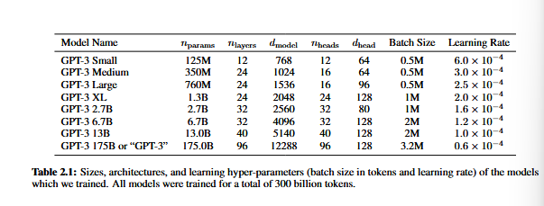

- Here $n_{params}$ is the total number of trainable parameters, $n_{layers}$ is the total number of layers, $d_{model}$ is the number of units in each bottleneck layer (we always have the feedforward layer four times the size of the bottleneck layer, $d_{ff} = 4 ∗ d_{model}$), and $d_{head}$ is the dimension of each attention head. All models use a context window of $n_{ctx}$ = 2048 tokens. We partition the model across GPUs along both the depth and width dimension in order to minimize data-transfer between nodes. The precise architectural parameters for each model are chosen based on computational efficiency and load-balancing in the layout of models across GPU’s.

#### 2.2 Training Dataset 

- found that unfiltered or lightly filtered versions of Common Crawl tend to have lower quality than more curated datasets. Therefore, we took 3 steps to improve the average quality of our datasets:

    1. we downloaded and filtered a version of CommonCrawl based on similarity to a range of high-quality reference corpora, 
    2. we performed fuzzy deduplication at the document level, within and across datasets, to prevent redundancy and preserve the integrity of our held-out validation set as an accurate measure of overfitting, 
    3. we also added known high-quality reference corpora to the training mix to augment CommonCrawl and increase its diversity.

- A major methodological concern with language models pretrained on a broad swath of internet data, particularly large models with the capacity to memorize vast amounts of content, is potential contamination of downstream tasks by having their test or development sets inadvertently seen during pre-training. To reduce such contamination, we searched for and attempted to remove any overlaps with the development and test sets of all benchmarks studied in this paper. Unfortunately, a bug in the filtering caused us to ignore some overlaps, and due to the cost of training it was not feasible to retrain the model.

#### Evaluation

- For few-shot learning, we evaluate each example in the evaluation set by randomly drawing K examples from that task’s training set as conditioning, delimited by 1 or 2 newlines depending on the task. For LAMBADA and Storycloze there is no supervised training set available so we draw conditioning examples from the development set and evaluate on the test set. For Winograd (the original, not SuperGLUE version) there is only one dataset, so we draw conditioning examples directly from it.

- K can be any value from 0 to the maximum amount allowed by the model’s context window, which is nctx = 2048 for all models and typically fits 10 to 100 examples. Larger values of K are usually but not always better, so when a separate development and test set are available, we experiment with a few values of K on the development set and then run the best value on the test set. For some tasks we also use a natural language prompt in addition to (or for K = 0, instead of) demonstrations.

- On tasks that involve choosing one correct completion from several options (multiple choice), we provide K examples of context plus correct completion, followed by one example of context only, and compare the LM likelihood of each completion. For most tasks we compare the per-token likelihood (to normalize for length), however on a small number of datasets (ARC, OpenBookQA, and RACE) we gain additional benefit as measured on the development set by normalizing by the unconditional probability of each completion, by computing $\left(\frac{P (completion|context)}{P (completion|answer_context)}\right)$ , where answer context is the string "Answer: " or "A: " and is used to prompt that the completion should be an answer but is otherwise generic.

- On tasks that involve binary classification, we give the options more semantically meaningful names (e.g. “True” or “False” rather than 0 or 1) and then treat the task like multiple choice. On tasks with free-form completion, we use beam search: a beam width of 4 and a length penalty of α = 0.6. We score the model using F1 similarity score, BLEU, or exact match, depending on what is standard for the dataset at hand. Final results are reported on the test set when publicly available, for each model size and learning setting (zero-, one-,and few-shot). When the test set is private, our model is often too large to fit on the test server, so we report results on the development set. We do submit to the test server on a small number of datasets (SuperGLUE, TriviaQA, PiQa) where we were able to make submission work, and we submit only the 200B few-shot results, and report development set results for everything else.

### Results

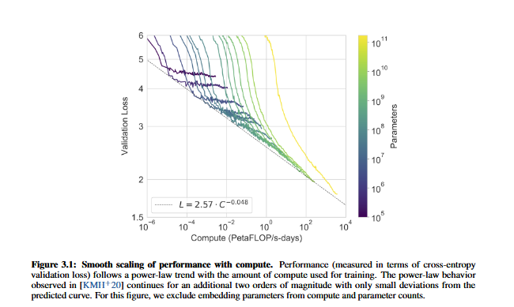

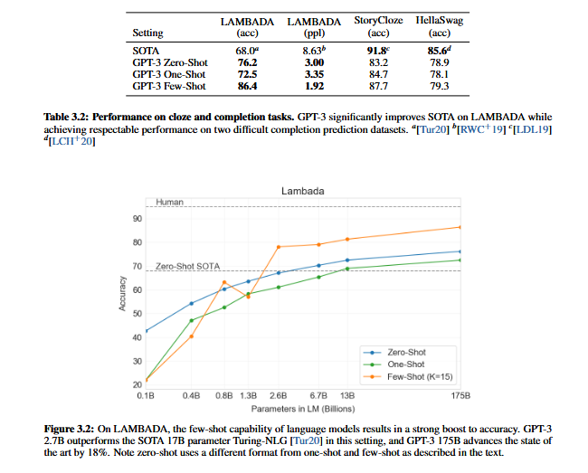

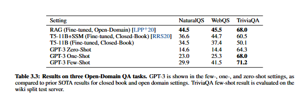

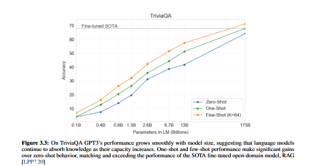

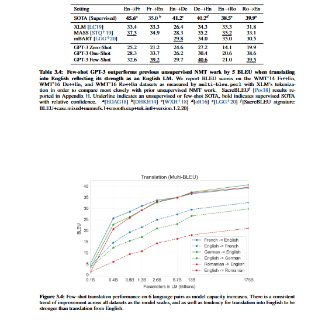

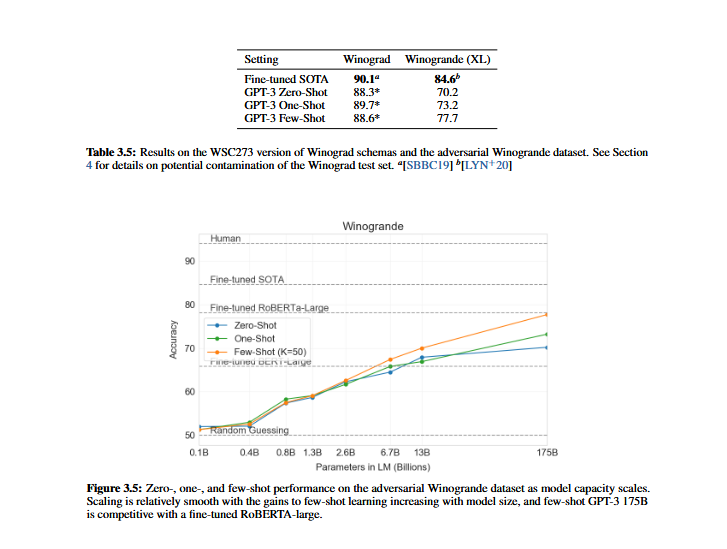

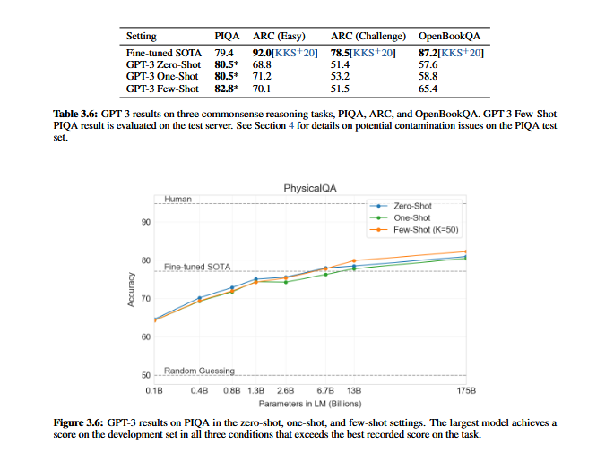

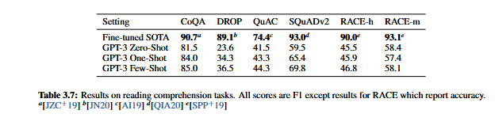

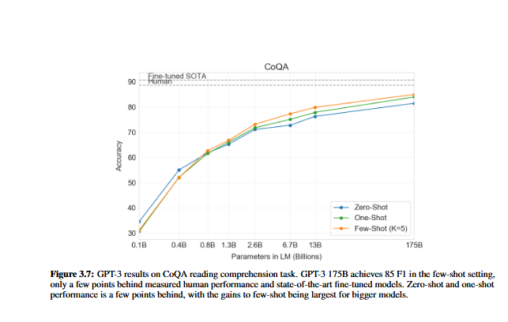

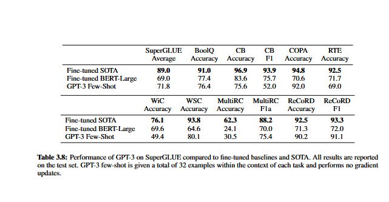

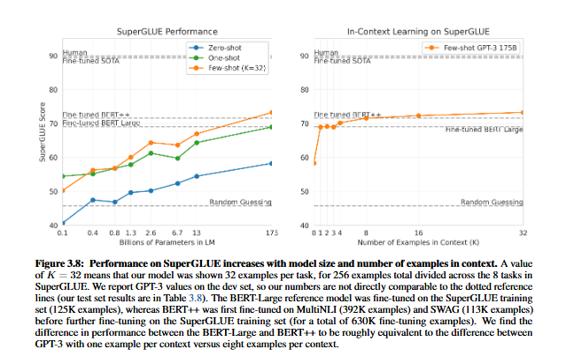

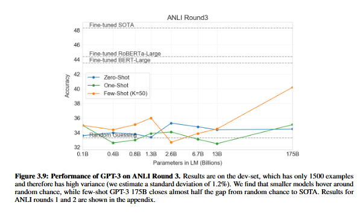
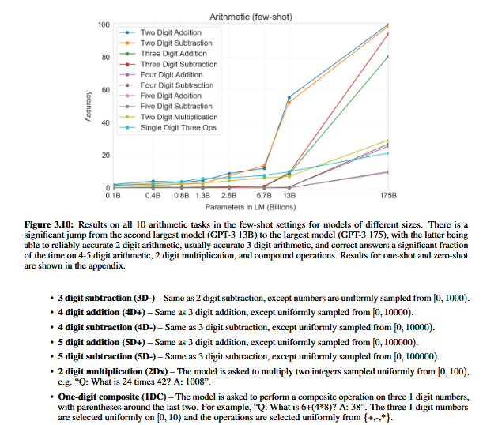

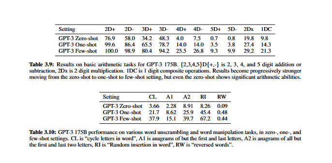
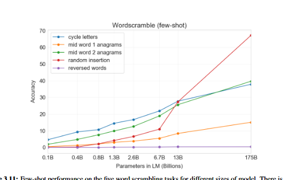

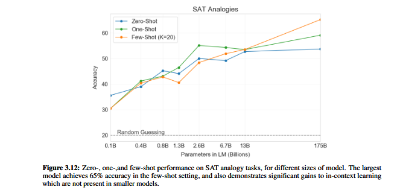

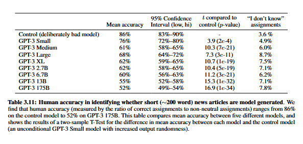

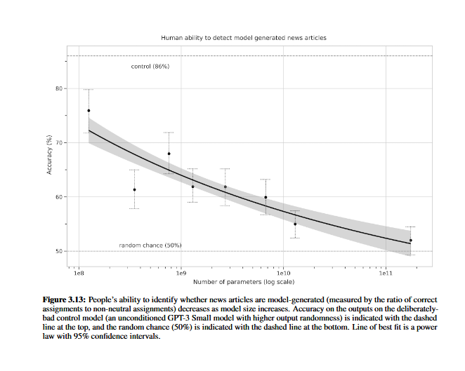

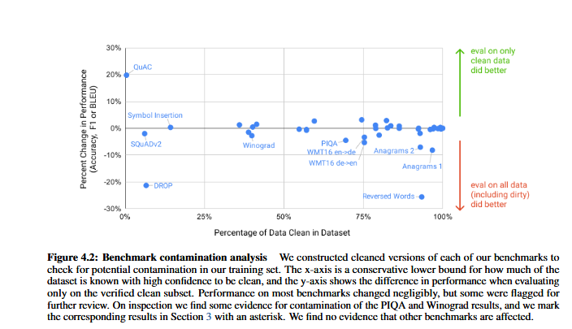

### Limitations

GPT-3 and our analysis of it have a number of limitations. Below we describe some of these and suggest directions for future work.

First, despite the strong quantitative and qualitative improvements of GPT-3, particularly compared to its direct predecessor GPT-2, it still has notable weaknesses in text synthesis and several NLP tasks. On text synthesis, although the overall quality is high, GPT-3 samples still sometimes repeat themselves semantically at the document level, start to lose coherence over sufficiently long passages, contradict themselves, and occasionally contain non-sequitur sentences or paragraphs.

 Within the domain of discrete language tasks, we have noticed informally that GPT-3 seems to have special difficulty with “common sense physics”, despite doing well on some datasets (such as PIQA) that test this domain. Specifically GPT-3 has difficulty with questions of the type “If I put cheese into the fridge, will it melt?”. Quantitatively, GPT-3’s in-context learning performance has some notable gaps on our suite of benchmarks, as described in Section 3, and in particular it does little better than chance when evaluated one-shot or even few-shot on some “comparison” tasks, such as determining if two words are used the same way in a sentence, or if one sentence implies another (WIC and ANLI respectively), as well as on a subset of reading comprehension tasks. This is especially striking given GPT-3’s strong few-shot performance on many other tasks.

GPT-3 has several structural and algorithmic lmitations, which could account for some of the issues above. We focused on exploring in-context learning behavior in autoregressive language models because it is straightforward to both sample and compute likelihoods with this model class. As a result our experiments do not include any bidirectional architectures or other training objectives such as denoising. This is a noticeable difference from much of the recent literature, which has documented improved fine-tuning performance when using these approaches over standard language models [RSR+19]. Thus our design decision comes at the cost of potentially worse performance on tasks which empirically benefit from bidirectionality. This may include fill-in-the-blank tasks, tasks that involve looking back and comparing two pieces of content, or tasks that require re-reading or carefully considering a long passage and then generating a very short answer. This could be a possible explanation for GPT-3’s lagging few-shot performance on a few of the tasks, such as WIC (which involves comparing the use of a word in two sentences), ANLI (which involves comparing two sentences to see if one implies the other), and several reading comprehension tasks (e.g. QuAC and RACE). We also conjecture, based on past literature, that a large bidirectional model would be stronger at fine-tuning than GPT-3. Making a bidirectional model at the scale of GPT-3, and/or trying to make bidirectional models work with few- or zero-shot learning, is a promising direction for future research, and could help achieve the “best of both worlds”. 

A more fundamental limitation of the general approach described in this paper – scaling up any LM-like model, whether autoregressive or bidirectional – is that it may eventually run into (or could already be running into) the limits of the pretraining objective. Our current objective weights every token equally and lacks a notion of what is most important to predict and what is less important.Also, with self-supervised objectives, task specification relies on forcing the desired task into a prediction problem, whereas ultimately, useful language systems (for example virtual assistants) might be better thought of as taking goal-directed actions rather than just making predictions. Finally, large pretrained language models are not grounded in other domains of experience, such as video or real-world physical interaction, and thus lack a large amount of context about the world.

For all these reasons, scaling pure self-supervised prediction is likely to hit limits, and augmentation with a different approach is likely to be necessary. Promising future directions in this vein might include learning the objective function from humans, fine-tuning with reinforcement learning, or adding additional modalities such as images to provide grounding and a better model of the world .

Another limitation broadly shared by language models is poor sample efficiency during pre-training. While GPT-3
takes a step towards test-time sample efficiency closer to that of humans (one-shot or zero-shot), it still sees much more text during pre-training than a human sees in the their lifetime. Improving pre-training sample efficiency is an important direction for future work, and might come from grounding in the physical world to provide additional information, or from algorithmic improvements.

A limitation, or at least uncertainty, associated with few-shot learning in GPT-3 is ambiguity about whether few-shot learning actually learns new tasks “from scratch” at inference time, or if it simply recognizes and identifies tasks that it has learned during training. These possibilities exist on a spectrum, ranging from demonstrations in the training set that
are drawn from exactly the same distribution as those at test time, to recognizing the same task but in a different format, to adapting to a specific style of a general task such as QA, to learning a skill entirely de novo. Where GPT-3 is on this spectrum may also vary from task to task. Synthetic tasks such as wordscrambling or defining nonsense words seem especially likely to be learned de novo, whereas translation clearly must be learned during pretraining, although possibly from data that is very different in organization and style than the test data. Ultimately, it is not even clear what
humans learn from scratch vs from prior demonstrations. Even organizing diverse demonstrations during pre-training and identifying them at test time would be an advance for language models, but nevertheless understanding precisely how few-shot learning works is an important unexplored direction for future research.

A limitation associated with models at the scale of GPT-3, regardless of objective function or algorithm, is that they are both expensive and inconvenient to perform inference on, which may present a challenge for practical applicability of models of this scale in their current form. One possible future direction to address this is distillation of large models down to a manageable size for specific tasks. Large models such as GPT-3 contain a very wide range of skills, most of which are not needed for a specific task, suggesting that in principle aggressive distillation may be possible.
Distillation is well-explored in general but has not been tried at the scale of hundred of billions parameters; new challenges and opportunities may be associated with applying it to models of this size.
Finally, GPT-3 shares some limitations common to most deep learning systems – its decisions are not easily interpretable, it is not necessarily well-calibrated in its predictions on novel inputs as observed by the much higher variance in performance than humans on standard benchmarks, and it retains the biases of the data it has been trained on. This last issue – biases in the data that may lead the model to generate stereotyped or prejudiced content – is of special concern from a societal perspective.

