# Scaling Laws for Neural Language Models

### Abstract

- This paper is to study empirical scaling laws for language model performance on the cross-entropy loss. The loss scales as a power-law with model size, dataset size and the amount of compute used for training, with some trends spanning more than seven orders of magnitude. Other architectural details such as network width or depth have minimal effects within a wide range. Simple equations govern the dependence of overfitting on model/dataset size and the dependence of training speed on model size. These relationships allow us to determine the optimal allocation of a fixed compute budget. Larger models are significantly more sample-efficient, such that optimally compute-efficient training involves training very large models on a relatively modest amounts of data and stopping significantly before convergence.

#### Introduction

- Language provides a natural domain for the study of artificial intelligence, as the vast majority of reasoning tasks can be efficiently expressed and evaluated in language, and the world's text provides a wealth of language modeling, with state of the art models approaching human-level performance on many specific tasks, including the composition of coherent multi-paragraph prompted text samples.

- One might expect language modeling performance to depend on model architecture, the size of neural models, the computing power used to train them, and the data available for this training process. In this work, we will empirically investigate the dependence of language modeling loss on all of these factors, focusing on the Transformer architecture. The high ceiling and low floor for performance on language tasks allows us to study trends over more than seven orders of magnitude in scale.

- Throughout we will observe precise power-law scalings for performance as a function of training time, context length, dataset size, model size and compute budget.

#### Summary

- Key findings for Transformer language models are as follows:

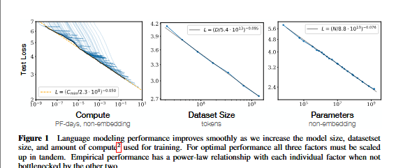

- Language modeling performancr improves smoothly as we increase the model size, dataset size and amount of compute used for training.

- **Performance depends strongly on scale, weakly on model shape**: Model performance depends most strongly on scale, which consists of three factors: the number of model parameters N (excluding embeddings), the size of the dataset D, and the amount of compute C used for training. Within reasonable limits, performance depends very weakly on other architectural hyperparameters such as depth vs width.

- **Smooth power laws**: Performance has a power-law relationship with each of the three scale factors N,D,C when not bottlenecked by the other two, with trends spanning more than six orders of magnitude. They observed no signs of deviation from these trends on the upper end, though performance must flatten out eventually before reaching zero loss.

- **Univerality of overfitting**: performance improves predictably as long as we scale up N and D in tandem, but enters a regime of diminishing returns if either N or D is held fixed while the other increases. The performance penalty depends predictably on the ratio $N^{0.74}/D$, meaning that every time we increase the model size 8x, we only need to increase the data by rougly 5x to avoid a penalty.

- **Universality of training**: Training curves follow predictable power-laws whose parameters are roughly independent of the model size. By extrapolating the early part of a training curve, we can roughly predict the loss that would be achieved if we trained for much longer.

- **Transfer improves with test performance**: When we evaluate models on text with a different distribution than they were trained on, the results are strongly correlated to those on the training validation set with a roughly constant offset in the loss - in other words, transfer to a different distribution incurs a constant penalty but otherwise improves roughly in line with performance on the training set.

- **Sample Efficiency**: Large models are more sample-efficient than small models, reaching the same level of performance with fewer optimization steps and using fewer data points.

- **Convergence is inefficient**: When working within a fixed compute budget C but without any other restrictions on the model size N or available data D, we attain optimal performance by training very large models and stopping significantly short of convergence. Maximally compute-efficient training would therefore be far more sample efficient than one might expect based on training small models to convergence, with data requirements growing very slowly as $D~C^{0.27}$ with training compute.

- **Optimal batch size**: The ideal batch size for training these models is roughly a power of the loss only, and continues to be determinable by measuring the gradient noise scale; it is roughly 1-2 million tokens at convergence for the largest models we can train.

- Taken together, these results show that language modeling performance improves smoothly and predictably as we appropriately scale up model size, data and compute. We expect that larger language models will perform better and be more sample efficient than current models.

#### Summary of Scaling Laws

- The test loss of a transformer trained to autoregressively model language can be predicted using a power-law when performance is limited by only either the number of non-embedding parameters N, the dataset size D, or the optimally allocated compute budget $C_{min}$:

    1. For models with a limited number of parameters, trained to convergence on sufficiently large datasets:
        $$L(N) = \left(\frac{N_c}{N}\right)^{\alpha_N},\qquad \alpha_N \approx 0.076,\quad N_c \approx 8.8 \times 10^{13}$$ (non-embedding parameters)
    
    2. For large models trained with a limited dataset with early stopping:
        $$L(D) = \left(\frac{D_{c}}{D}\right)^{\alpha_D} ; \alpha_D \approx 0.095, D_c \approx 5.4 \times 10^{13}$$ (tokens)
    3. When training with a limited amount of compute, a sufficiently large dataset, an optimally-sized model, and a sufficiently small batch size(making optimal use of compute):
        $$L(C_{\min})=\left(\frac{C_c^{\min}}{C_{\min}}\right)^{\alpha_C^{\min}} ; {\alpha_C}^{min} \approx 0.050, {C_c}^{min} \approx 3.1 \times 10^{8}$$(PF-days)

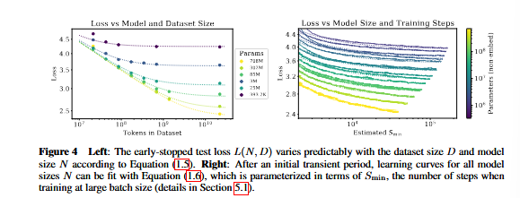

- These relations hold across eight orders of magnitude in $C_{min}$, six orders of magnitude in N, and over two orders of magnitude in D. They depend very weakly on model shape and other Transformer hyperparameters(depth, width, number of self-attention heads), with specific numerical values associated with the Webtext2 training set. The power laws  $\alpha_N, \alpha_D, {\alpha_C}^{min}$ specify the degree of performance improvement expected as we scale up N,D or $C_{min}$; for example, doubling the number of parameters yields a loss that is smaller by a factor $2^{-\alpha_N}=0.95$. The precise numerical values of $N_c, {C_c}^{min}, and D_c$ depend on the vocabulary size and tokenization and hence do not have a fundamental meaning.

- The critical batch size, which determines the speed/efficiency tradeoff for data parallelism, also roughly obeys a power law in L:
        $$B_{crit}(L)= \left(\frac{B_*}{L^{1/{\alpha_B}}}\right), B_* \approx 2.10^{8} tokens, \alpha_B \approx 0.21$$

- The first 2 equations together suggest that as we increase the model size, we should increase the dataset size sublinearly according to $D \propto N^{\alpha_N/{\alpha_D}} \approx N^{0.74}$. In fact, we find that there is a single equation combining the 2 equations that governs the simultaneous dependence on N and D and governs the degree of overfitting:
        $$L(N,D)=[(N_c/{N})^{\alpha_N/{\alpha_D}}+D_c/D]^{\alpha_D}$$. We conjucture that this functional form may also parameterize the trained log-likelihood for other generative modeling tasks.
        When training a given model for a finite number of parameter update steps S in the infinite data limit, after an initial transient period, the learning curves can be accurately fit by:
        $$L(N,S)=(N_c/N)^{\alpha_N}+(S_c/{S_{min}(S)})^{\alpha_S} where S_c \approx 2.1 \times 10^3 and \alpha_S \approx 0.76, and S_{min}(S)$$ is the minimum possible number of optimization steps(paramter updates) estimated using the equation $$ S_{min}(S)=S/({1+({B_{crit}(L)})/B})$$
        When training within a fixed compute budget C, but with no other constraints, the above equations leads to the prediction that the optimal model size N, optimal batch size B, optimal number of steps S, and dataset size D should grow as $$ N \propto C^{{{\alpha_C}^{min}}/\alpha_N}, B \propto C^{{{\alpha_C}^{min}}/\alpha_B}, S \propto C^{{{\alpha_C}^{min}}/\alpha_S}, D=B.S$$ with
        $${\alpha_C}^{min}=1/{(1/{\alpha_S}+1/{\alpha_B}+1/{\alpha_N})}$$ which closely matches the empirically optimal results $N \propto C_{min}^{0.73},B \propto C_{min}^{0.24},S \propto C_{min}^{0.03}$. As the computational budget C increases, it should be spent primarily on larger models, without dramatic increases in training time or dataset size. This also implies that as models grow larger, they become increasingly sample efficient. In practice, resarchers typically train smaller models for longer than would be maximally compute-efficient because of hardware constraints. Optimal performance depends on total compute as a power law.

#### Notation

- L: the cross-entropy loss in nats. Typically it will be averaged over the tokens in a context, but in some cases we report the loss for specific tokens within the context.

- N: the number of model parameters, excluding all vocabulary and positional embeddings.

- $C \approx 6N BS$- an estimate of the total non-embedding training compute, where B is the batch size, and S is the number of training steps. We quote numerical values in PF-days, where one PF-day= $10^{15} \times 24 \times 3600 = 8.64 \times 10^{19}$ floating point operations.

- D- the dataset size in tokens.

- $B_{crit}$- the critical batch size. Training at the critical batch size provides a roughly optimal compromise between time and compute efficiency.

- $C_{min}$- an estimate of the minimum amount of non-embedding compute to reach a given value of the loss. This is the training compute that would be used if the model were trained at a batch size much less than the critical batch size.

- $S_{min}$- an estimate of the minimal number of training steps needed to reach a given value of the loss. This is also the number of training steps that would be used if the model were trained at a batch size much greater than the critical batch size.

- $\alpha_x$- power-law exponents for the scaling of the loss as $L(X) \propto 1/{X^{\alpha_x}}$ where X can be any of N,D,C,S,B,$C^{min}$.

#### Background and Methods

- Language models were trained on WebText2, an extended version of the WebText datset, tokenized using byte-pair encoding with a vocabulary size $n_{vocab}=50257$. They optimized the autoregressive log-likelihood(i.e cross-entropy loss) averaged over a 1024-token context, which is also the principal performance metric. They recorded the loss on the WebText2 test distribution and on a selection  of other text distributions. They primarily trained decoder-only transformer models, though they also trained LSTM models and Universal Transformers for comparison.

#### Parameter and Compute Scaling of Transformers

- They parameterized the Transformer architecture using hyperparameters $n_{layer}$(number of layers), $d_{model}$(dimension of the residual stream), $d_{ff}$(dimension of the intermediate feed-forward layer), $d_{attn}$(dimension of the attention output) and $n_{heads}$(number of attention heads per layer). They included $n_{ctx}$ tokens in the input context, with $n_{ctx}$=1024 except where otherwise noted.

- They used N to denote the model size, which they defined as the number of non-embedding parameters
        $$N \approx 2d_{model}n_{layer}(2d_{attn}+d_{ff})=12n_{layer}d^2_{model} with the standard d_{attn}=d_{ff}/4=d_{model}$$
    where they have excluded biases and other sub-leading terms. Their models also had $n_{vocab}d_{model}$ parametrs in an embedding matrix, and use $n_{ctx}d_{model}$ parameters for positional embeddings, but they did not include these when discussing the model size N; this produces significantly cleaner scaling laws.

- Evaluating a forward pass of the Transformer involves roughly $C_{forward} \approx 2N+ 2n_{layer}n_{ctx}d_{model}$ add-multiply operations, where the factor of two comes from the multiply-accumulate operation used in matrix multiplication. 

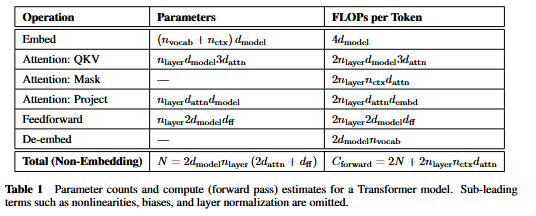

- For contexts and models with $d_{model}>n_{ctx}/12$, the context-dependent computational cost per token is a relatively small fraction of the total compute. Since we primarily study models where $d_{model}>>n_{ctx}/12$, we do not include context-dependent terms in our training compute estimate. Accounting for the backward pass(approximately twice the compute as the forward pass), we then define the estimated non-embedding compute as $C \approx 6N$ floating point operators per training token.

#### Training Procedures

- They trained the models with the Adam Optimizer for a fixed $2.5 \times 10^5$ steps with a batch size of 512 sequences of 1024 tokens. Due to memory constraints, the largest models(more than 1B parameters) were trained in Adafactor. Variety of learning rates and schedules were used. They found that the results at convergence were largely independent of the learning rate schedule. All training runs included in the data used a learning rate schedule with a 3000 step linear warmup followed by a cosine decay to zero.

#### Datasets

- The models have been trained on an extended version of WebText which was a web scrape of outbound links from Reddit through December 2017 which received at least 3 karma. The karma threshold served as a heuristic for whether people found the link interesting or useful. They applied reversible tokenizer which yields $2.29 \times 10^{10}$ tokens. $6.6 \times 10^8$ of these tokens for use as a test set.

#### Empirical Results and Basic Power Laws

- To characterize language model scaling they trained a wide variety of models, varying a number of factors including:
    - Model size(ranging in size from 768 to 1.5 billion non-embedding parameters)
    - Dataset size(ranging from 22 million to 23 billion tokens)
    - Shape(including depth,width,attention heads, and feed-forward dimension)
    - Context length(1024 for most runs)
    - Batch size($2^{19}$ for most runs)
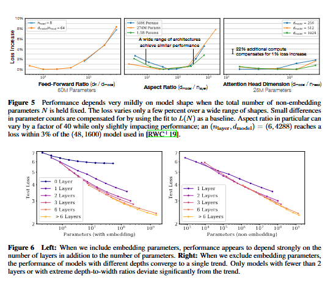

#### Approximate Transformer Shape and Hyperparameter Independence

- Transformer performance depends very weakly on the shape parameters when we hold the total non-embedding parametrs count N fixed. To establish these results we trained models with fixed size while varying a single hyperparameter.

#### Performance with Non-Embedding  Parameters Count N

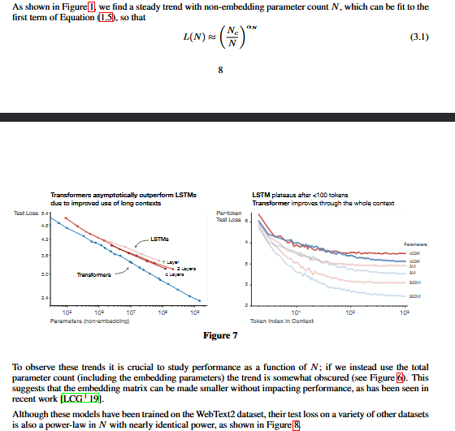

#### Comparing to LSTMs and Universal Transformers

- LSTM and transformer performance is compared as a function of non-embedding parameter count N. The LSTMs were trained with the same dataset and context length. LSTMs perform as well as transformers for tokens appearing early in the context but cannot match the transformer performance for the later tokens. Increasingly large powers for larger models suggest improved ability to quickly recognise patterns.

#### Generalization Among Data Distributions

- Loss on the other data distributions improves smoothly with model size, in direct parallel with the improvement on WebText2. Generalization depends almost exclusively on the in-distribution validation loss, and does not depend on the duration of training or proximity to convergence. 

#### Performanc with Dataset Size and Compute

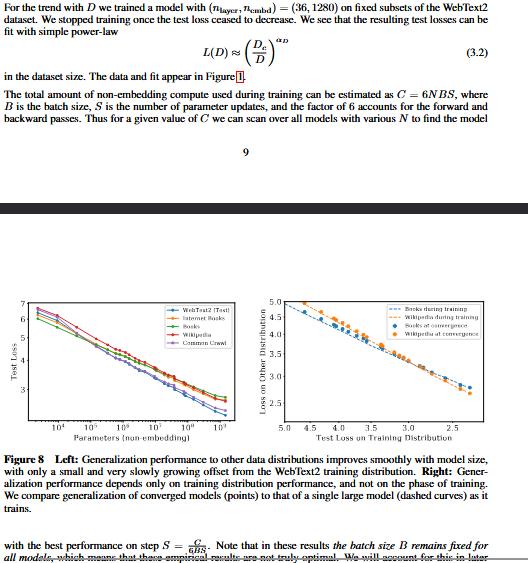
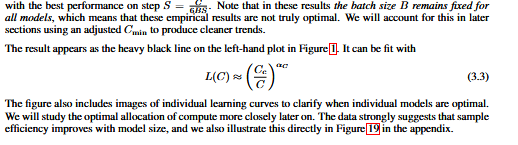

### Charting the Infinite Data Limit and Overfitting

- In the above section we found a number of basic scaling laws for language modeling performance. Now we study the performance of a model of size N trained on a dataset with D tokens while varying N and D simultaneously. This provides guidance on how much data we would need to train models of increasing size while keeping overfitting under control.

#### Proposed L(N,D) Equation

- $L(N,D)={[{(N_c/N)}^{\alpha_N/\alpha_D}+D_c/D]}^{\alpha_D}$ using three principles:

    1. Changes in vocabulary size or tokenization are expected to rescale the loss by an overall factor. The parameterization of L(N,D)(and all models of the loss) must naturally allow for such a rescaling.

    2. Fixing D and sending $N \to \infty$, the overall loss should approach L(D) . Conversely, fixing N and sending $D \to \infty$ the loss must approach L(N).

    3. L(N,D) should eb analytic at $D=\infty$, so that it has a series expansion in 1/D with integer powers. Theoretical support for this principle is significantly weaker than for the first two.

- This choice of L(N,D) satisfies the first requirement because we can rescale $N_c, D_c$ with changes in the vocabulary. This also implies that the values of $N_c,D_c$ have no fundamental meaning.

- Since training stops early when the test loss ceases to improve and optimize all models in the same way, we expect the larger models should always perform better than smaller models. But with fixed finite D, we also do not expect any model to be capable of approaching the best possible loss(i.e the entropy of the text). Similarly a model with a fixed size will be capacity-limited.

- The third reason is more speculative. There is a simple and general reason one might expect overfitting to scale $\propto 1/D$ at very large D. Overfitting should be related to the variance or the signal-to-noise ratio of the dataset, and this scales as 1/D. This expectation should hold for any smooth loss function, since we expect to be able to expand the loss about the $D \to \infty$ limit. However, this argument assumes that 1/D corrections dominate over other sources of variance, such as the finite batch size and other limits on the efficacy of optimization. Without empirical confirmation, we would not be very confident of its applicability.

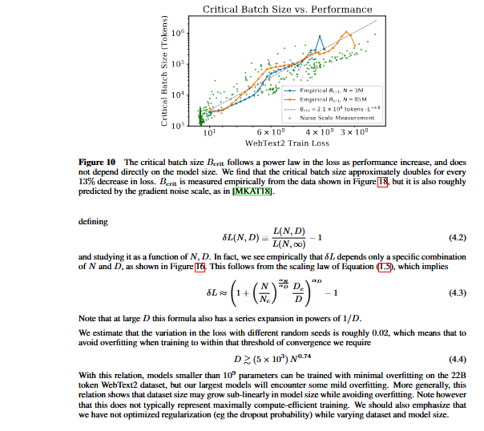

### Scaling Laws with Model size and Training time

- In this section , we study that a simple scaling law provides a good description for the loss as a function of model size N and training time. First we define a univeral training step $S_{min}$, which accounts for the fact that most of our models have not been trained at an optimal batch size. Then we demonstrate that we can fit the model size and training time dependence of the loss . Later we use these results to predict the optimal allocation of training compute between model size and training time, and then confirmed that prediction.

#### Adjustment for Training at $B_{crit}(L)$

- It was argued that there is a critical batch size $B_{crit}$ for training; for B up to $B_{crit}$ the batch size can be increased with very minimal degradation in compute-efficiency, whereas for B>$B_{crit}$ increases in B result in diminishing returns. It was also argued that the gradient noise scale provides a simple prediction for $B_{crit}$ and that neither depends directly on model size except through the value of the loss that has been attained. These results can be used to predict how training time and compute will vary with the batch size. To utilize both training time and compute as effectively as possible, it is best to train with a batch size B $\approx B_{crit}$. Training at B>> $B_{crit}$ minimizes the number of training steps, while B<<$B_{crit}$ minimizes the use of compute.

- More specifically, it was demonstrated that for a wide variety of neural network tasks, the number of training steps S and the number of data examples processed E=BS satisfy the simple relation:
        $$(S/{S_{min}}-1)(E/{E_{min}}-1)=1$$ when training to any fixed value of the loss L. Here $S_{min}$ is the minimum number of steps necessary to reach L ,while $E_{min}$ is the minimum number of data examples that must be processed.

- This relation defines the critical batch size
        $B_{crit}(L)=E_{min}/{S_{min}}$ which is a function of the target value of the loss. Training at the critical batch size makes a roughly optimal time/compute tradeoff, requiring $2S_{min}$ training steps and processing E=2$E_{min}$ data examples.

-  we have plotted the critical batch size and gradient noise scale as a function of training loss for two different models. We see that $B_{\mathrm{crit}}(L)$ is independent of model size, and only depends on the loss $L$. So the predictions of [MKA+18] continue to hold for Transformer language models. The critical batch size can be fit with a power-law in the loss $$B_{\mathrm{crit}}(L)\approx\frac{B_*}{L^{1/\alpha_B}}$$ where $B_* \approx 2\times10^8$ and $\alpha_B \approx 0.21$.

- We have chosen this parameterization for $B_{\mathrm{crit}}(L)$ because as the loss approaches its minimum value $L_{\min}$, the gradient noise scale is expected to diverge, and we expect $B_{\mathrm{crit}}$ to track this noise scale. We do not know $L_{\min}$, as we see no sign that our models are approaching it, but $L_{\min}>0$ since the entropy of natural language is non-zero. Since apparently $L_{\min}$ is much smaller than the values of $L$ we have achieved, we used a parameterization where $B_{\mathrm{crit}}$ diverges as $L\rightarrow0$.

- We will use $B_{\mathrm{crit}}(L)$ to estimate the relation between the number of training steps $S$ while training at batch size $B=2^{19}$ tokens and the number of training steps while training at $B\gg B_{\mathrm{crit}}$. This is simply $$S_{\min}(S)=\frac{S}{1+B_{\mathrm{crit}}(L)/B}\qquad\text{(minimum steps, at }B\gg B_{\mathrm{crit}}\text{)}$$

for any given target value $L$ for the loss. This also defines a critical value of the compute needed to train to $L$ with a model of size $N$ if we were to train at $B\ll B_{\mathrm{crit}}(L)$. This is

$$
C_{\min}(C)=\frac{C}{1+B/B_{\mathrm{crit}}(L)}
\qquad
\text{(minimum compute, at }B\ll B_{\mathrm{crit}}\text{)}
$$

where

$$
C=6NBS
$$

estimates the (non-embedding) compute used at batch size $B$.

## Results for $L(N,S_{\min})$ and Performance with Model Size and Compute

Now we will use $S_{\min}$ defined in Equation (5.4) to obtain a simple and universal fit for the dependence of the loss on model size and training time in the infinite data limit. We will fit the stable, Adam-optimized training runs using Equation (1.6), repeated here for convenience:

$$
L(N,S_{\min})=
\left(\frac{N_c}{N}\right)^{\alpha_N}
+
\left(\frac{S_c}{S_{\min}}\right)^{\alpha_S}
$$

for the loss. We include all training steps after the warmup period of the learning rate schedule, and find a fit to the data with the parameters:

With these parameters, we obtain the learning curve fits in Figure 4. Though the fits are imperfect, we believe
they are quite compelling given the simplicity of Equation (5.6).
The data and fits can be visualized in a different and more interesting way, as shown in Figure 11. There we
study the test loss as a function of model size while fixing either the total non-embedding compute C used
in training, or the number of steps S. For the fits we use Equation (5.5) and (5.4) along with the parameters
above and Equation (5.6).
The power-law dependence of the loss on Smin reflects the interplay of optimizer dynamics and the loss
landscape. Since the fits are best late in training, when the loss may be approximately quadratic, the power-
law should provide information about the spectrum of the Hessian of the loss. Its universality suggests that
the Hessian eigenvalue density is roughly independent of model size.

## 5.3 Lower Bound on Early Stopping Step

The results for $L(N,S_{\min})$ can be used to derive a lower-bound (and rough estimate) of the step at which early stopping should occur when training is data limited. It is motivated by the idea that finite and infinite $D$ learning curves for a given model will be very similar until we reach $S_{\mathrm{stop}}$. Thus, overfitting should be proportional to the correction from simply ending training at $S_{\mathrm{stop}}$. This will underestimate $S_{\mathrm{stop}}$, because in reality the test loss will decrease more slowly when we have a finite $D$, and therefore we will require more training steps to reach the optimal test loss at finite $D$. This line of reasoning leads to the inequality

$$
S_{\mathrm{stop}}(N,D)
\gtrsim
\frac{S_c}
{\left[L(N,D)-L(N,\infty)\right]^{1/\alpha_S}}
\tag{5.7}
$$

where $L(N,\infty)$ is the converged loss, evaluated with infinite available data. This inequality and its comparison to the empirical data is displayed in Figure 16 in the appendix. In that figure, the values of $S_{\mathrm{stop}}$ and $L(N,D)$ are empirical (though $S_{\mathrm{stop}}$ is adjusted to mimic training at $B \gg B_{\mathrm{crit}}$), while $L(N,\infty)$ is computed from the fit to $L(N,D)$ evaluated at $D=\infty$.

# 6 Optimal Allocation of the Compute Budget

We displayed the empirical trend of performance as a function of the computation used during training in the top-right of Figure 1. However, this result involved training at a fixed batch size $B$, whereas we know 
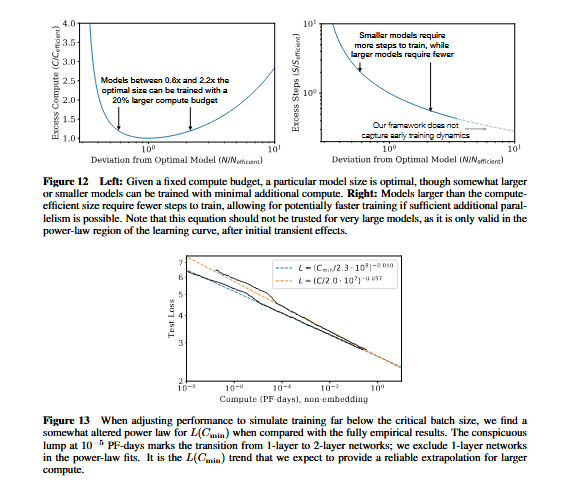

that in fact we could train more efficiently by training at the batch size $B_{\mathrm{crit}}$ (discussed in Section 5.1). Large and small values of the loss could have been achieved with fewer samples or fewer steps, respectively, and correcting for this inefficiency by standardizing to the critical batch size results in cleaner and more predictable trends.

In this section we will adjust for this oversight. More importantly, we will use the results of Section 5 to determine the optimal allocation of compute between model size $N$ and the quantity of data processed during training, namely $2B_{\mathrm{crit}}S_{\min}$. We will determine this allocation both empirically and theoretically, by using the equation for $L(N,S_{\min})$, and we will demonstrate that these methods agree.

## 6.1 Optimal Performance and Allocations

Let us first study the loss as a function of the optimally allocated compute from Equation (5.5). The result is plotted in Figure 13, along with a power-law fit. We see that as compared to the compute plot of Figure 1, the new fit with $C_{\min}$ is somewhat improved.

Given $L(C_{\min})$, it is natural to ask for the optimal model size $N(C_{\min})$ that provides the minimal loss with a given amount of compute. The optimal model size is shown in Figure 14. We observe that $N(C_{\min})$ 
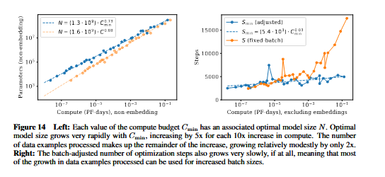

can be fit very well with a power-law

$$
N(C_{\min}) \propto C_{\min}^{0.73}
\tag{6.1}
$$

In Figure 12, we show the effect of training models of sub-optimal sizes (see Appendix B.4).

By definition $C_{\min}=6NB_{\mathrm{crit}}S$, and so we can use $N(C_{\min})$ to extract further results. In particular, since prior fits show $B\propto L^{-4.8}$ and $L\propto C^{-0.05}$, we can conclude that $B_{\mathrm{crit}}\propto C_{\min}^{0.24}$. This leads us to conclude that the optimal number of steps will only grow very slowly with compute, as

$$
S_{\min}\propto C_{\min}^{0.03},
\tag{6.2}
$$

matching the empirical results in Figure 14. In fact if the measured exponent is sufficiently small that our results may even be consistent with an exponent of zero.

Thus we conclude that as we scale up language modeling with an optimal allocation of computation, we should predominantly increase the model size $N$, while simultaneously scaling up the batch size via $B\approx B_{\mathrm{crit}}$ with negligible increase in the number of serial steps. Since compute-efficient training uses relatively few optimization steps, additional work on speeding up early training dynamics may be warranted.

## 6.2 Predictions from $L(N,S_{\min})$

The results for $L(C_{\min})$ and the allocations can be predicted from the $L(N,S_{\min})$ equation obtained in Section 5. Given our equation for $L(N,S_{\min})$, we can substitute $S_{\min}=C/(6N)$ and then find the minimum of the loss as a function of $N$, while fixing the training compute. We carry out this procedure in detail in Appendix B, where we also provide some additional predictions.

For the loss as a function of training compute, we predict that

$$
L(C_{\min})=
\left(\frac{C_c^{\min}}{C_{\min}}\right)^{\alpha_C^{\min}}
\tag{6.3}
$$

where

$$
\alpha_C^{\min}
=
\frac{1}{1/\alpha_S+1/\alpha_B+1/\alpha_N}
\approx 0.054
\tag{6.4}
$$

in excellent agreement with the exponent of Figure 13. We also predict that

$$
N(C_{\min})
\propto
(C_{\min})^{\alpha_N^{\min}}
\propto
(C_{\min})^{0.71}
\tag{6.5}
$$

which also matches the scaling of Figure 14 to within a few percent. Our scaling laws provide a predictive framework for the performance of language modeling.

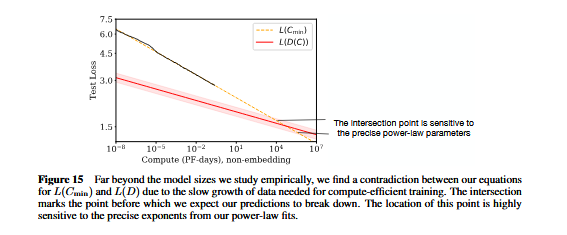

## 6.3 Contradictions and a Conjecture

We observe no signs of deviation from straight power-law trends at large values of compute, data, or model size. Our trends must eventually level off, though, since natural language has non-zero entropy.

Indeed, the trends for compute-efficient training described in this section already contain an apparent contradiction. At scales several orders of magnitude above those documented here, the performance predicted by the $L(C_{\min})$ scaling law decreases below what should be possible given the slow growth in training data with compute. This implies that our scaling laws must break down before this point, but we conjecture that the intersection point has a deeper meaning: it provides an estimate of the point at which Transformer language models reach maximal performance.

Since the amount of data used by compute-efficient training grows slowly with the compute budget, the performance predicted by $L(C_{\min})$ eventually hits a lower bound set by the $L(D)$ power law (see Figure 15). Let us work this out in more detail.

To keep overfitting under control, the results of Section 4 imply that we should scale the dataset size as

$$
D \propto N^{0.74} \propto C_{\min}^{0.54}
\tag{6.6}
$$

where we have used the compute-efficient $N(C_{\min})$ from Figure 14.

Let us compare this to the data requirements of compute-efficient training. If we train at the critical batch size (i.e. $C=2D_{\min}$) and never re-use data during training, we find that data usage grows with compute as

$$
D(C_{\min})
=
\frac{2C_{\min}}{6N(C_{\min})}
\times
\left(4\times10^{10}\ \text{tokens}\right)
\left(C_{\min}/\mathrm{PF\!-\!Day}\right)^{0.26}.
\tag{6.7}
$$

This is the maximum rate at which the dataset size can productively grow with compute, since it means that we are only training for a single epoch. But it grows the dataset much more slowly than in Equation (6.6). It appears to imply that compute-efficient training will eventually run into a problem with overfitting, even if the training process never re-uses any data!

According to Figure 1, we expect that when we are bottlenecked by the dataset size (i.e. by overfitting), the loss should scale as $L(D)\propto D^{-0.095}$. This implies that the loss would scale with compute as $L(D(C_{\min}))\propto C_{\min}^{-0.03}$ once we are data-limited. Once again, we have a contradiction, as this will eventually intersect with our prediction for $L(C_{\min})$ from Figure 13, where we found a scaling $L(C_{\min})\propto C_{\min}^{-0.054}$.

The intersection point of $L(D(C_{\min}))$ and $L(C_{\min})$ occurs at

$$
C^* \sim 10^4\ \mathrm{PF\!-\!Days},
\qquad
N^* \sim 10^{12}\ \text{parameters},
\qquad
D^* \sim 10^{12}\ \text{tokens},
\qquad
L^* \sim 1.7\ \text{nats/token}.
\tag{6.8}
$$

though the numerical values are highly uncertain, varying by an order of magnitude in either direction depending on the precise values of the exponents from the power-law fits. The most obvious interpretation is that our scaling laws break down at or before we reach this point, which is still many orders of magnitude away in both compute and model size.

One might also conjecture that this intersection point has a deeper meaning. If we cannot increase the model size beyond N* without qualitatively different data requirements, perhaps this means that once we reach C_min and N*, we have extracted all of the reliable information available in natural language data. In this interpretation, L* would provide a rough estimate for the entropy-per-token of natural language. In this scenario, we would expect the loss trend to level off at or before L*.

We can guess at the functional form of L(C_min) as it levels off by considering a version of our training dataset with added noise. For example, we could append a random string of tokens to each context shown to the model to artificially boost the loss by a constant additive factor. Then, the distance from the noise floor L − L_noise would be a more meaningful performance metric, with even a small decrease in this distance potentially representing a significant boost in qualitative performance. Since the artificial noise would affect all of our trends equally, the critical point of 6.8 would not change (aside from the absolute value of L*), and may be meaningful even if it occurs after the leveling off.