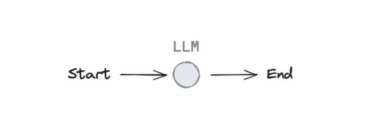
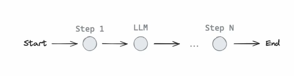
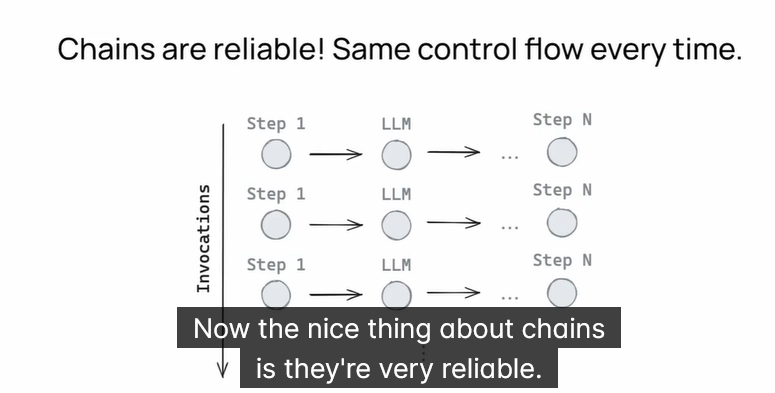
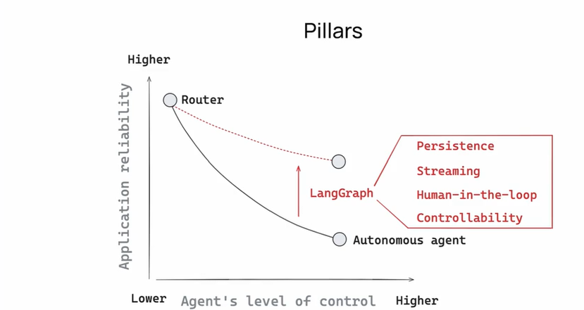

# LangGraph

- LangGraph is an orchestration framework for complex agentic systems and is more low-level and controllable than LangChain agents.

## LangGraph Platform vs LangGraph

- LangGraph is a stateful, orchestration framework that brings added control to agent workflows. LangGraph Platform is a service for deploying and scaling LangGraph applications, with a built-in Studio for prototyping, debugging, and sharing LangGraph applications.

- A solitary language model is fairly limited

- So many LLM application use a control flow with steps pre/post-LLM call.

- This control flow forms a chain

- Agent: control flow defined by a LLM

- Kinds of agents: 

    - Router
    - Fully Autonomous

