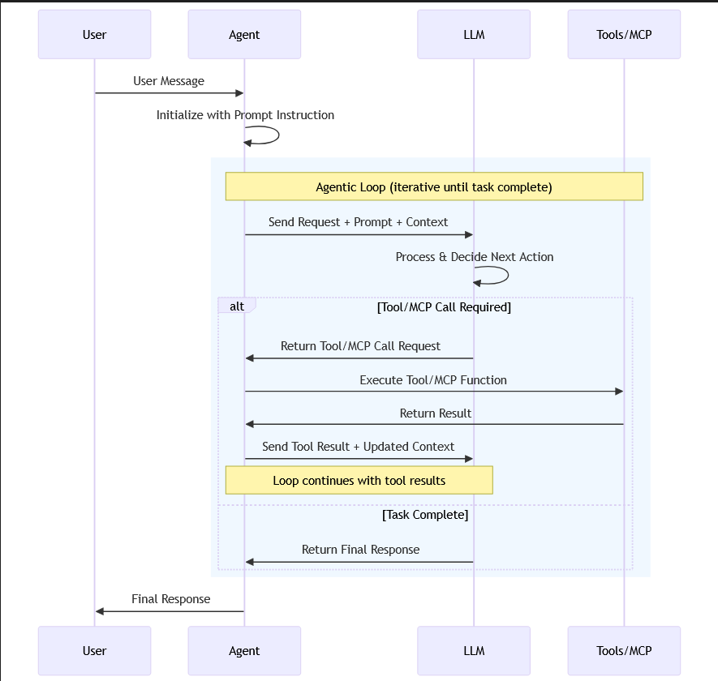

# Microsoft Agent Framework

- Agent framework offers 2 primary categories of capabilities:
    - AI Agents : Individual agents that use LLMs to process user inputs, call tools and MCP servers to perform actions, and generate responses. 
    - Workflows: Graph-based workflows that connect multiple agents and functions to perform complex, multi-step tasks. Workflows support type-based routing, nesting, checkpointing and request/response patterns for human-in-the-loop scenarios.

- The framework also provides foundational building blocks, including model clients(chat completions and responses), an agent thread for state management, context providers for agent memory, middleware for intercepting agent actions, and MCP clients together for tool integration. 

## AI Agents 

- An AI agent uses an LLM to process user inputs, make decisions, call tools and MCP servers to perform actions, and generate responses. 

- AI agents are not well suited for tasks that are highly structured and require strict adherence to predefined rules. If your application anticipates a specific kind of input and has a well defined sequence of operations to perform, using AI agents might introduce unnecessary uncertainity, latency and cost.

## Workflows

- A workflow can express a predefined sequence of operations that can include AI agents as components while maintaining consistency and reliability. Workflows are designed to handle complex and long-running processes that might involve multiple agents, human interactions and integrations with external systems.

- Workflows can also express dynamic sequences using conditional routing, model-based decision making and concurrent execution. This is how multi-agent orchestration patterns are implemented.