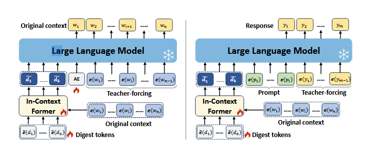

# In-Context Former: Lightning-fast Compressing Context for Large Language Model

## Abstract

- One effective approach to reduce high inference costs is to compress the long input contexts. Existing LLMs use self attention mechanism for context-compression. 

- Despite these methods, the compression process still has a quadratic time complexity. 

- Unlike these methods, IC-Former doesnot depend on the target LLMs. Instead it leverages the cross-attention mechanism and a small number of learnable digest tokens to directly condense information from the contextual word embeddings. This approach significantly reduces inference time, whcih achieves linear growth in time complexity within the compression range. 

- It requires only 1/32 of the floating-point operations of the baseline during compression and improves processing speed by 68 to 112 times while achieving over 90% of the baseline performance on evaluation metrics.

## Introduction

- The self attention improvement mechanisms mitigate the overhead of long context processing, they inevitably introduce modifications to the original structure of LLMs, potentially impacting the capabilities of the original model.

- A preliminary context compression process is based on a core assumption: most natural language texts contain redundant information, which makes context compression feasible. 

- These methods design compression models to condense lengthy contexts into short, context-rich soft prompts,which then serve as substitutes for the original context when input into the LLM. However, these methods still suffer the issue of expensive time costs during the compression process. This limitation restricts their application in real-time compression scenarios, such as compressing retrieved or real-time Internet documents immediately.

- The In-context former aims at optimizing resource consumption during the compression of long context in existing models. This model is based on two assumptions regarding semantic compression:

    1. Word embeddings already contains sufficient semantic information, suggesting that the interactions between embeddings may not be necessary prior to the extraction process.

    2. Learnable tokens within an elaborate structure can effectively aggregate information to a certain extent.

- Based on these, the paper tries to discard the costly self-attention interaction of text content in previous models. Instead, it uses the cross-attention mechanism for information extraction. This strategy ensures that the computational overhead of compression grows linearly with the context length within the compression range.

- The IC-former consists of a few cross-attention blocks and some learnable digest tokens. 

- Through this structure, the IC-Former leverages the digest tokens to extract information from lengthy contextual content and refine it into compact digest vectors.

- Subsequently these digest vectors directly replace the original, verbose context and serve as input to the LLMs while ensuring that the generated texts are faithful to the original context.

- In the training phase, it employs a strategy that combines pre-training and fine-tuning to optimize the IC-Former. 

- During pre-training phase, the IC-Former engages in a context reconstruction task. It is used to generate digest vectors from which an LLM can reconstruct the original context. 

- In the fine-tuning phase, the IC-Former is trained to ensure that the generated digest vectors correctly respond to various context-related prompts.

## Method 

### Task Formulation

- Context compression aims to transform lengthy contexxts into brief, compact representations while endeavoring to preserve the fundamental semantics and integrity of the original contexts.

- Formally, we define the original context that is to be compressed as w=(w1,w2,....,wn) where $w_i$ represents the $i^{\text{th}}$ token of context and n is the number of tokens in context.

- Then we denote e(.) as the word embedding lookup in the LLM and $\tilde{e}$(.) as the learnable embeddings of soft tokens. 

- A context compressor model $\Theta$ utilizes the embeddings of soft tokens $\tilde{e}(d) = (\tilde{e}(d_1), \tilde{e}(d_2), \ldots, \tilde{e}(d_k))$ and context embeddings $e(w) = (e(w_1), e(w_2), \ldots, e(w_n))$ to generate compact representations $\tilde{d} = (\tilde{d}_1, \tilde{d}_2, \ldots, \tilde{d}_k)$ of the context, where $k$ is the length of the compressed context and $k \ll n$.

- The condensed vectors $\tilde{d}$ can substitute the original context and can be combined with another prompt $e(p) = (e(p_1), e(p_2), \ldots, e(p_l))$ for input to an LLM $\phi$.

- The output $y = (y_1, \ldots, y_m)$ remains faithful to the content of the original context $w$.

### In-Context Former

- IC-Former consists of a few cross-attention layers and a set of learnable soft tokens, which are called _digest tokens_. 

- The IC-Former utilizes context tokens and disgest tokens as inputs, leveraging a casual cross-attention mechanism to condense the context information into digest vectors. 

- **Attention Computation** : when compressing a long context, the context tokens are concatenated with digest tokens and subsequently mapped into embeddings, which serve as key and value in the cross-attention layer. 

    - Meanwhile, the embeddings of the digest tokens serve as query to interact with both context embeddings and digest embeddings. To be specific, the Q,K and V in IC-former can be computed as:
        $$
        Q = W_Q \tilde{e}(d)^T

        K = W_K[e(w); \tilde{e}(d)]^T

        V = W_V[e(w); \tilde{e}(d)]^T
        $$

    - Then we employ the cross-attention mechanism to condense contextual information, as this approach has been empirically validated effective in multimodal information extraction. 

- **Attention Masks**: The design for attention masks allows digest tokens to attend to all context tokens as well as preceeding digest tokens, thereby mitigating the deficiency of interaction among context tokens.

- Additionally, it can be observed from the attention matrix that given a context length of n and a target compression length of k, the time complexity of our method are both $$O(kn+k^2) {~} O(kn)$$.

- **Positional embeddings:** The pure cross-attention mechanism doesn't capture the relative positional relationships among tokens within the context. This implies swapping any two tokens in the context results in an identical digest vector, which does not align with our expectations. 

- To address, IC-Former uses RoPE to represent the relative positional relations within the context tokens.

- We denote the positional embeddings of the nth token in the sequence as RoPE(n) and is abbreviated as $R_n$.

$$ RoPE(n)= \begin{bmatrix}R_n^{(0)} & & & & \\
                            & R_n^{(1)} & & & \\
                            & & \ddots & & \\
                            & & & & R_n^{(h/2-1)}
                            \end{bmatrix}
$$

$$\[
\text{RoPE}(n) =
\begin{bmatrix}
R_n^{(0)} &        & \cdots &        & 0 \\
         & R_n^{(1)} &        &        & \\
\vdots   &        & \ddots &        & \vdots \\
         &        &        & \ddots & \\
0        &        & \cdots &        & R_n^{(h/2 - 1)}
\end{bmatrix}
\]
$$