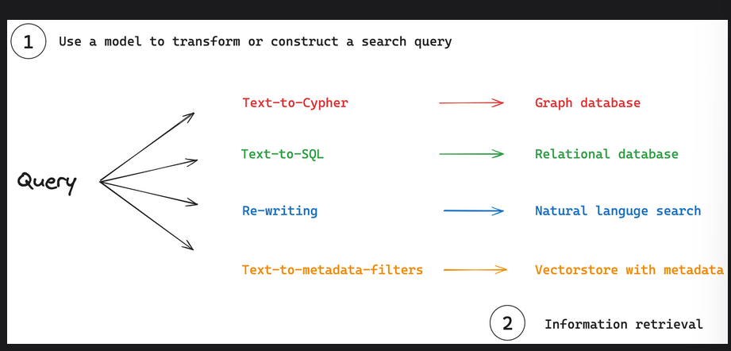

# Retrieval

## Overview 

- Retrieval systems are fundamental to many AI applications, efficiently identifying relevant information from large datasets. These systems accomodate various data formats:

1. Unstructured text is often stored in vector stores or lexical search indexes.

2. Structured data is typically housed in relational or graph databases with defined schemas.

## Key concepts 

- 

1. Query analysis: A process where models transform or construct search queries to optimise retrieval.

2. Information retrieval: Search queries are used to fetch information from various retrieval systems

## Query Analysis

- It serves as a bridge between raw user input and optimized search queries.Common applications include:

1. Query Re-writing: Queries can be re-written or expanded to improve semantic or lexical searches.

2. Query construction: Search indexes may require structured queries.

